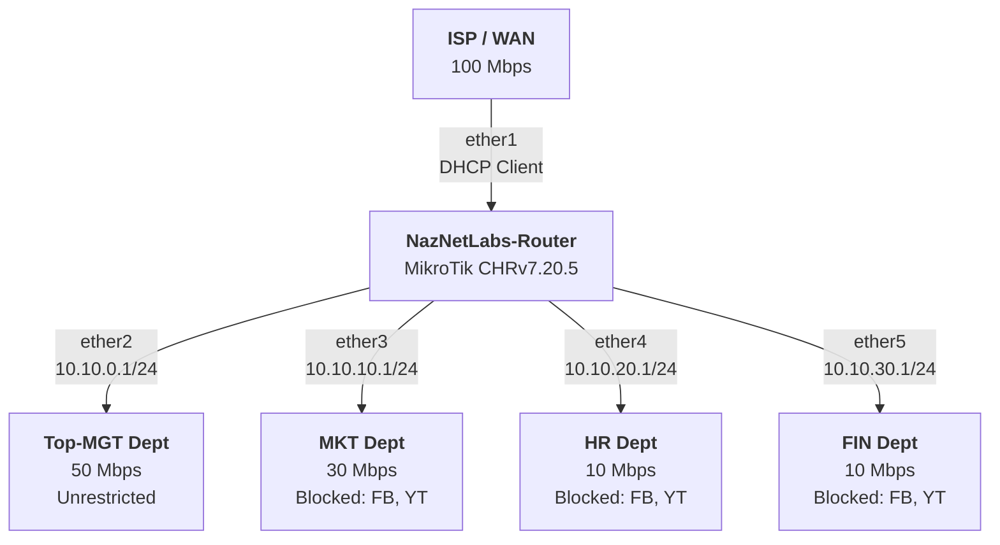

# MikroTik Router Configuration

## Lab Requirements

### Network Topology



#### LAB DEMO


### Access Control Requirements

- **Time**: 9:00 AM to 5:00 PM (Everyday)
- **Blocked Sites**: Facebook, YouTube, BDJobs (including subdomains)
- **Affected Departments**: MKT, HR, FIN
- **Unrestricted Access**: Top-MGT can access everything, anytime

### Technical Requirements

- PCQ (Per Connection Queue) for fair bandwidth distribution
- Queue Tree for bandwidth management
- Mangle for traffic marking
- Time-based blocking rules
- DNS-based blocking (Regex)

---

## Configuration Script

Copy and paste this script into the MikroTik terminal.

```bash
# ============================================================
# MIKROTIK ROUTER CONFIGURATION
# ============================================================
#
# Author: nazDridoy
# Source: https://github.com/nazdridoy/NazNetLabs/blob/main/Mikrotik-Labs/PCQ-Bandwidth-Management-and-Time-Based-Web-Filtering.md
# License: MIT License
# Date: 2025-12-16
#
# MIT License
#
# Copyright (c) 2025 nazDridoy
#
# Permission is hereby granted, free of charge, to any person obtaining a copy
# of this software and associated documentation files (the "Software"), to deal
# in the Software without restriction, including without limitation the rights
# to use, copy, modify, merge, publish, distribute, sublicense, and/or sell
# copies of the Software, and to permit persons to whom the Software is
# furnished to do so, subject to the following conditions:
#
# The above copyright notice and this permission notice shall be included in all
# copies or substantial portions of the Software.
#
# THE SOFTWARE IS PROVIDED "AS IS", WITHOUT WARRANTY OF ANY KIND, EXPRESS OR
# IMPLIED, INCLUDING BUT NOT LIMITED TO THE WARRANTIES OF MERCHANTABILITY,
# FITNESS FOR A PARTICULAR PURPOSE AND NONINFRINGEMENT. IN NO EVENT SHALL THE
# AUTHORS OR COPYRIGHT HOLDERS BE LIABLE FOR ANY CLAIM, DAMAGES OR OTHER
# LIABILITY, WHETHER IN AN ACTION OF CONTRACT, TORT OR OTHERWISE, ARISING FROM,
# OUT OF OR IN CONNECTION WITH THE SOFTWARE OR THE USE OR OTHER DEALINGS IN THE
# SOFTWARE.
# ============================================================

# ============================================================
# 0. GLOBAL VARIABLES (MODIFIABLE)
# ============================================================

# Interfaces
:global wanInterface "ether1"
:global mgtInterface "ether2"
:global mktInterface "ether3"
:global hrInterface "ether4"
:global finInterface "ether5"

# Gateway IPs (Router IPs)
:global mgtGateway "10.10.0.1/24"
:global mktGateway "10.10.10.1/24"
:global hrGateway "10.10.20.1/24"
:global finGateway "10.10.30.1/24"

# ------------------------------------------------------------
# 1. SYSTEM CONFIGURATION
# ------------------------------------------------------------

# Set router identity
/system identity
set name=NazNetLabs-Router

# Configure timezone (adjust for your location)
/system clock
set time-zone-name=Asia/Dhaka

# Enable NTP for accurate time synchronization
/system ntp client
set enabled=yes servers=pool.ntp.org,time.google.com

# ------------------------------------------------------------
# 2. WAN CONFIGURATION
# ------------------------------------------------------------

# Configure WAN interface to get IP from ISP via DHCP
/ip dhcp-client
add interface=$wanInterface disabled=no comment="WAN DHCP Client"

# If you need static IP instead, use this:
# /ip address
# add address=YOUR_WAN_IP/MASK interface=ether1 comment="WAN Static IP"
# /ip route
# add gateway=YOUR_GATEWAY_IP

# ------------------------------------------------------------
# 3. INTERFACE IP ADDRESSES
# ------------------------------------------------------------

/ip address
add address=$mgtGateway interface=$mgtInterface comment="Top-MGT Gateway"
add address=$mktGateway interface=$mktInterface comment="MKT Gateway"
add address=$hrGateway interface=$hrInterface comment="HR Gateway"
add address=$finGateway interface=$finInterface comment="FIN Gateway"


# ------------------------------------------------------------
# 4. DNS CONFIGURATION
# ------------------------------------------------------------

/ip dns
set servers=8.8.8.8,8.8.4.4 allow-remote-requests=yes

# ------------------------------------------------------------
# 5. NAT CONFIGURATION
# ------------------------------------------------------------

/ip firewall nat
add chain=srcnat out-interface=$wanInterface action=masquerade comment="Internet Access NAT"

# ------------------------------------------------------------
# 6. DHCP SERVER CONFIGURATION
# ------------------------------------------------------------

# Top-MGT DHCP Pool
/ip pool
add name=MGT-pool ranges=10.10.0.100-10.10.0.200

/ip dhcp-server
add name=MGT-dhcp interface=$mgtInterface address-pool=MGT-pool disabled=no

/ip dhcp-server network
add address=10.10.0.0/24 gateway=10.10.0.1 dns-server=8.8.8.8,8.8.4.4 comment="Top-MGT DHCP Network"

# MKT DHCP Pool
/ip pool
add name=MKT-pool ranges=10.10.10.100-10.10.10.200

/ip dhcp-server
add name=MKT-dhcp interface=$mktInterface address-pool=MKT-pool disabled=no

/ip dhcp-server network
add address=10.10.10.0/24 gateway=10.10.10.1 dns-server=8.8.8.8,8.8.4.4 comment="MKT DHCP Network"

# HR DHCP Pool
/ip pool
add name=HR-pool ranges=10.10.20.100-10.10.20.200

/ip dhcp-server
add name=HR-dhcp interface=$hrInterface address-pool=HR-pool disabled=no

/ip dhcp-server network
add address=10.10.20.0/24 gateway=10.10.20.1 dns-server=8.8.8.8,8.8.4.4 comment="HR DHCP Network"

# FIN DHCP Pool
/ip pool
add name=FIN-pool ranges=10.10.30.100-10.10.30.200

/ip dhcp-server
add name=FIN-dhcp interface=$finInterface address-pool=FIN-pool disabled=no

/ip dhcp-server network
add address=10.10.30.0/24 gateway=10.10.30.1 dns-server=8.8.8.8,8.8.4.4 comment="FIN DHCP Network"

# ------------------------------------------------------------
# 7. TRAFFIC MARKING (MANGLE)
# ------------------------------------------------------------

/ip firewall mangle
# Top-MGT Department
add chain=prerouting in-interface=$mgtInterface action=mark-connection new-connection-mark=MGT_conn passthrough=yes comment="Mark MGT Connections"
add chain=prerouting connection-mark=MGT_conn action=mark-packet new-packet-mark=MGT_pkt passthrough=no comment="Mark MGT Packets"

# MKT Department
add chain=prerouting in-interface=$mktInterface action=mark-connection new-connection-mark=MKT_conn passthrough=yes comment="Mark MKT Connections"
add chain=prerouting connection-mark=MKT_conn action=mark-packet new-packet-mark=MKT_pkt passthrough=no comment="Mark MKT Packets"

# HR Department
add chain=prerouting in-interface=$hrInterface action=mark-connection new-connection-mark=HR_conn passthrough=yes comment="Mark HR Connections"
add chain=prerouting connection-mark=HR_conn action=mark-packet new-packet-mark=HR_pkt passthrough=no comment="Mark HR Packets"

# FIN Department
add chain=prerouting in-interface=$finInterface action=mark-connection new-connection-mark=FIN_conn passthrough=yes comment="Mark FIN Connections"
add chain=prerouting connection-mark=FIN_conn action=mark-packet new-packet-mark=FIN_pkt passthrough=no comment="Mark FIN Packets"

# ------------------------------------------------------------
# 8. QUEUE TYPES (PCQ)
# ------------------------------------------------------------

/queue type
add name="PCQ_download" kind=pcq pcq-rate=0 pcq-classifier=dst-address
add name="PCQ_upload" kind=pcq pcq-rate=0 pcq-classifier=src-address

# ------------------------------------------------------------
# 9. BANDWIDTH MANAGEMENT (QUEUE TREE)
# ------------------------------------------------------------

# Parent Queues
/queue tree
add name="Total_Download" parent=global max-limit=100M comment="Total WAN Download Bandwidth"
add name="Total_Upload" parent=$wanInterface max-limit=100M comment="Total WAN Upload Bandwidth"

# Top-MGT Department Queues (50 Mbps)
add name="Top-MGT_Download" parent=Total_Download packet-mark=MGT_pkt queue=PCQ_download limit-at=50M max-limit=50M priority=1 comment="MGT Download: 50M guaranteed"
add name="Top-MGT_Upload" parent=Total_Upload packet-mark=MGT_pkt queue=PCQ_upload limit-at=50M max-limit=50M priority=1 comment="MGT Upload: 50M guaranteed"

# MKT Department Queues (30 Mbps)
add name="MKT_Download" parent=Total_Download packet-mark=MKT_pkt queue=PCQ_download limit-at=30M max-limit=30M priority=2 comment="MKT Download: 30M guaranteed"
add name="MKT_Upload" parent=Total_Upload packet-mark=MKT_pkt queue=PCQ_upload limit-at=30M max-limit=30M priority=2 comment="MKT Upload: 30M guaranteed"

# HR Department Queues (10 Mbps)
add name="HR_Download" parent=Total_Download packet-mark=HR_pkt queue=PCQ_download limit-at=10M max-limit=10M priority=3 comment="HR Download: 10M guaranteed"
add name="HR_Upload" parent=Total_Upload packet-mark=HR_pkt queue=PCQ_upload limit-at=10M max-limit=10M priority=3 comment="HR Upload: 10M guaranteed"

# FIN Department Queues (10 Mbps)
add name="FIN_Download" parent=Total_Download packet-mark=FIN_pkt queue=PCQ_download limit-at=10M max-limit=10M priority=4 comment="FIN Download: 10M guaranteed"
add name="FIN_Upload" parent=Total_Upload packet-mark=FIN_pkt queue=PCQ_upload limit-at=10M max-limit=10M priority=4 comment="FIN Upload: 10M guaranteed"

# ------------------------------------------------------------
# 10. ADDRESS LISTS
# ------------------------------------------------------------

/ip firewall address-list
add address=10.10.10.0/24 list=Restricted_Depts comment="MKT Department"
add address=10.10.20.0/24 list=Restricted_Depts comment="HR Department"
add address=10.10.30.0/24 list=Restricted_Depts comment="FIN Department"

# Note: Top-MGT (10.10.0.0/24) is NOT in this list, so they have unrestricted access

# ------------------------------------------------------------
# 11. DNS BLOCKING (REGEX)
# ------------------------------------------------------------
# NOTE: TLS-host based blocking is OBSOLETE due to:
#   - QUIC protocol (UDP/443) bypasses TCP inspection
#   - TLS 1.3 + ECH encrypts SNI (Server Name Indication)
#   - L7 filtering cannot inspect encrypted traffic
# 
# DNS-based blocking is the modern solution:
#   - Block at DNS resolution level
#   - Force clients to use router DNS
#   - Return NXDOMAIN (domain doesn't exist)
# ------------------------------------------------------------

# DNS Static Entries - Return NXDOMAIN for blocked domains
# STRATEGY: 
# 1. All clients use 8.8.8.8 (Google DNS) by default -> No blocking.
# 2. Restricted Depts are REDIRECTED to Router DNS during work hours.
# 3. Router DNS has these static entries to return NXDOMAIN.
# 4. Uses REGEX to catch all subdomains automatically.
/ip dns static

# YouTube (matches youtube.com, youtu.be, googlevideo.com, etc)
add regexp=".*youtube.*" type=NXDOMAIN comment="Block YouTube (Regex)"
add regexp=".*googlevideo.*" type=NXDOMAIN comment="Block YouTube Video (Regex)"
add regexp=".*youtu\\.be.*" type=NXDOMAIN comment="Block YouTube Short (Regex)"

# Facebook/Meta (matches facebook.com, fbcdn, messenger, instagram, etc)
add regexp=".*facebook.*" type=NXDOMAIN comment="Block Facebook (Regex)"
add regexp=".*fbcdn.*" type=NXDOMAIN comment="Block Facebook CDN (Regex)"
add regexp=".*fbsbx.*" type=NXDOMAIN comment="Block Facebook Sandbox (Regex)"
add regexp=".*messenger.*" type=NXDOMAIN comment="Block Messenger (Regex)"
add regexp=".*instagram.*" type=NXDOMAIN comment="Block Instagram (Regex)"
add regexp=".*cdninstagram.*" type=NXDOMAIN comment="Block Instagram CDN (Regex)"

# BDJobs (matches bdjobs.com and subdomains)
add regexp=".*bdjobs.*" type=NXDOMAIN comment="Block BDJobs (Regex)"

# WhatsApp - Optional, uncomment if needed
# add regexp=".*whatsapp.*" type=NXDOMAIN comment="Block WhatsApp (Regex)"

# ------------------------------------------------------------
# 12. DNS REDIRECTION (FORCE RESTRICTED DEPTS)
# ------------------------------------------------------------
# Redirect all DNS queries from restricted depts to router DNS
# This prevents users from using external DNS (8.8.8.8, 1.1.1.1)
# Time-based: Only during work hours (9AM-5PM, Everyday)
# ------------------------------------------------------------

/ip firewall nat
# Force DNS UDP (standard DNS)
add chain=dstnat protocol=udp dst-port=53 \
    src-address-list=Restricted_Depts \
    time=9h-17h,sun,mon,tue,wed,thu,fri,sat \
    action=redirect to-ports=53 \
    comment="Force DNS UDP (9AM-5PM Everyday)"

# Force DNS TCP (for larger responses)
add chain=dstnat protocol=tcp dst-port=53 \
    src-address-list=Restricted_Depts \
    time=9h-17h,sun,mon,tue,wed,thu,fri,sat \
    action=redirect to-ports=53 \
    comment="Force DNS TCP (9AM-5PM Everyday)"

# ------------------------------------------------------------
# 13. BLOCK DNS BYPASS (DoH/DoT)
# ------------------------------------------------------------

/ip firewall address-list
# Common DoH/DoT provider IPs (add more as needed)
add list=DoH_Servers address=8.8.8.8 comment="Google DNS"
add list=DoH_Servers address=8.8.4.4 comment="Google DNS"
add list=DoH_Servers address=1.1.1.1 comment="Cloudflare DNS"
add list=DoH_Servers address=1.0.0.1 comment="Cloudflare DNS"
add list=DoH_Servers address=9.9.9.9 comment="Quad9 DNS"
add list=DoH_Servers address=149.112.112.112 comment="Quad9 DNS"
add list=DoH_Servers address=208.67.222.222 comment="OpenDNS"
add list=DoH_Servers address=208.67.220.220 comment="OpenDNS"

/ip firewall filter
# Block DoT (DNS over TLS) port 853
add chain=forward protocol=tcp dst-port=853 \
    src-address-list=Restricted_Depts \
    time=9h-17h,sun,mon,tue,wed,thu,fri,sat \
    action=drop \
    comment="Block DoT (9AM-5PM Everyday)"

# Block DoH to known providers (port 443 to DoH servers)
add chain=forward protocol=tcp dst-port=443 \
    dst-address-list=DoH_Servers \
    src-address-list=Restricted_Depts \
    time=9h-17h,sun,mon,tue,wed,thu,fri,sat \
    action=drop \
    comment="Block DoH (9AM-5PM Everyday)"

# Block QUIC to known DoH providers (UDP 443)
add chain=forward protocol=udp dst-port=443 \
    dst-address-list=DoH_Servers \
    src-address-list=Restricted_Depts \
    time=9h-17h,sun,mon,tue,wed,thu,fri,sat \
    action=drop \
    comment="Block DoH QUIC (9AM-5PM Everyday)"

# ------------------------------------------------------------
# 14. CONNECTION TRACKING
# ------------------------------------------------------------

/ip firewall connection tracking
set enabled=yes

# ============================================================
# END OF CONFIGURATION
# ============================================================
```

---

## Configuration Summary

### Bandwidth Allocation

```
Total WAN: 100 Mbps
├── Top-MGT: 50 Mbps (50%)
├── MKT:     30 Mbps (30%)
├── HR:      10 Mbps (10%)
└── FIN:     10 Mbps (10%)
```

### Blocking Schedule

| Department | Facebook/YouTube | Time Window | Days |
|-----------|------------------|-------------|------|
| Top-MGT | Allowed | Always | All days |
| MKT | Blocked | 9 AM - 5 PM | Everyday |
| HR | Blocked | 9 AM - 5 PM | Everyday |
| FIN | Blocked | 9 AM - 5 PM | Everyday |

---

## Verification Commands

### System Time

```bash
/system clock print
/system ntp client print
```

### Interface Configuration

```bash
/ip address print
```

### Mangle Rules

```bash
/ip firewall mangle print
/ip firewall mangle print stats
```

### Queue Tree

```bash
/queue tree print
/queue tree monitor Top-MGT_Download
```

### Firewall Filter

```bash
/ip firewall filter print
/ip firewall filter print stats
```

### DNS Static Entries

```bash
/ip dns static print
/put [:resolve youtube.com]
```

### NAT Rules

```bash
/ip firewall nat print where dst-port=53
```

---

## Testing Procedure

### Test 1: Bandwidth Limits

**Objective**: Verify each department gets their allocated bandwidth

1. Connect a client to each department
2. Run bandwidth test simultaneously from all departments
3. Monitor queue tree statistics

```bash
/queue tree print stats
```

**Expected Results**:
- Top-MGT: Up to 50 Mbps
- MKT: Up to 30 Mbps
- HR: Up to 10 Mbps
- FIN: Up to 10 Mbps

### Test 2: PCQ Fair Distribution

**Objective**: Verify bandwidth is shared fairly among users

1. Connect 2-3 clients to MKT department
2. Start download on all clients simultaneously
3. Monitor individual client speeds

```bash
/queue tree monitor MKT_Download
```

**Expected Results**:
- 30 Mbps shared equally among all MKT users
- Each user gets ~10 Mbps if 3 users active

### Test 3: Time-Based Blocking (During Work Hours)

**Objective**: Verify Facebook/YouTube are blocked 9 AM - 5 PM (Everyday)

**From MKT/HR/FIN department** (during 9 AM - 5 PM):

```bash
# Try to resolve YouTube (should fail - NXDOMAIN)
nslookup youtube.com
# Expected: "server can't find youtube.com: NXDOMAIN" or timeout

# Try to access YouTube
curl -v https://youtube.com
# Expected: "Could not resolve host" error

# Try to access Facebook
curl -v https://facebook.com
# Expected: "Could not resolve host" error
```

**From Top-MGT department**:

```bash
# Try to access Facebook
curl -v https://facebook.com
# Expected: Success (200 OK or redirect)
# Note: Top-MGT uses Google DNS directly, not affected by DNS static entries
```

Monitor on router:

```bash
# Check DNS static entries
/ip dns static print

# Check forced DNS NAT statistics
/ip firewall nat print stats where comment~"Force DNS"
# Should show increasing packet counts during work hours
```

### Test 4: After Hours Access

**Objective**: Verify all departments can access social media outside work hours

**Test after 5 PM** from MKT department:

```bash
curl -v https://facebook.com
# Expected: Success
```

### Test 5: Connection Tracking

**Objective**: Verify connections are properly marked

```bash
# View all marked connections
/ip firewall connection print where connection-mark!=""

# View specific department
/ip firewall connection print where connection-mark~"MKT"
```

**Expected**: Active connections from each department should show their respective marks.

---

## Troubleshooting

### Time-based blocking not working

1. Check router time: `/system clock print`
2. Verify timezone is correct.
3. Check NTP status.

### Bandwidth limiting not working

1. Check mangle rules: `/ip firewall mangle print stats`
2. Verify connection marks.
3. Check queue tree parents.

### Social media still accessible

1. Check DNS static entries: `/ip dns static print`
2. Verify NAT redirect rules.
3. Flush DNS cache: `/ip dns cache flush`
4. Check if client is using DoH/DoT.

### Real-time Monitoring Dashboard

```bash
# Monitor all queues simultaneously (run in separate terminals)
/queue tree monitor Top-MGT_Download
/queue tree monitor MKT_Download
/queue tree monitor HR_Download
/queue tree monitor FIN_Download
```

### Daily Traffic Statistics

```bash
# View total traffic per queue
/queue tree print stats

# View traffic per interface
/interface print stats

# View connection counts
/ip firewall connection print count-only
```

### Check Top Talkers

```bash
# View most active connections
/ip firewall connection print where bytes>1000000

# View connections by department
/ip firewall connection print where src-address~"10.10.10"
```

---

## Security Best Practices

### Additional Recommended Rules

```bash
# Protect router from WAN
/ip firewall filter
add chain=input in-interface=ether1 connection-state=established,related action=accept \
    comment="Allow established connections from WAN"
add chain=input in-interface=ether1 action=drop comment="Drop all other WAN input"

# Protect against port scanning
add chain=input protocol=tcp psd=21,3s,3,1 action=drop comment="Drop port scanners"

# Limit ICMP ping
/ip firewall filter
add chain=input protocol=icmp limit=5,5:packet action=accept comment="Limit ICMP flood"
add chain=input protocol=icmp action=drop

# Enable firewall logging
/system logging
add topics=firewall action=memory
```

### Backup Configuration

```bash
# Export configuration to file
/export file=mikrotik-backup-2025-12-15

# Download from router via SFTP/FTP
# Or view in terminal
/file print
```

---

## Advanced Configuration Options

### Option 1: Add Bandwidth Bursting

Allow temporary speed bursts for better user experience:

```bash
/queue tree
# Modify existing queues to add burst
set [find name="MKT_Download"] burst-limit=50M burst-threshold=25M burst-time=10s
# Allows MKT to burst to 50M for 10 seconds when bandwidth is available
```

### Option 2: Add QoS Priority for VoIP/Video Calls

```bash
# Mark VoIP traffic (example for SIP/RTP)
/ip firewall mangle
add chain=prerouting protocol=udp dst-port=5060-5061 action=mark-packet \
    new-packet-mark=VoIP_pkt passthrough=no comment="Mark VoIP SIP"
add chain=prerouting protocol=udp dst-port=10000-20000 action=mark-packet \
    new-packet-mark=VoIP_pkt passthrough=no comment="Mark VoIP RTP"

# Create high-priority queue for VoIP
/queue tree
add name="VoIP_Priority" parent=Total_Download packet-mark=VoIP_pkt \
    priority=1 max-limit=5M comment="VoIP Priority Queue"
```

### Option 3: Add Logging for Blocked Access

```bash
# Log all blocked social media attempts
/ip firewall filter
# Add this BEFORE the drop rules
add chain=forward src-address-list=Restricted_Depts dst-port=443 \
    tls-host=*facebook.com* time=9h-17h,mon,tue,wed,thu,fri \
    action=log log-prefix="BLOCKED-FB" comment="Log Facebook blocks"

add chain=forward src-address-list=Restricted_Depts dst-port=443 \
    tls-host=*youtube.com* time=9h-17h,mon,tue,wed,thu,fri \
    action=log log-prefix="BLOCKED-YT" comment="Log YouTube blocks"

# View logs
/log print where message~"BLOCKED"
```

### Option 4: Web Proxy for Better Control

For more granular control, enable web proxy:

```bash
/ip proxy
set enabled=yes port=8080 cache-administrator=admin@example.com

# Redirect HTTP traffic to proxy
/ip firewall nat
add chain=dst-nat protocol=tcp dst-port=80 \
    src-address-list=Restricted_Depts action=redirect to-ports=8080

# Configure access rules
/ip proxy access
add action=deny dst-host=*facebook.com* comment="Proxy: Block Facebook"
add action=deny dst-host=*youtube.com* comment="Proxy: Block YouTube"
```

---

## Configuration Checklist

Use this checklist to verify your setup:

- [ ] **System Configuration**
  - [ ] Router identity set
  - [ ] Timezone configured correctly
  - [ ] NTP client enabled and syncing
  - [ ] Time verified (matches real time)

- [ ] **Network Configuration**
  - [ ] WAN interface configured (ether1)
  - [ ] All department IPs assigned (ether2-5)
  - [ ] DNS servers configured
  - [ ] NAT masquerading enabled
  - [ ] Internet connectivity working

- [ ] **DHCP Configuration** (if used)
  - [ ] DHCP pools created for all departments
  - [ ] DHCP servers enabled
  - [ ] Clients receiving IPs automatically

- [ ] **Traffic Marking**
  - [ ] Mangle rules created for all departments
  - [ ] Connection marks working (verified)
  - [ ] Packet marks working (verified)

- [ ] **Bandwidth Management**
  - [ ] PCQ types created (download & upload)
  - [ ] Queue tree parent queues created
  - [ ] All department queues created (8 total)
  - [ ] Bandwidth limits verified through testing

- [ ] **Content Blocking**
  - [ ] Address list for restricted departments created
  - [ ] Firewall filter rules for Facebook blocking
  - [ ] Firewall filter rules for YouTube blocking
  - [ ] Time-based rules active during work hours
  - [ ] Top-MGT has unrestricted access

- [ ] **Testing**
  - [ ] Bandwidth limits tested per department
  - [ ] PCQ distribution verified
  - [ ] Social media blocking tested (work hours)
  - [ ] Social media access verified (after hours)
  - [ ] Top-MGT unrestricted access verified

- [ ] **Documentation**
  - [ ] Configuration backed up
  - [ ] Network diagram created
  - [ ] Admin credentials secured

---

## Understanding the Configuration

### Traffic Marking (Mangle)

The mangle rules implement a **connection-based marking strategy** using a single packet mark per department for both upload and download traffic.

#### Connection Mark vs Packet Mark

| Mark Type | Scope | Purpose |
|-----------|-------|---------|
| Connection Mark (`MKT_conn`) | Per TCP/UDP session | Identifies which department initiated the connection |
| Packet Mark (`MKT_pkt`) | Per packet | Used by Queue Tree to apply bandwidth limits |

#### Marking Process

1. **Connection Identification**: Traffic entering from a LAN interface (e.g., `ether3`) is marked with a connection mark (`MKT_conn`).
2. **Bidirectional Propagation**: MikroTik's connection tracking ensures the connection mark applies to **both directions** (outgoing requests and incoming replies belong to the same connection).
3. **Packet Stamping**: All packets within a marked connection receive the corresponding packet mark (`MKT_pkt`).

#### Single Mark Design Rationale

Separate upload/download packet marks are not required. Direction differentiation is handled at the Queue Tree level via:
- **Parent queue attachment** (interface-based filtering)
- **PCQ classifiers** (address-based sub-queue creation)

This reduces mangle rule count and lowers CPU overhead.

---

### Bandwidth Management (Queue Tree)

Queue Tree implements hierarchical bandwidth allocation using PCQ (Per Connection Queue) for fair distribution among users.

#### Parent Queue Configuration

| Queue | Parent | Traffic Scope |
|-------|--------|---------------|
| `Total_Download` | `global` | All traffic passing through the router |
| `Total_Upload` | `$wanInterface` | Only traffic exiting via WAN interface |

**Design Note**: `Total_Upload` uses interface-based parent (`$wanInterface`) to ensure only outbound WAN traffic is processed. This prevents download traffic from consuming upload bandwidth quota and enables asymmetric bandwidth limits (e.g., 50M down / 10M up) if required.

#### PCQ Classifier Behavior

PCQ dynamically creates sub-queues based on the classifier:

| Queue Type | Classifier | Sub-Queue Key | Effect |
|------------|------------|---------------|--------|
| Download | `dst-address` | Client IP (destination) | Fair bandwidth per receiving user |
| Upload | `src-address` | Client IP (source) | Fair bandwidth per sending user |

**Example**: MKT department with 30 Mbps allocation and 3 active users:

```
MKT_Download (30 Mbps, pcq-classifier=dst-address)
├── 10.10.10.101 → 10 Mbps
├── 10.10.10.102 → 10 Mbps
└── 10.10.10.103 → 10 Mbps
```

PCQ automatically redistributes bandwidth as users connect/disconnect.

#### Traffic Flow Summary

```
                              MANGLE                    QUEUE TREE
                              ══════                    ══════════
LAN Client                                              
    │                                                   
    ├─► Packet enters router                            
    │   └─► in-interface match                          
    │       └─► mark-connection (MKT_conn)              
    │           └─► mark-packet (MKT_pkt)               
    │                                                   
    ├─► Upload (LAN → WAN)                              
    │   └─► Exits via $wanInterface ─────────────────► Total_Upload
    │                                                   └─► MKT_Upload (PCQ src-address)
    │                                                   
    └─► Download (WAN → LAN)                            
        └─► Passes through router ───────────────────► Total_Download
                                                        └─► MKT_Download (PCQ dst-address)
```

### How DNS-Based Blocking Works

**DNS-based blocking** is the modern solution for content filtering:

```
                                    DNS Query Flow
                                    ═══════════════

Client (MKT)                        MikroTik Router                    Internet
     │                                    │                                │
     │  DNS query: youtube.com            │                                │
     ├─────────────────────────────────>  │                                │
     │                                    │                                │
     │  ┌─────────────────────────────────┤                                │
     │  │ 1. NAT redirects DNS to router  │                                │
     │  │ 2. Router checks DNS static     │                                │
     │  │ 3. youtube.com = NXDOMAIN       │                                │
     │  └─────────────────────────────────┤                                │
     │                                    │                                │
     │  Response: NXDOMAIN (not found)    │                                │
     │<─────────────────────────────────  │                                │
     │                                    │                                │
     ✗  Browser shows "Cannot reach site"                 (No connection ever made)
```

**Why DNS blocking works with QUIC/TLS 1.3**:
- Block happens BEFORE any connection attempt
- Client can't resolve IP address → can't connect
- Doesn't rely on inspecting encrypted traffic
- Works regardless of protocol (HTTP, HTTPS, QUIC)

**Why TLS-host blocking is OBSOLETE**:
- **QUIC (UDP/443)**: Bypasses TCP-based TLS inspection
- **TLS 1.3 + ECH**: Encrypts Server Name Indication (SNI)
- **L7 filtering**: Cannot inspect encrypted payloads
- Router only sees encrypted blobs, not domain names

**Components of DNS blocking**:
1. **DNS Static (NXDOMAIN)**: Returns "domain not found" for blocked sites
2. **Forced DNS Redirect**: Routes all DNS queries through router
3. **DoH/DoT Blocking**: Prevents encrypted DNS bypass

---

## Quick Start Guide

### For New Router Setup

1. **Connect to router**
   ```
   - Connect PC to any port (ether2-8)
   - Access via Winbox or web: http://192.168.88.1
   - Default user: admin, no password
   ```

2. **Reset to factory defaults** (optional, if needed)
   ```bash
   /system reset-configuration no-defaults=yes skip-backup=yes
   ```

3. **Copy and paste the complete configuration script** from this document

4. **Verify time is correct**
   ```bash
   /system clock print
   ```

5. **Test internet connectivity**
   ```bash
   /ping google.com count=5
   ```

6. **Connect clients and test**

### For Existing Router

1. **Backup current configuration**
   ```bash
   /export file=backup-before-changes
   ```

2. **Apply new configuration** (copy/paste from complete script)

3. **Verify rules don't conflict** with existing setup

4. **Test thoroughly** before deploying to production

---

## Support and Maintenance

### Regular Maintenance Tasks

**Daily**:
- Check dashboard for unusual traffic patterns
- Verify time sync is working

**Weekly**:
- Review firewall filter statistics
- Check queue tree performance
- Verify all departments have internet access

**Monthly**:
- Update social media IP/domain lists if needed
- Review and analyze traffic logs
- Backup configuration
- Check for RouterOS updates

### Updating Social Media Block Lists

Social media services may change domains/IPs. Update as needed:

```bash
# Add new domains to DNS static
/ip dns static
add name=new-facebook-domain.com type=NXDOMAIN comment="Block New Facebook Domain"

# Then flush DNS cache
/ip dns cache flush
```

> [!IMPORTANT]
> Always flush DNS cache after adding new NXDOMAIN entries:
> ```bash
> /ip dns cache flush
> ```

---

## Additional Resources

### Official MikroTik Documentation
- Queue Trees: https://wiki.mikrotik.com/wiki/Manual:Queue_Tree
- Mangle: https://wiki.mikrotik.com/wiki/Manual:IP/Firewall/Mangle
- Firewall: https://wiki.mikrotik.com/wiki/Manual:IP/Firewall/Filter

### Useful Commands Reference

```bash
# Quick system info
/system resource print

# View logs
/log print

# Monitor CPU
/system resource monitor

# Monitor interfaces
/interface monitor-traffic ether1

# Reboot router
/system reboot

# Safe mode (auto-rollback if disconnected)
[Ctrl+X in terminal]
```

---

## Final Notes

This configuration provides:

- Guaranteed bandwidth for each department using `limit-at`
- Fair distribution among users with PCQ
- Time-based control for social media (9 AM-5 PM, Everyday)
- Department-specific policies (Top-MGT unrestricted)
- DNS-based blocking (works with QUIC and TLS 1.3)
- DoH/DoT bypass prevention (blocks encrypted DNS)
- Scalable design that works with any number of users per department
- Production-ready with proper error handling and verification

**Configuration Status**: **Production Ready**

**Tested On**: RouterOS 7.x

**Last Updated**: 2025-12-16

---

> [!IMPORTANT]
> **Before deploying to production**:
> 1. Test in lab environment first
> 2. Verify router time is correct (critical for time-based rules)
> 3. Backup existing configuration
> 4. Document any custom modifications
> 5. Have rollback plan ready

> [!TIP]
> **Performance Tip**: If you have low-powered router (< 256MB RAM), consider reducing the number of firewall rules by combining related rules or using address lists more extensively.

> [!WARNING]
> **Security Warning**: Change default admin password immediately:
> ```bash
> /user set admin password=YourStrongPasswordHere
> ```

---

For questions or issues, refer to the Troubleshooting section or MikroTik community forums.

