# Chapter 8: Managing Local and Cloud Storage

Windows 11 provides a robust set of tools for managing both physical hardware and cloud-based storage. This chapter covers initializing new disks, creating virtual storage containers, and leveraging OneDrive to keep your important documents synchronized and secure across all your devices.

---

## Lab 8.1: Setting Up a New Hard Disk

When you add a new hard disk or SSD to your PC, Windows won't recognize it until you initialize and format it. This lab walks through the complete setup process to make a new drive ready for use.

### Procedure

1. **Opening Disk Management**:
   - Right-click the **Start** button and select **Disk Management**.
   - Alternatively, press **Win + R**, type `diskmgmt.msc`, and press **Enter**.

   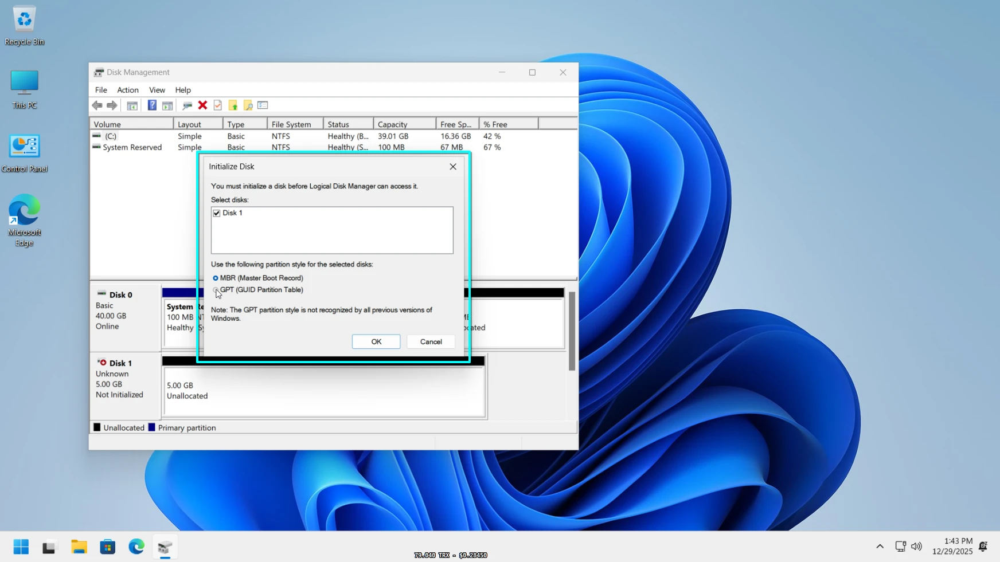
   *Figure 1: Disk Management window showing a new, uninitialized disk.*

2. **Bringing a Disk Online**:
   - If the disk is showing as "Offline," right-click the disk name (e.g., Disk 1) and select **Online**. This is common for disks moved from other systems.

3. **Initializing the Disk**:
   - Right-click the disk labeled "Not Initialized" and select **Initialize Disk**.
   - In the dialog box, ensure the correct disk is selected.
   - For modern Windows 11 systems, pick **GPT (GUID Partition Table)** for better compatibility and support for drives over 2TB. Use **MBR** only for legacy systems.

   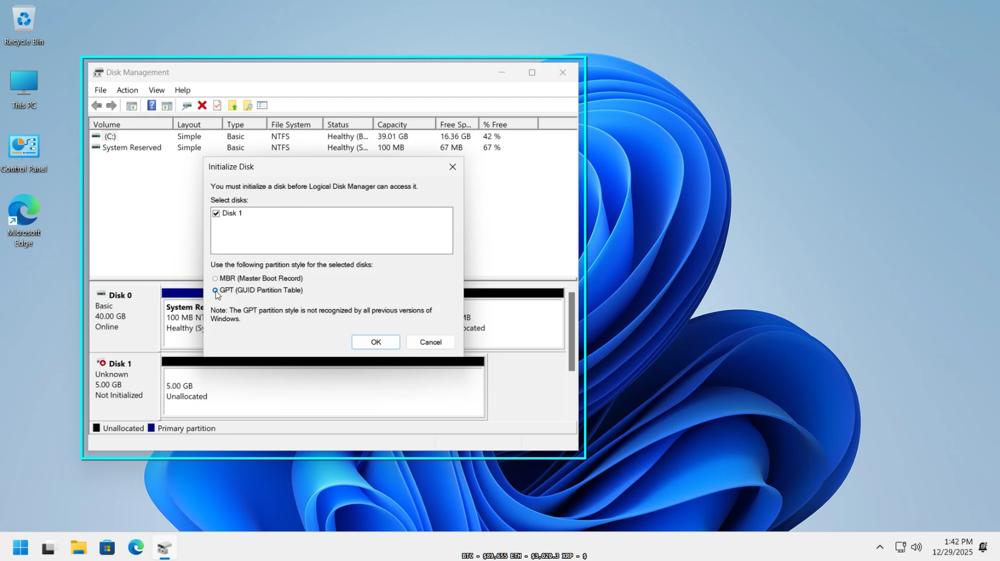
   *Figure 2: Selecting the partition style in the Initialize Disk dialog.*

4. **Creating a Simple Volume**:
   - Right-click the black "Unallocated" space on the disk and select **New Simple Volume**.
   - Follow the **New Simple Volume Wizard**:
     - **Size**: Use the default maximum size unless you want to create multiple partitions.
     - **Drive Letter**: Assign a letter like D, E, or F.
     - **Format**: Select **NTFS** for the file system and give it a **Volume label** (e.g., "Data" or "Storage").
     - Ensure **Perform a quick format** is checked.

   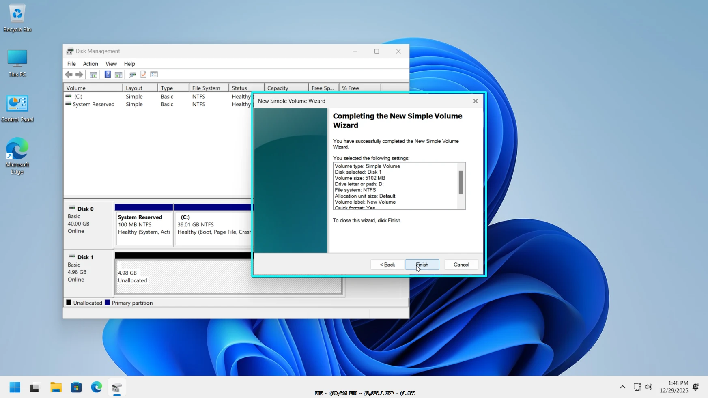
   *Figure 3: Configuring file system and format options in the volume wizard.*

5. **Verifying the New Drive**:
   - Open **File Explorer** and click **This PC**. Your new drive should appear with the letter and label you assigned.
   - In Disk Management, the disk should now show a status of **Healthy (Basic Data Partition)**.

   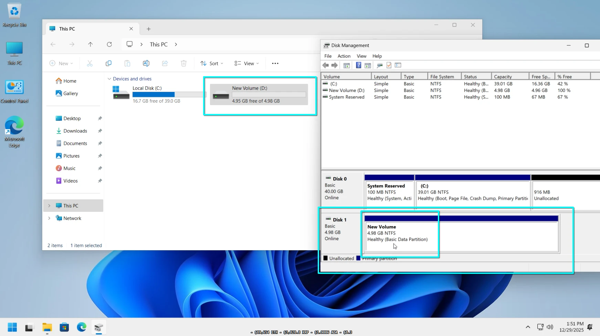
   *Figure 4: Verification of the healthy, formatted partition in Disk Management.*

---

## Lab 8.2: Using Disk Management Tools

Disk Management lets you resize partitions, change drive letters, and re-format volumes without need for third-party tools. These skills are essential for reorganizing storage as your needs change.

### Procedure

1. **Shrinking a Volume**:
   - Right-click an existing volume (like C: or D:) and select **Shrink Volume**.
   - Windows will calculate how much space can be taken away.
   - Enter the amount to shrink in MB and click **Shrink**. The freed space will appear as "Unallocated."

   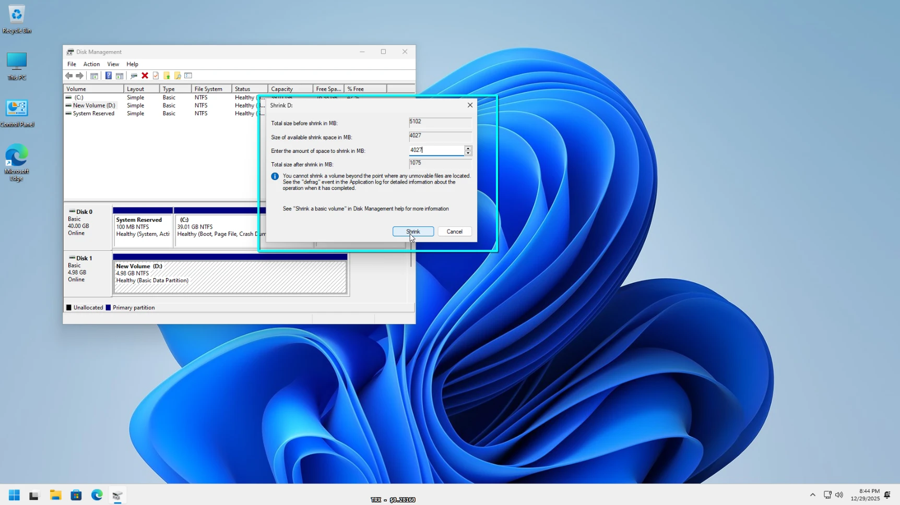
   *Figure 5: Calculating and entering the amount of space to shrink from a volume.*

2. **Extending a Volume**:
   - You can only extend a volume if there is unallocated space immediately to its right.
   - Right-click the volume and select **Extend Volume**.
   - Follow the wizard to add the unallocated space back to your partition.

3. **Formatting a Volume**:
   - Right-click a partition and select **Format**.
   - Choose **NTFS** for Windows internal drives or **exFAT** for USB drives that need to work with Macs.
   - Click **OK** to wipe the data and reset the file system.

   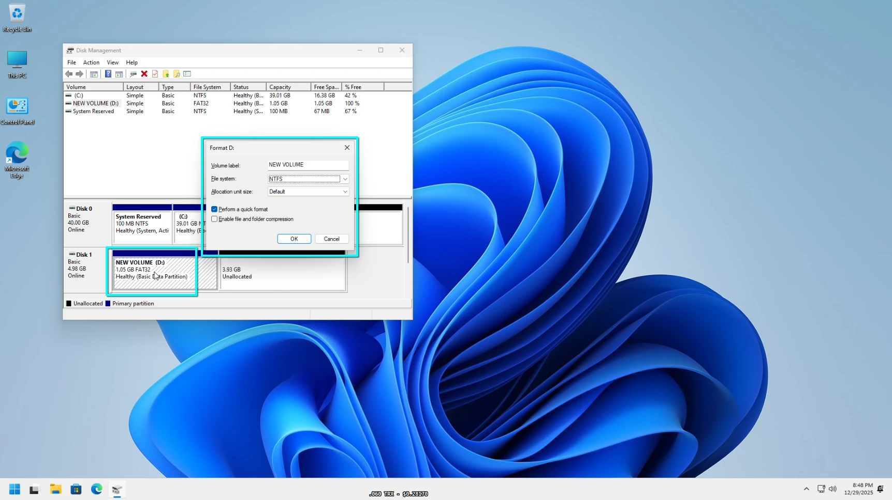
   *Figure 6: Choosing the file system and perform a quick format.*

4. **Changing Drive Letters**:
   - Right-click a volume and select **Change Drive Letter and Paths**.
   - Click **Change**, select a new letter from the list, and click **OK**.
   - Warning: Programs that rely on the old letter (like shortcuts or games) may stop working until you update their paths.

   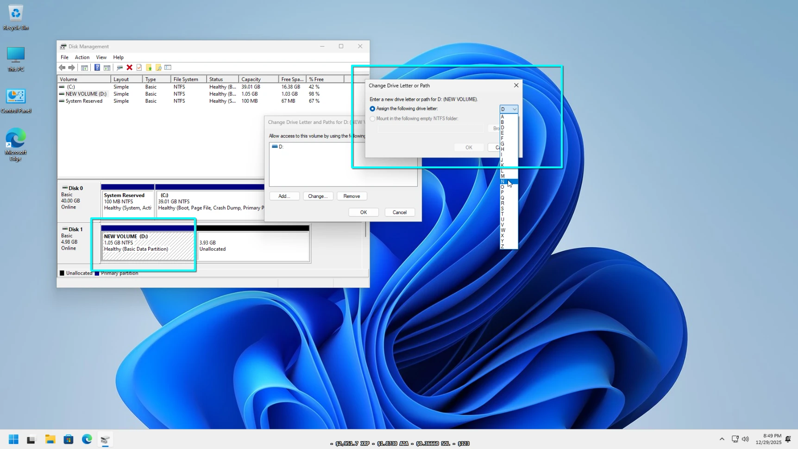
   *Figure 7: Reassigning a different drive letter to an existing volume.*

---

## Lab 8.3: Creating and Using Virtual Disks (VHD)

A virtual hard disk (VHD or VHDX) is a disk stored inside a single file. You can create one, format it, and even copy the file to a USB drive to carry your data between different Windows machines easily.

### Procedure

1. **Creating a VHD**:
   - In Disk Management, click the **Action** menu and select **Create VHD**.
   - Click **Browse** to choose where to save the file.
   - Set the size and select **VHDX** (more modern and resilient) and **Dynamically expanding** (only uses space as you add files).

   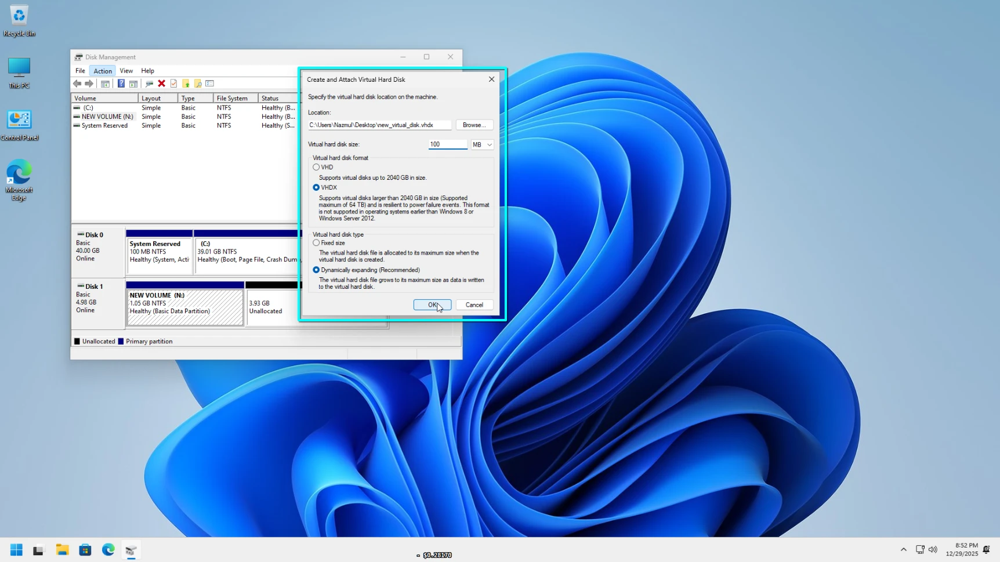
   *Figure 8: Setting the location, size, and format for a new virtual disk.*

2. **Initializing and Formatting**:
   - The VHD appears as a new disk at the bottom of Disk Management.
   - Right-click the disk name > **Initialize Disk**.
   - Right-click the unallocated space > **New Simple Volume**.

   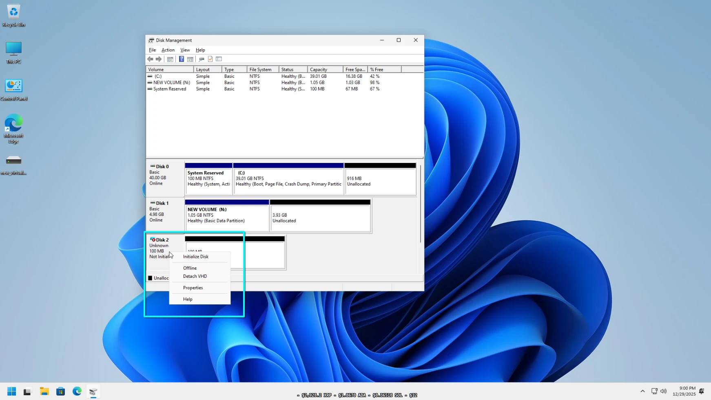
   *Figure 9: The virtual disk as it first appears, ready for initialization.*

3. **Using and Detaching**:
   - The VHD now acts like a physical drive in File Explorer.
   - To "remove" it, right-click the disk in Disk Management and select **Detach VHD**. The file remains on your PC, but the drive disappears from Explorer.

   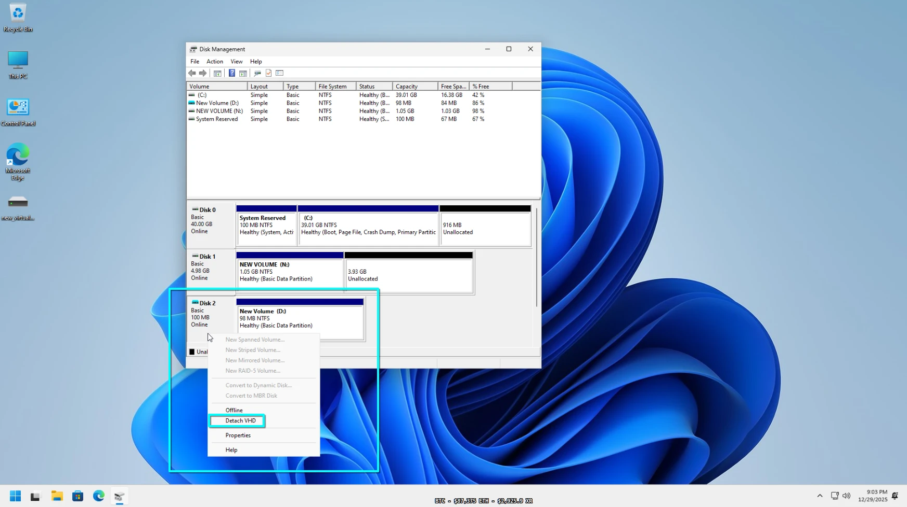
   *Figure 10: Detaching the VHD when it's no longer needed.*

4. **Attaching on Another PC**:
   - Copy the `.vhdx` file to a USB drive and plug it into another Windows PC.
   - In Disk Management, go to **Action > Attach VHD** and browse to the file on the USB.

---

## Lab 8.4: Creating a Mounted Folder

Instead of assigning a drive letter like D: or E:, you can mount a volume directly into an empty folder. This is useful if you're running out of letters or want to expand a folder's storage capacity transparently.

### Procedure

1. **Creating a Target Folder**:
   - Open File Explorer and create a new, empty folder on an NTFS drive (e.g., `C:\StorageExpansion`).

2. **Mounting the Volume**:
   - In Disk Management, right-click the volume you want to mount and select **Change Drive Letter and Paths**.
   - Click **Add**.
   - Select **Mount in the following empty NTFS folder** and click **Browse** to select the folder you just created.

   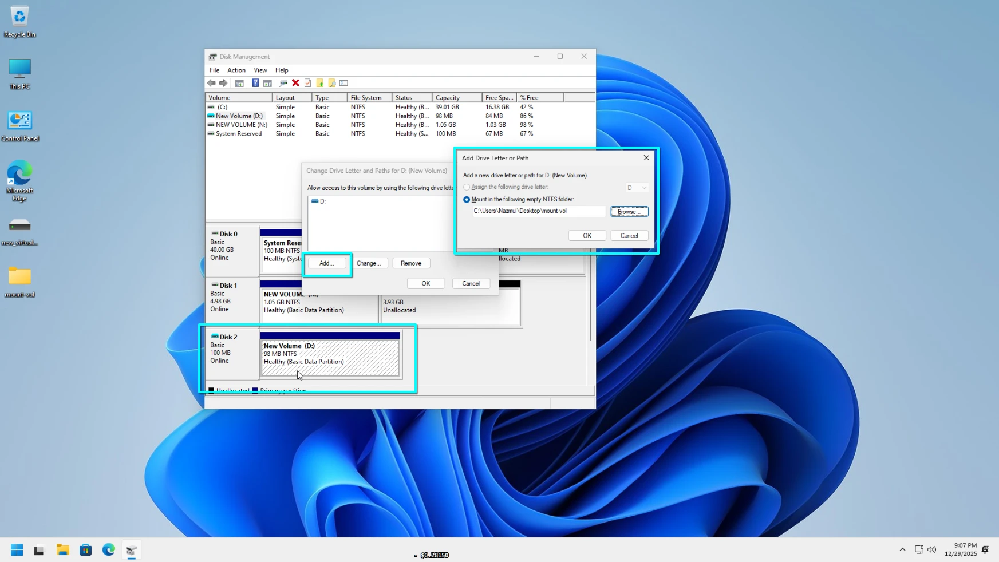
   *Figure 11: Mapping a volume to a folder path instead of a drive letter.*

3. **Verifying the Mount**:
   - Navigate to the folder in File Explorer. You'll notice the folder icon has a small drive overlay on it.
   - Files you save here are actually being stored on the secondary volume, even though the path looks like it's on your C: drive.

   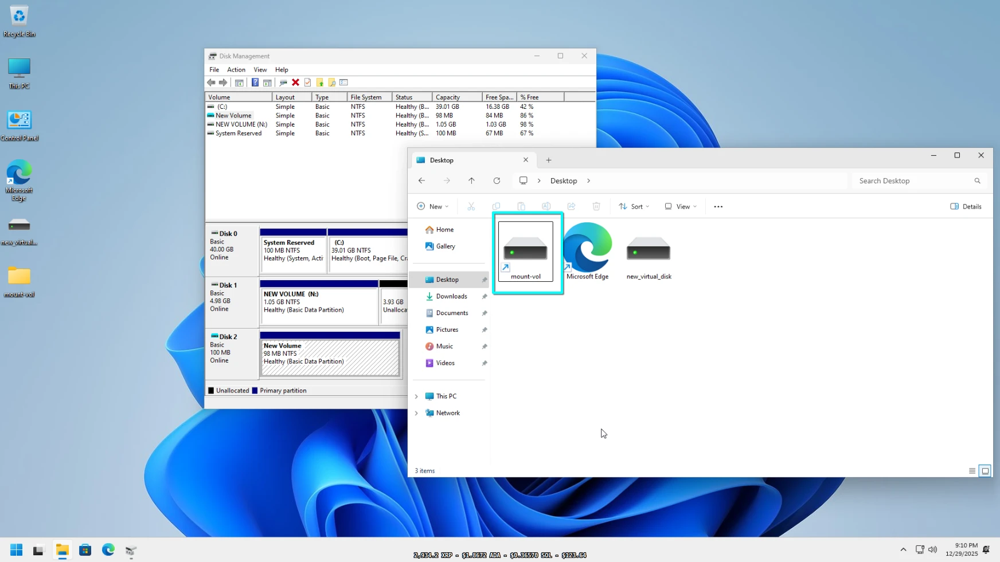
   *Figure 12: A mounted folder appearing in File Explorer with its unique icon.*

---

## Lab 8.5: Connecting and Using OneDrive

OneDrive is built into Windows 11 and syncs your files to the cloud. You get 5GB of free storage with a standard Microsoft account, allowing you to access your files from any device.

### Procedure

1. **Signing into OneDrive**:
   - Click the **OneDrive cloud icon** in the system tray (near the clock).
   - Enter your Microsoft account email and password.
   - Follow the prompts to finish the setup. Your OneDrive folder will be created at `C:\Users\[YourName]\OneDrive`.

   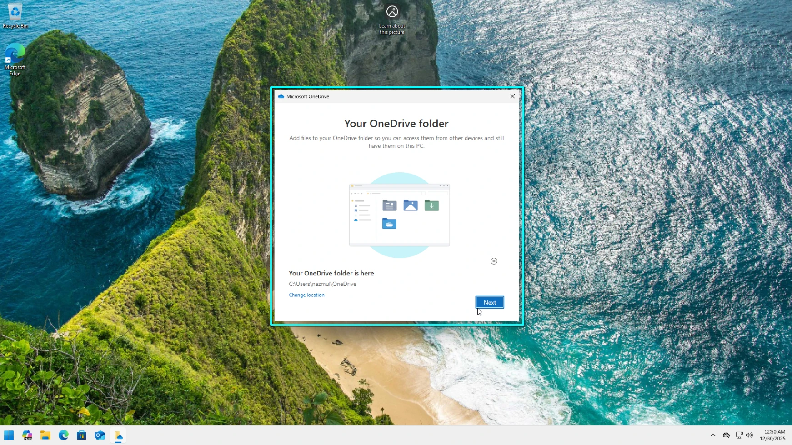
   *Figure 13: Starting the OneDrive setup process.*

2. **Managing Files On-Demand**:
   - Open your OneDrive folder in File Explorer. Notice the icons in the **Status** column:
     - **Blue cloud**: Online-only (doesn't take up space on your PC).
     - **Green checkmark**: Downloaded to your PC and available offline.
   - To save space, right-click a file or folder and select **Free up space**.
   - To ensure a file is always offline, right-click it and select **Always keep on this device**.

   
   *Figure 14: Understanding the various sync status icons in File Explorer.*

3. **Pausing Sync**:
   - If you're on a slow connection, click the OneDrive icon in the tray, click the **Settings** (gear), and select **Pause syncing**. You can pause for 2, 8, or 24 hours.

---

## Lab 8.6: Using Personal Vault for Secure Documents

Personal Vault is a protected folder within OneDrive that requires extra verification (like a PIN, fingerprint, or mobile code) to open. It automatically locks after a period of inactivity.

### Procedure

1. **Opening Personal Vault**:
   - Open your OneDrive folder and double-click the **Personal Vault** icon.
   - Follow the prompt to verify your identity. If it's your first time, Windows will guide you through the setup.

   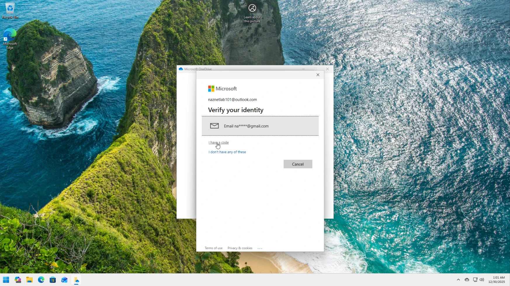
   *Figure 15: Verifying your identity to unlock the Personal Vault.*

2. **Adding Important Files**:
   - Move sensitive items like ID scans or tax documents into the vault.
   - They are encrypted and will stay hidden until you unlock the vault again.

3. **Locking the Vault Manually**:
   - Right-click the Personal Vault icon in OneDrive and select **Lock Personal Vault**.
   - Alternatively, click the OneDrive icon in the system tray and select **Lock Personal Vault**.

   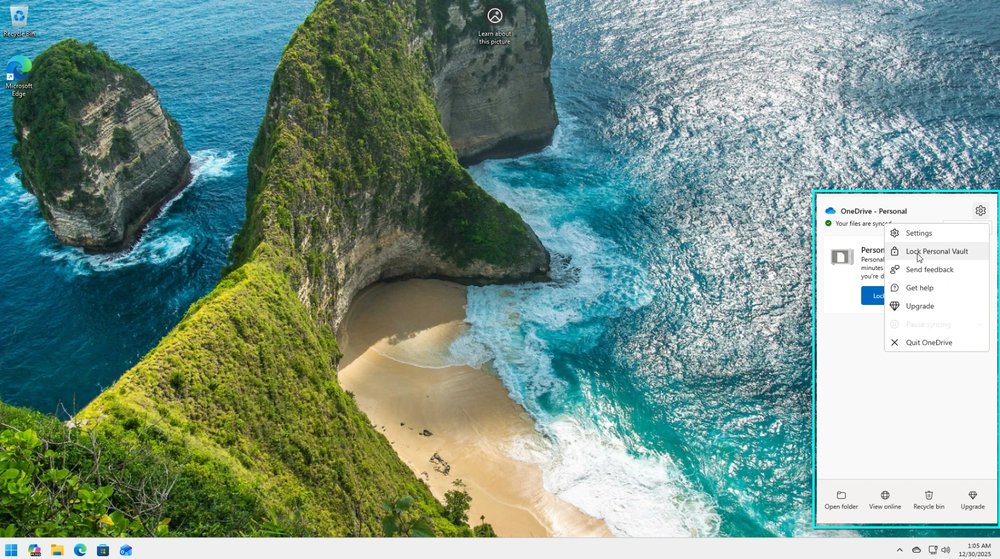
   *Figure 16: Manually locking your sensitive data.*

---

## Lab 8.7: Configuring Cloud Backup and Sync Folders

Windows can automatically back up your Desktop, Documents, and Pictures folders to OneDrive. This ensures your most important files are safe even if your PC fails.

### Procedure

1. **Accessing Backup Settings**:
   - Click the OneDrive icon in the tray, select the **Settings** gear, and go to **Sync and backup > Manage backup**.

   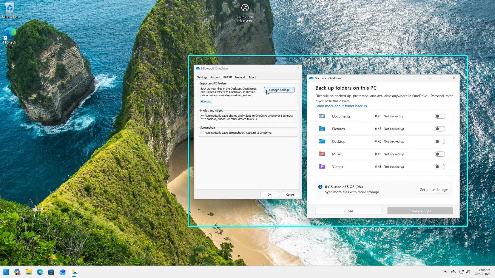
   *Figure 17: Accessing the backup configuration panel in OneDrive settings.*

2. **Choosing Folders to Sync**:
   - Toggle the switches for **Desktop**, **Documents**, and **Pictures**.
   - Click **Save changes**. These folders will now sync to the cloud automatically.

3. **Managing Device Sync**:
   - Go to **Settings > Accounts > Windows backup**. 
   - Turn on **Remember my apps** and **Remember my preferences** to keep your settings and app list synced across your different Windows PCs.

---

## Lab 8.8: Changing Default File Save Locations

If your main drive is small, you can tell Windows to save new apps, documents, and media to a secondary hard drive by default.

### Procedure

1. **Opening Storage Settings**:
   - Go to **Settings > System > Storage**.
   - Click **Advanced storage settings** and select **Where new content is saved**.

2. **Redirecting New Content**:
   - Use the dropdown menus to change the drive for new apps, documents, music, photos, and movies.
   - Click **Apply** after each change.

   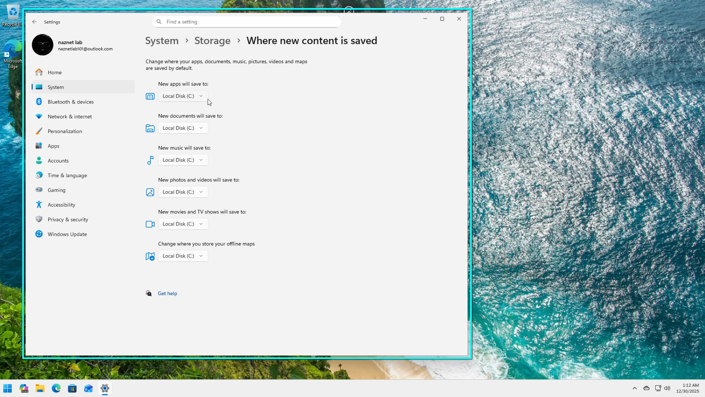
   *Figure 18: Changing default storage drives for various file types.*

3. **Moving Existing Folders**:
   - To move your existing Documents folder, open File Explorer and right-click **Documents** under "This PC."
   - Select **Properties**, go to the **Location** tab, and click **Move**.
   - Choose a folder on your secondary drive and click **Select Folder**. Windows will ask if you want to move all existing files there—click **Yes**.

---

## Lab 8.9: Managing Existing Disks and Storage Health

Maintaining your drives ensures your PC stays fast and your data remains safe. Windows includes built-in tools to clean up junk files and check for errors.

### Procedure

1. **Using Storage Sense**:
   - Go to **Settings > System > Storage > Storage Sense**.
   - Toggle it **On** to allow Windows to automatically delete temporary files and empty the Recycle Bin.
   - Click **Configure Storage Sense** to set how often it runs.

2. **Reviewing Cleanup Recommendations**:
   - In the Storage settings page, click **Cleanup recommendations**. 
   - Windows will list large files, unused apps, and temporary data you can safely delete to free up space.

   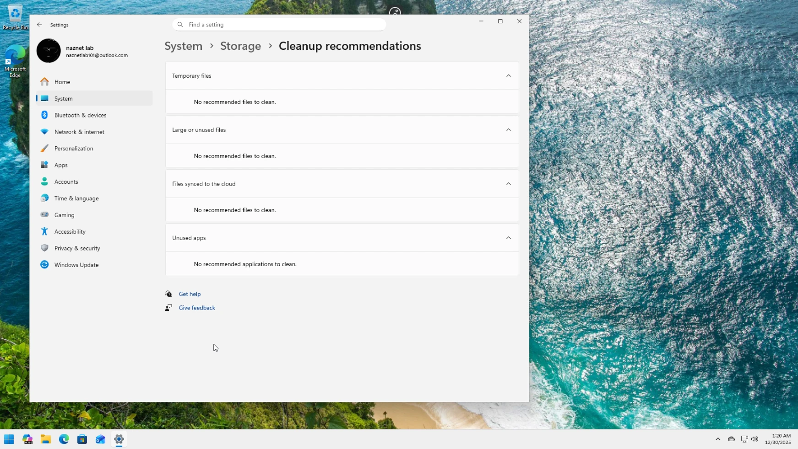
   *Figure 19: Freeing up space using Windows' built-in cleanup suggestions.*

3. **Optimizing and Defragmenting**:
   - Search for **Defragment and Optimize Drives** in the Start menu.
   - Select your drive and click **Optimize**. For SSDs, this runs a "re-trim" command; for HDDs, it defragments the files for faster access.

4. **Checking Disk Health**:
   - Right-click a drive in File Explorer and select **Properties**.
   - Go to the **Tools** tab and click **Check** under "Error checking." Windows will scan the drive for file system corruption.

   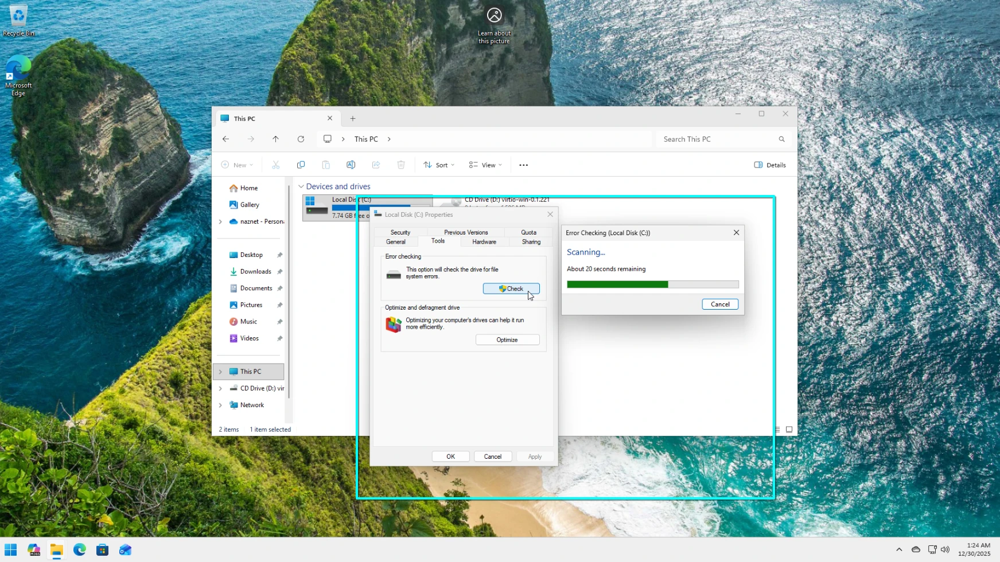
   *Figure 20: Initiating a manual check for drive errors.*
