# Chapter 10: Managing User Accounts, Passwords, and Credentials

Managing users in Windows 11 involves more than just creating a login. You must handle local accounts, secure sign-in options, and the permissions that protect data from unauthorized access. This chapter walks through the core administrative tasks for user security.

---

## Lab 10.1: Creating and Managing Local User Accounts

Windows 11 prioritizes Microsoft accounts, but local accounts remain essential for shared office PCs or offline workstations.

### Procedure

1. **Creating via Settings**:
   - Open **Settings** > **Accounts** > **Other users**.
   - Click **Add account**.
   - Select **I don't have this person's sign-in information** on the popup.
   - Choose **Add a user without a Microsoft account**.
   - Enter a username and password. You must set three security questions.
   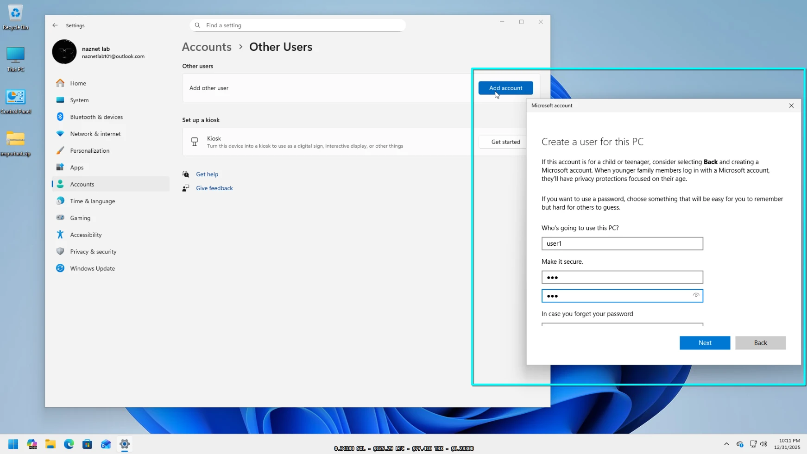
   *Figure 1: Navigating to the local account setup in Settings.*

2. **The "Non-Microsoft" choice**:
   - Avoid the prompts to use an email address. Always look for the "without a Microsoft account" link to proceed offline.
   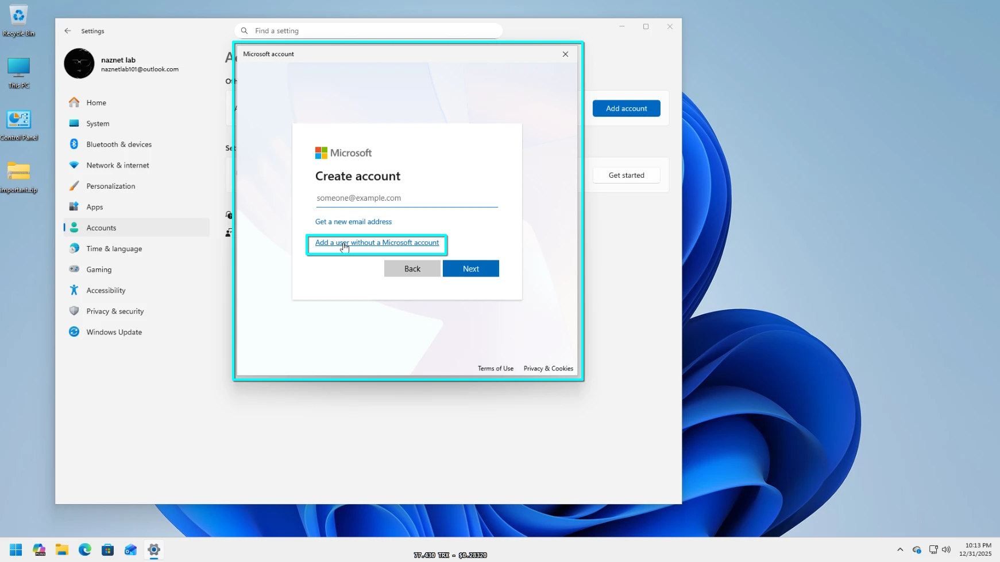
   *Figure 2: Selecting the offline account option.*

3. **Using Computer Management**:
   - Right-click Start > **Computer Management**.
   - Expand **Local Users and Groups** > **Users**.
   - Right-click in the list > **New User**.
   - Type the name and password. Uncheck **User must change password at next logon** to set a permanent password.
   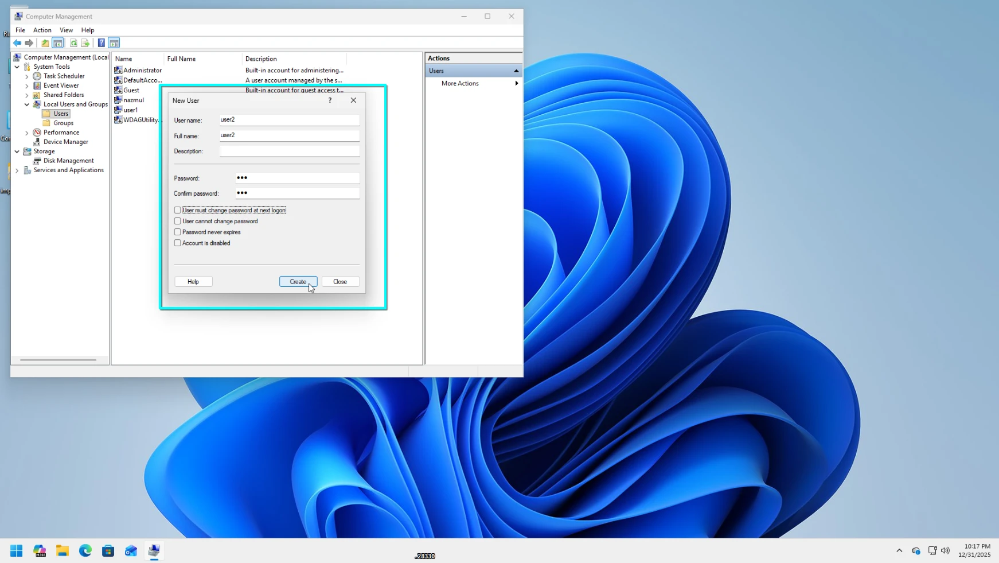
   *Figure 3: Creating a user via the classic administrative tool.*

4. **Deleting accounts**:
   - In Settings, select the user and click **Remove**.
   - Or, in Computer Management, right-click the user and select **Delete**.

---

## Lab 10.2: Managing Local Groups

Groups allow you to apply permissions to many users at once. Instead of editing folder security for multiple people individually, adding them to a group lets you grant access once.

### Procedure

1. **Viewing Default Groups**:
   - Open **Computer Management** > **Local Users and Groups** > **Groups**.
   - Note the default groups like **Administrators** (full control) and **Users** (standard limited access).
   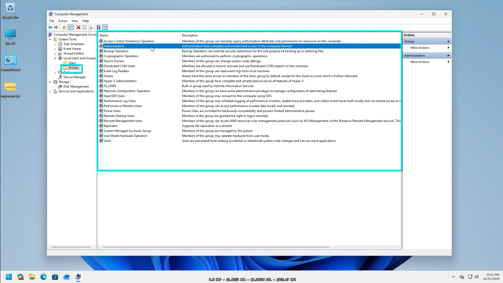
   *Figure 4: The built-in Windows security groups.*

2. **Creating a Custom Group**:
   - Right-click **Groups** > **New Group**.
   - Name it (e.g., "Project_Team"). 
   - Click **Add...** to include members immediately.
   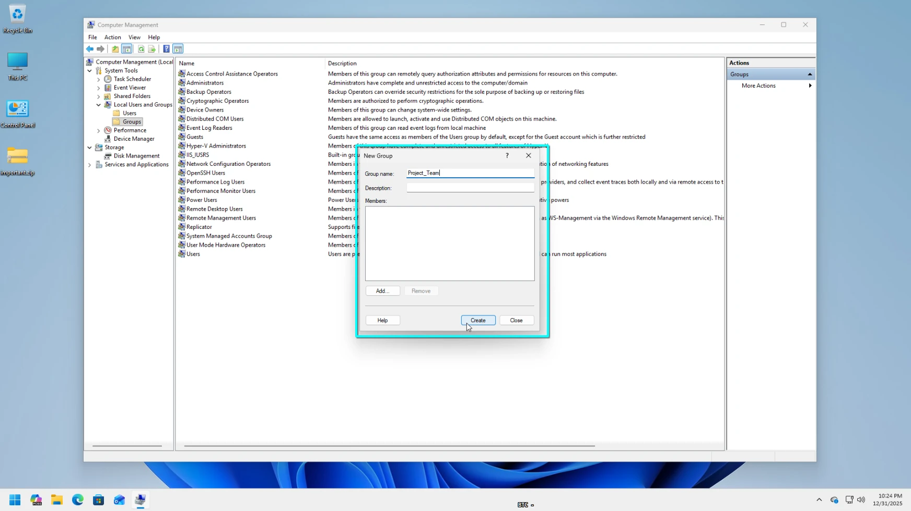
   *Figure 5: Setting up a custom group for file permissions.*

3. **Adding Users to Groups**:
   - Double-click an existing group > **Add...**.
   - Type the username and click **Check Names**. Click **OK**.
   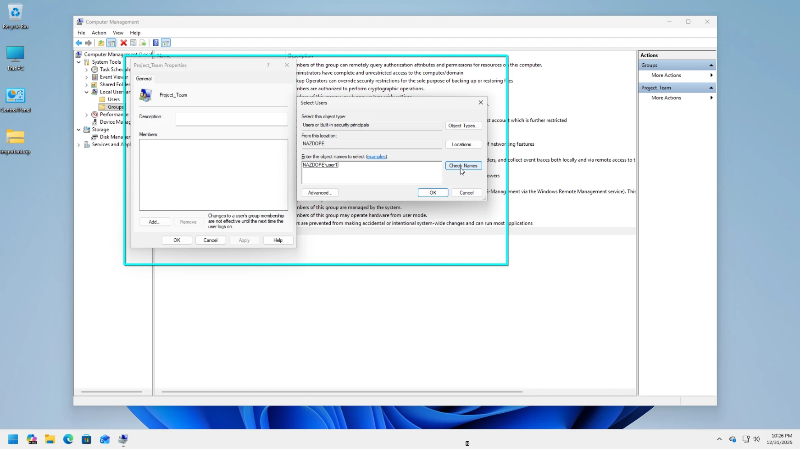
   *Figure 6: Inserting a user into a security group.*

---

## Lab 10.3: Changing Account Settings

You can rename local users, switch account types, or reset passwords when a user gets locked out.

### Procedure

1. **Changing Account Type**:
   - Go to **Settings** > **Accounts** > **Other users**.
   - Select the user > **Change account type**.
   - Switch between **Standard User** (limited) and **Administrator** (full power).
   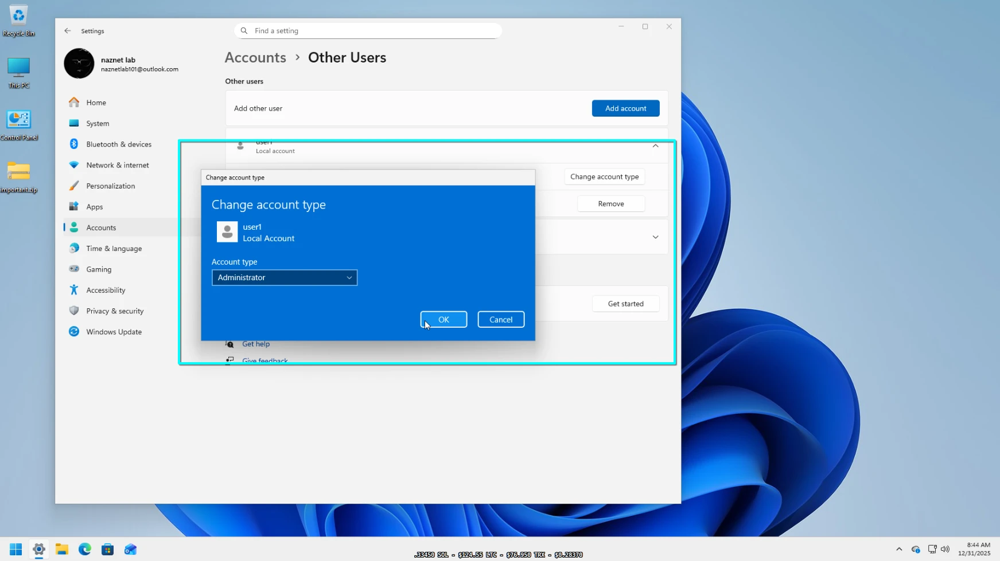
   *Figure 7: Elevating a user to administrator status.*

2. **Renaming a Local User**:
   - In **Computer Management** > **Users**, right-click the username > **Rename**.
   - Note: This only changes the login name, not the name of the user profile folder in `C:\Users`.

3. **Resetting Passwords**:
   - Right-click a user in Computer Management > **Set Password**.
   - Click **Proceed**.
   - **Warning**: Windows will warn you about data loss for EFS-encrypted files. If the user does not use filesystem encryption, this is safe.
   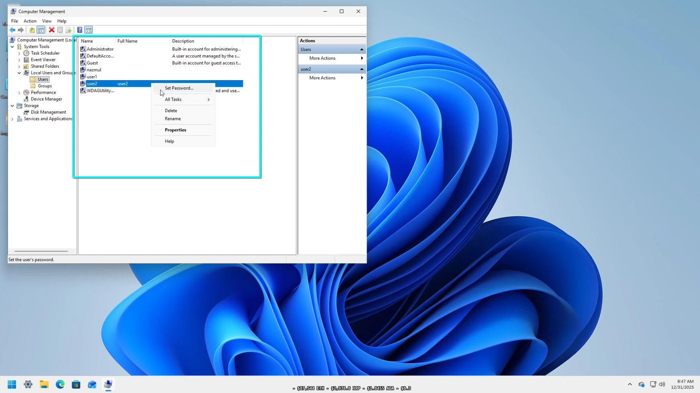
   *Figure 8: Forcing a password reset for a local account.*

---

## Lab 10.4: Setting Up Windows Hello Sign-In Options

Windows Hello is faster and more secure than traditional passwords because it ties your identity to the specific hardware device.

### Procedure

1. **Configuring a PIN**:
   - Go to **Settings** > **Accounts** > **Sign-in options**.
   - Select **PIN (Windows Hello)** > **Set up**.
   - Enter your account password first, then create a numeric PIN.
   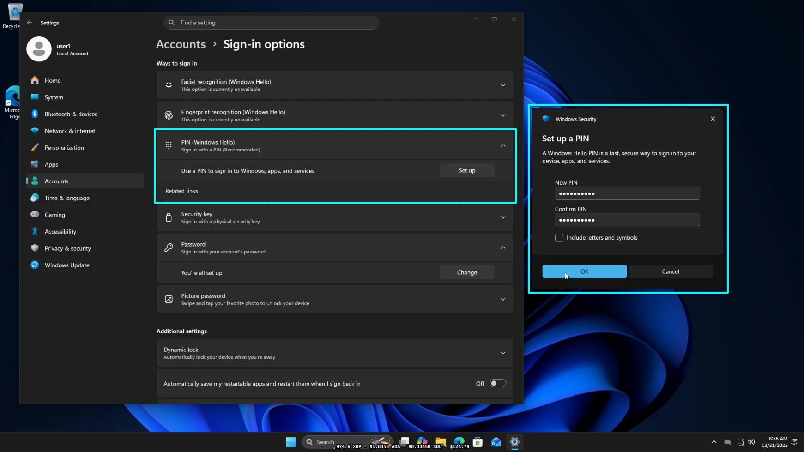
   *Figure 9: Creating a device-specific PIN.*

2. **Biometric Setup**:
   - If your PC has an IR camera or fingerprint reader, select those options.
   - Follow the prompts to scan your face or finger several times.
   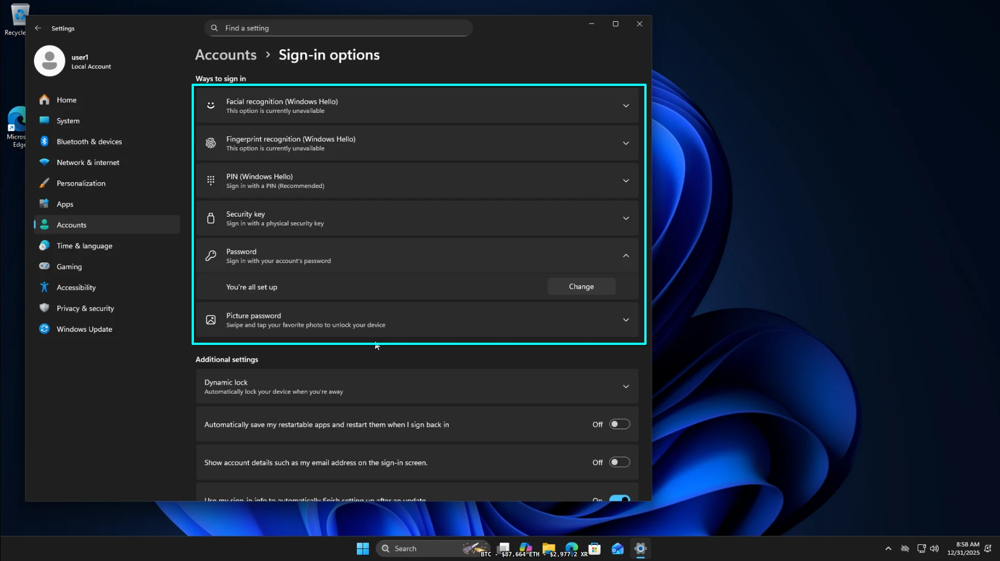
   *Figure 10: Overview of all available Windows Hello methods.*

3. **Picture Password**:
   - Select **Picture password** > **Add**.
   - Choose a photo and draw three gestures on it (lines, circles, or taps). 
   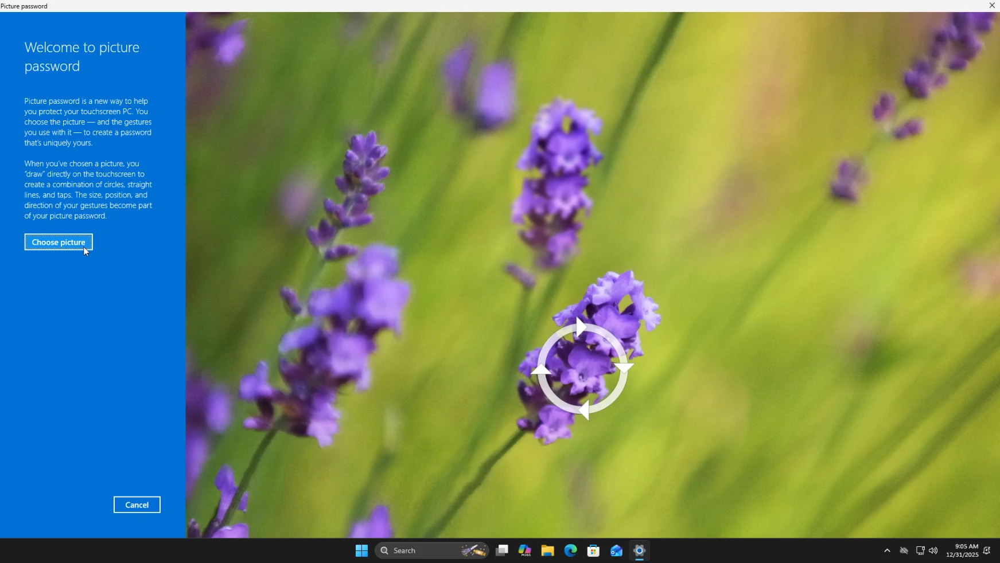
   *Figure 11: Setting up gestural login on a favorite image.*

---

## Lab 10.5: Setting or Changing Your Password

Even if you use a PIN, you must maintain a password as a fallback method.

### Procedure

1. **Changing via Settings**:
   - Select **Sign-in options** > **Password** > **Change**.
   - You need the current password to authorize the change.
   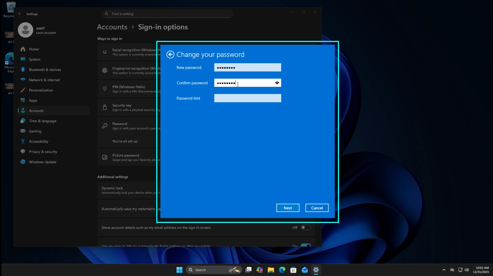
   *Figure 12: Updating your current login credentials.*

2. **The Classic Shortcut**:
   - Press **Ctrl + Alt + Del** and select **Change a password**.
   - This works instantly and is often faster than navigating through Settings.
   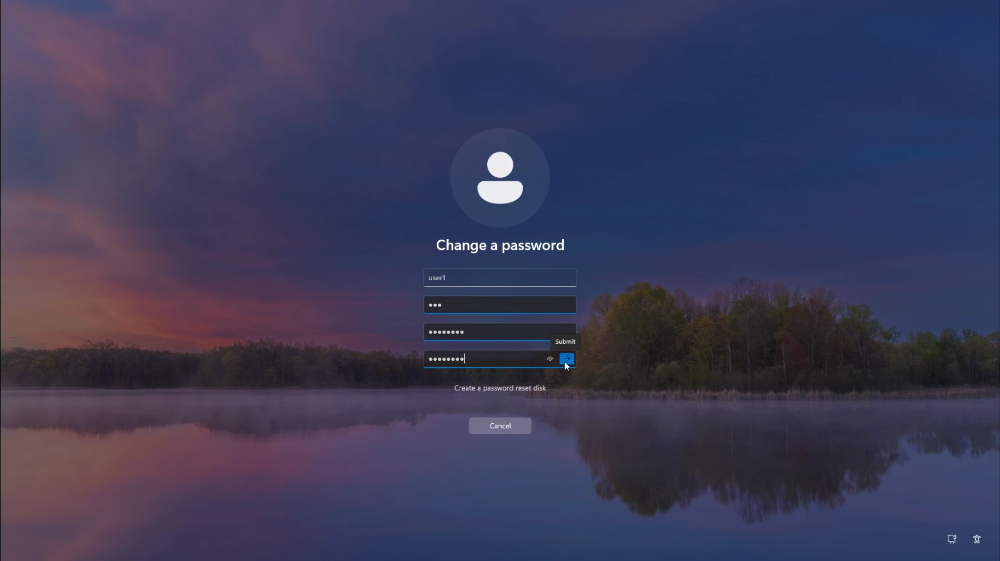
   *Figure 13: Using the secure attention sequence to change passwords.*

3. **Setting "Password Never Expires"**:
   - In **Computer Management** > **Users**, right-click your account > **Properties**.
   - Check **Password never expires**. This prevents forced password changes on personal PCs.
   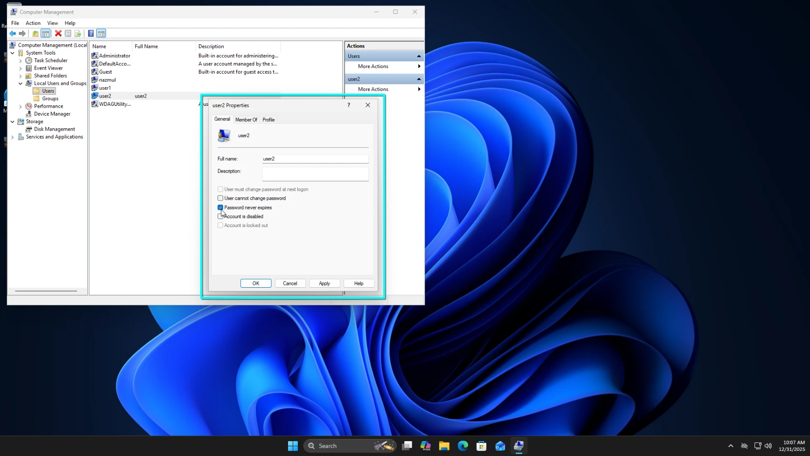
   *Figure 14: Disabling automatic password expiration.*

---

## Lab 10.6: Using Dynamic Lock

Dynamic Lock automatically locks your PC when you walk away, triggered by the Bluetooth signal of your phone.

### Procedure

1. **Pairing a Phone**:
   - Open **Settings** > **Bluetooth & devices**.
   - Click **Add device** and pair your smartphone.
   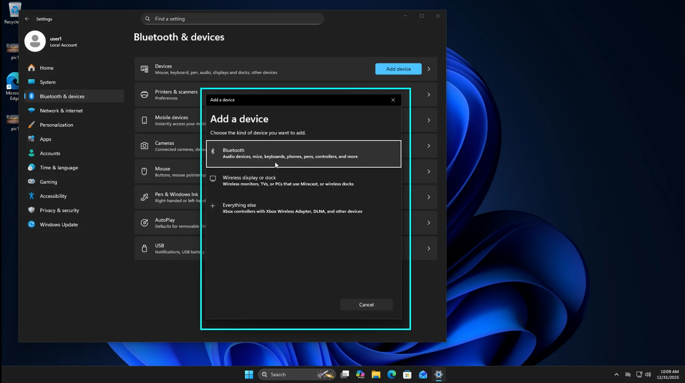
   *Figure 15: Pairing your mobile device with Windows.*

2. **Enabling the Lock**:
   - Return to **Sign-in options**.
   - Expand **Dynamic Lock** and check **Allow Windows to automatically lock your device when you're away**.
   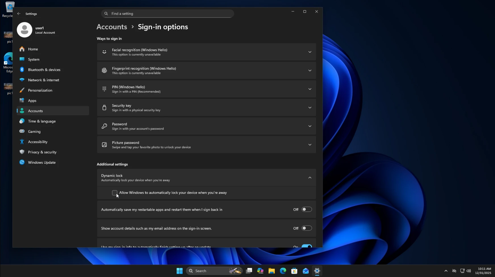
   *Figure 16: Activating the proximity lock feature.*

---

## Lab 10.7: Account Switching, Signing Out, and Locking

Locking keeps your apps running. Signing out closes everything. Switching users pauses your session while another person logs in.

### Procedure

1. **Locking the PC**:
   - Press **Win + L** to lock instantly.
   - Or open the **Start** menu, click the **Power** icon (bottom right), and select **Lock**.
   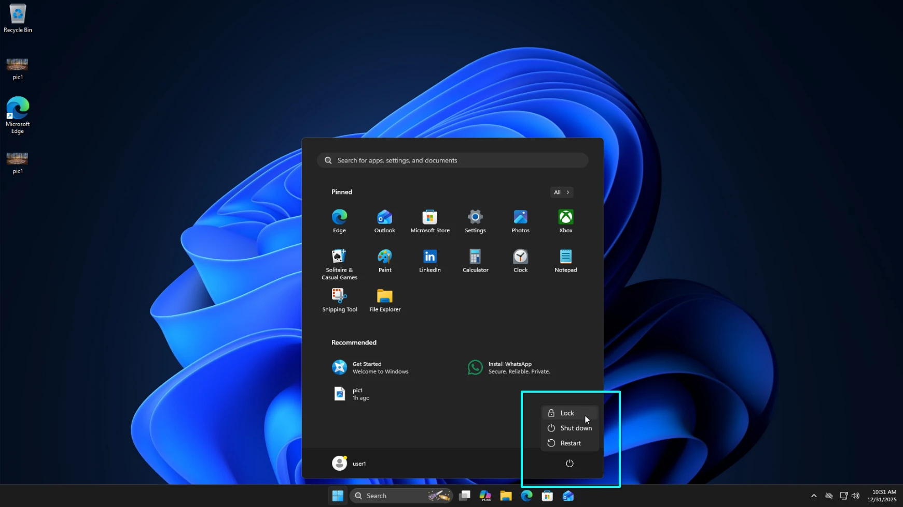
   *Figure 17: The Power menu shows Lock, Sleep, Shutdown, and Restart.*

2. **Signing Out or Switching Users**:
   - Open the **Start** menu and click your **user profile icon** (bottom left).
   - To sign out, select **Sign out**. All apps close.
   - To switch users, select another account from the list. Your session stays paused in the background.
   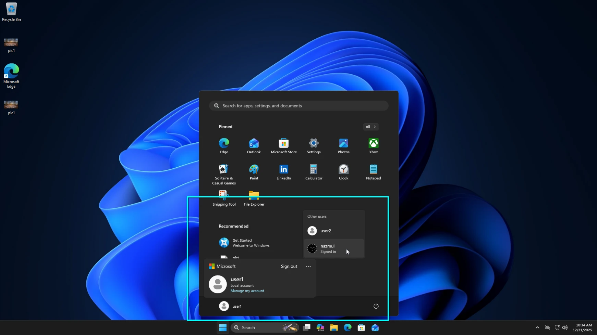
   *Figure 18: The user menu showing Sign out and available accounts.*

---

## Lab 10.8: Understanding NTFS and Share Permissions

NTFS permissions control local access. Share permissions control network access. When both apply, the most restrictive wins.

### Procedure

1. **Viewing NTFS Permissions**:
   - Right-click a folder > **Properties** > **Security** tab.
   - You'll see a list of users and groups with their assigned permissions.
   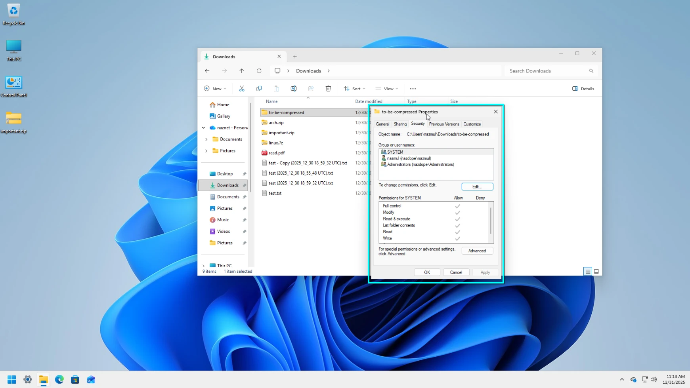
   *Figure 19: The Security tab showing current NTFS permissions.*

2. **Modifying NTFS Permissions**:
   - Click **Edit** to open the permissions dialog.
   - Click **Add** to include a new user. Type the name, click **Check Names**, then **OK**.
   - Check the boxes for **Read**, **Modify**, or **Full Control** as needed.
   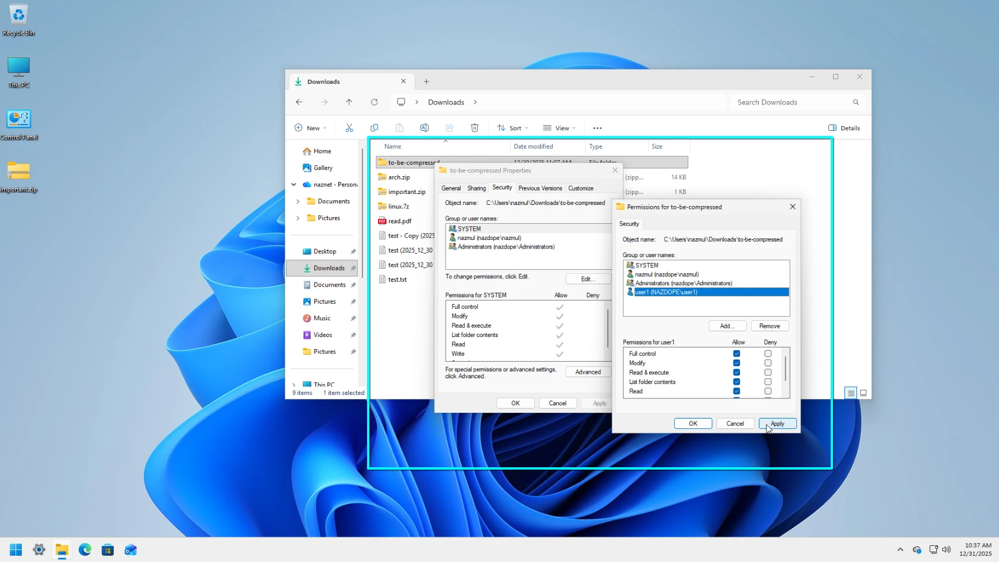
   *Figure 20: Editing NTFS permissions for a folder.*

3. **Sharing Over the Network**:
   - Go to **Properties** > **Sharing** tab > **Advanced Sharing**.
   - Check **Share this folder** and click **Permissions**.
   - Set Share permissions to **Everyone - Full Control** or **Change**. Use NTFS permissions (Security tab) to restrict actual access.
   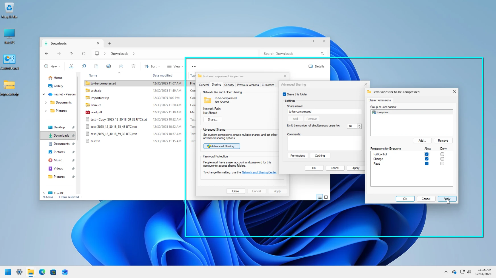
   *Figure 21: Configuring share permissions for network access.*

---

## Lab 10.9: Working with Security Identifiers (SIDs)

Windows uses SIDs (Security Identifiers) internally—not usernames. Every account has a unique SID.

### Procedure

1. **Finding Your SID**:
   - Open **Terminal** as Administrator.
   - Run: `whoami /user`
   - Your SID appears as a long string starting with `S-1-5-21-`.
   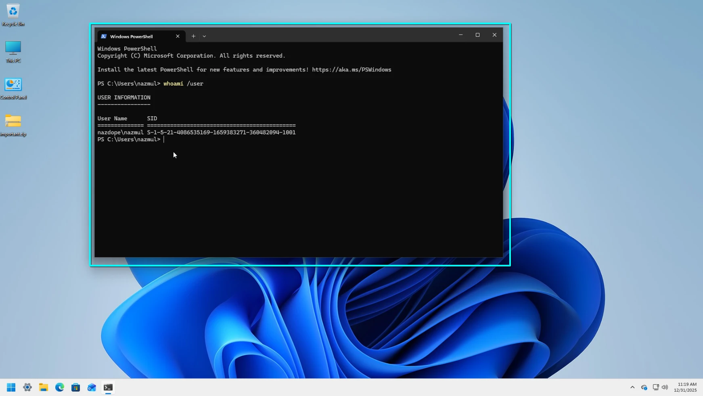
   *Figure 22: The whoami command showing your account SID.*

2. **Listing All User SIDs**:
   - Run: `Get-LocalUser | Select-Object Name, SID`
   - This displays every local account and its SID.
   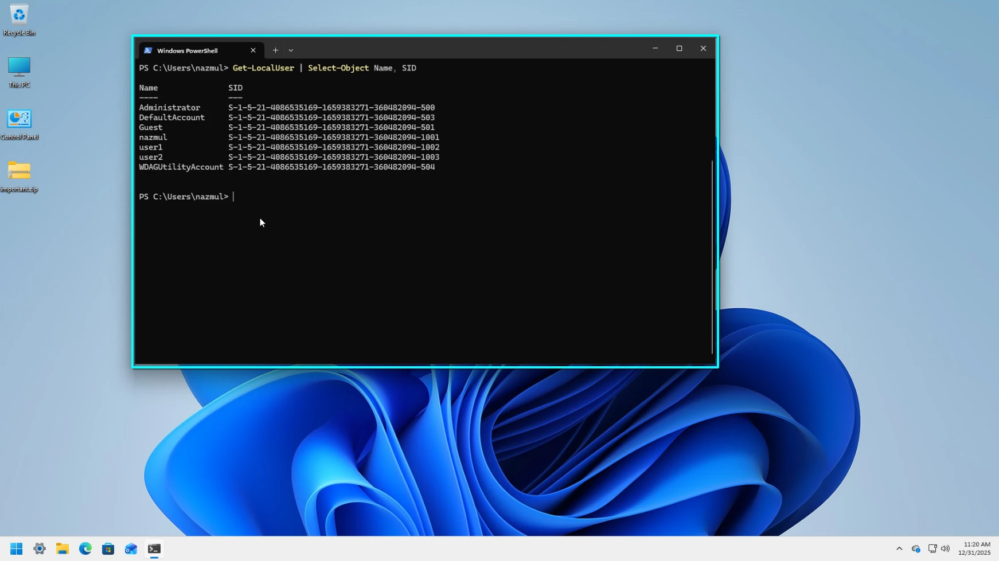
   *Figure 23: PowerShell listing all local users with their SIDs.*

---

## Lab 10.10: Customizing User Account Control (UAC)

UAC prompts you before system changes. Lower settings mean fewer prompts but weaker security.

### Procedure

1. **Opening UAC Settings**:
   - Search for **UAC** in Start > Select **Change User Account Control settings**.
   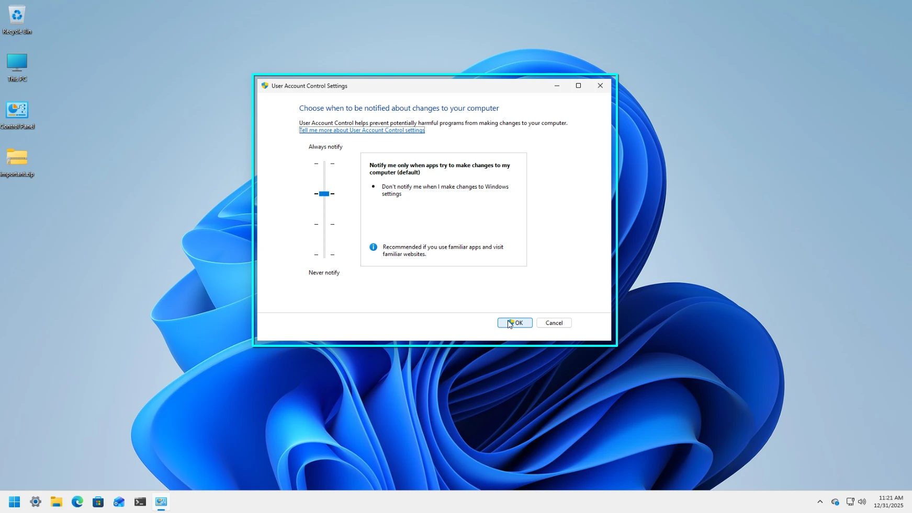
   *Figure 24: The UAC slider with four security levels.*

2. **Choosing a Level**:
   - **Always notify** (top): Most secure. Prompts for everything.
   - **Default** (second from top): Prompts when apps make changes.
   - **Never notify** (bottom): No prompts. Not recommended.
   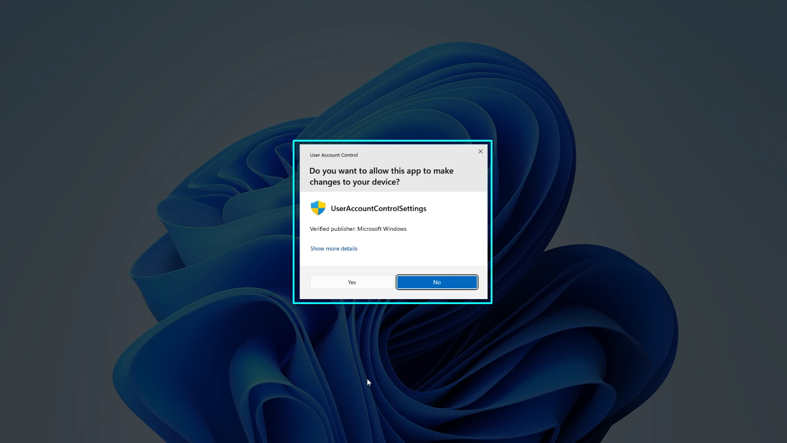
   *Figure 25: A UAC prompt asking for permission.*

---

## Lab 10.11: Setting Up Kiosk Mode

Kiosk mode locks a PC to a single app—useful for public terminals.

> **Note**: Requires Windows 11 Pro, Enterprise, or Education.

### Procedure

1. **Creating a Kiosk**:
   - Go to **Settings** > **Accounts** > **Other users**.
   - Click **Set up a kiosk** > **Get started**.
   - Create a name for the kiosk account.
   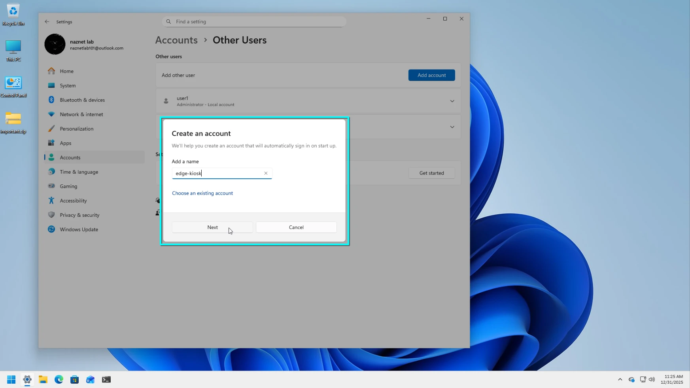
   *Figure 26: Starting the kiosk configuration wizard.*

2. **Selecting the App**:
   - Choose a Microsoft Store app (e.g., Microsoft Edge).
   - For Edge, you can set a specific URL to open automatically.
   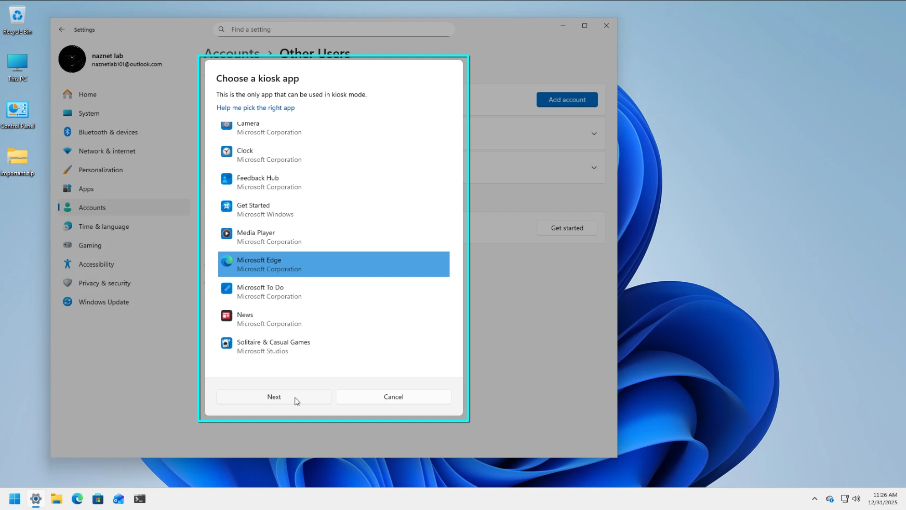
   *Figure 27: Choosing which app runs in kiosk mode.*

3. **Using and Exiting Kiosk Mode**:
   - Sign in as the kiosk user. Only the selected app runs.
   - To exit, press **Ctrl + Alt + Del** and sign out.
   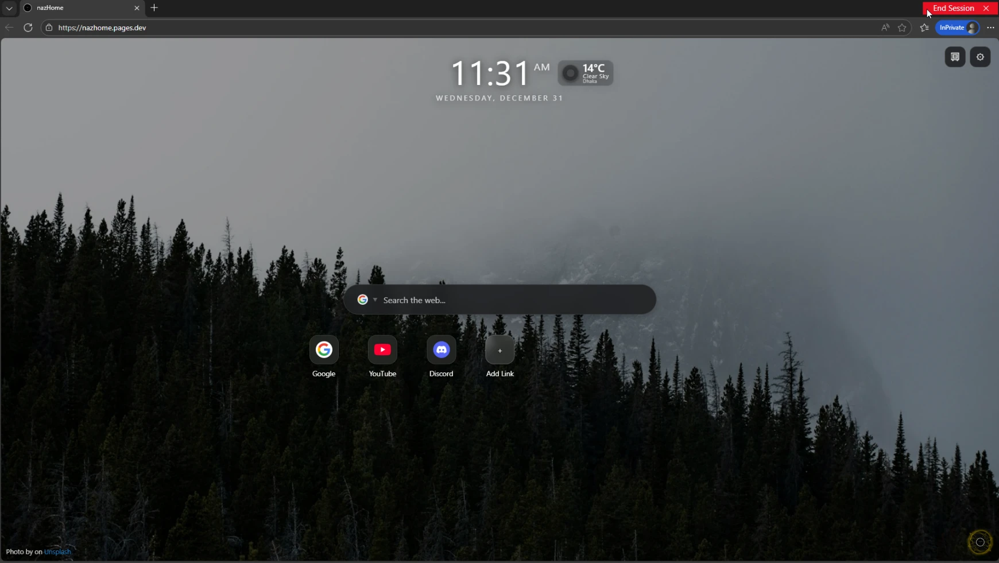
   *Figure 28: A PC running in kiosk mode.*

---

## Lab 10.12: Using Physical Security Keys

A FIDO2 security key (like YubiKey) provides phishing-resistant sign-in. You must physically possess the key.

### Procedure

1. **Adding a Security Key**:
   - Go to **Settings** > **Accounts** > **Sign-in options**.
   - Select **Security key** > **Manage**.
   - Insert the key and follow the prompts to set a PIN for the key.
   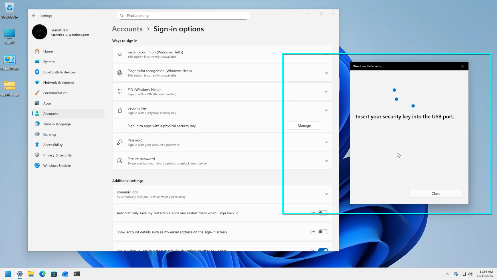
   *Figure 29: The security key management section.*

2. **Signing In with the Key**:
   - On the lock screen, click **Sign-in options** and select the key icon.
   - Insert your key and enter its PIN.
