# Chapter 11: Configuring Windows Networks

Networking in Windows 11 goes beyond just connecting to Wi-Fi. This chapter covers how to check your connection status, use diagnostic tools, set up Remote Desktop access, and share files and printers across your local network.

---

## Lab 11.1: Checking the Status of Your Network

Before troubleshooting connectivity problems, you need to know your current network state: IP address, connection type, and whether you can actually reach the internet.

### Procedure

1. **Viewing Network Status in Settings**:
   - Open **Settings** > **Network & internet**.
   - The top of the page shows your connection type (Ethernet or Wi-Fi) and status.
   - Click **Properties** under your active connection to see IP address, DNS servers, and gateway.
   <figure>
    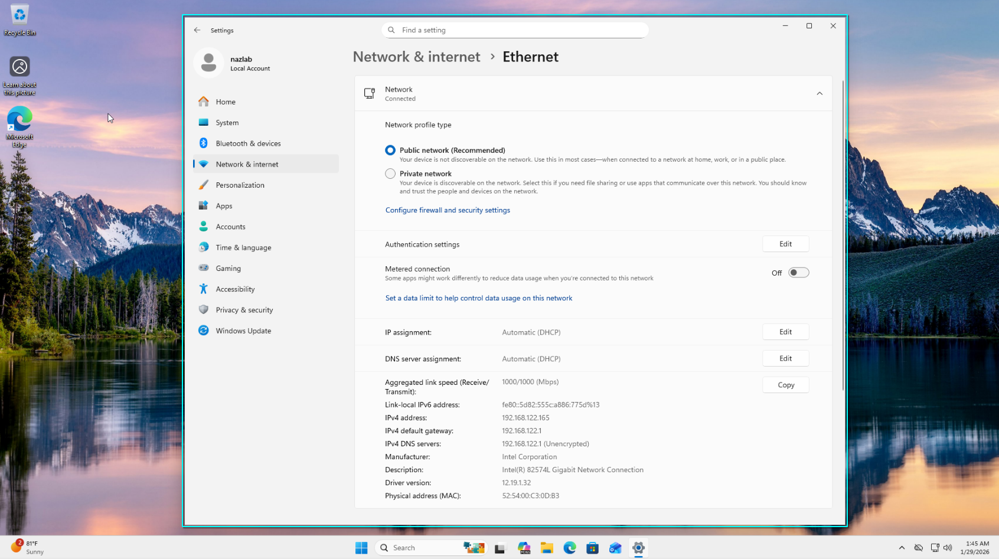
    <figcaption align="left"><i>Figure 1: The Network & internet page showing connection status.</i></figcaption>
   </figure>

2. **Using the Quick Settings Panel**:
   - Click the network/volume/battery icons in the taskbar (bottom right).
   - The panel shows your connected network at a glance.
   - Click the arrow next to Wi-Fi to see available networks.
   <figure>
    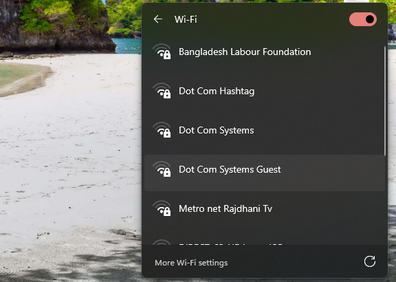
    <figcaption align="left"><i>Figure 2: Quick Settings showing current network connection.</i></figcaption>
   </figure>

3. **Checking Details with ipconfig**:
   - Open **Terminal** (right-click Start > Terminal).
   - Run `ipconfig` for basic adapter info.
   - Run `ipconfig /all` for full details including DHCP server, lease times, and MAC address.
   <figure>
    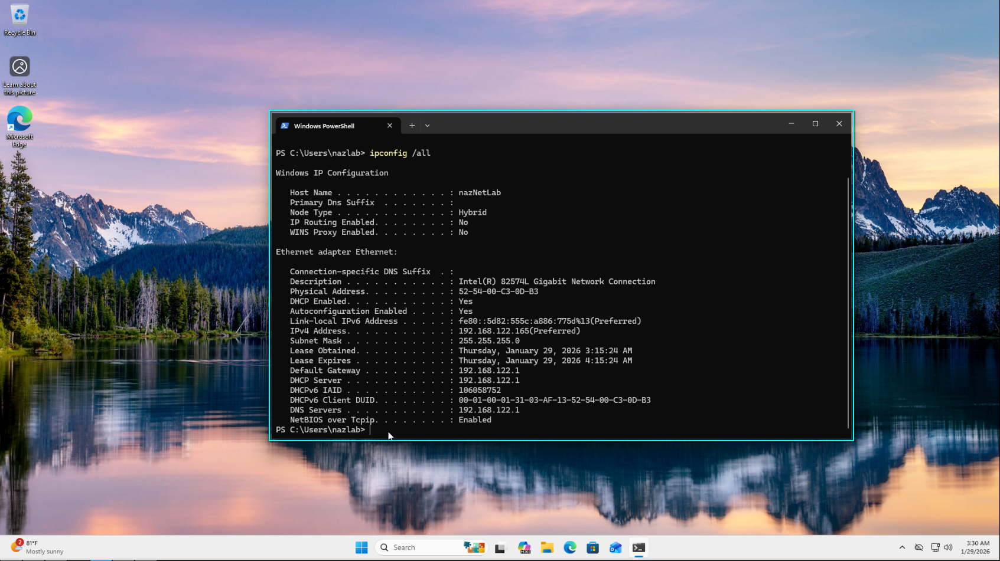
    <figcaption align="left"><i>Figure 3: The ipconfig /all command showing detailed network configuration.</i></figcaption>
   </figure>

4. **Testing Connectivity with ping**:
   - Run `ping 192.168.1.1` (replace with your gateway) to test local network.
   - Run `ping 8.8.8.8` to test internet connectivity.
   - If local ping works but external fails, the problem is likely your router or ISP.
   <figure>
    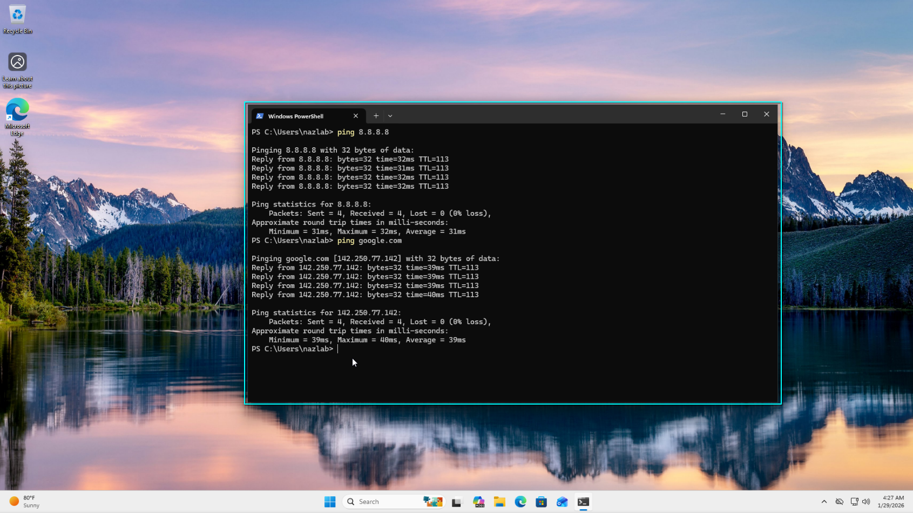
    <figcaption align="left"><i>Figure 4: Successful ping responses confirming network connectivity.</i></figcaption>
   </figure>

---

## Lab 11.2: Using Network Management Tools

Settings covers the basics, but Windows includes several tools for deeper network diagnostics and configuration.

### Procedure

1. **Opening Network Connections**:
   - Press **Win + R**, type `ncpa.cpl`, press Enter.
   - This opens the classic Network Connections window showing all adapters.
   - Right-click any adapter to disable, enable, or view status.
   <figure>
    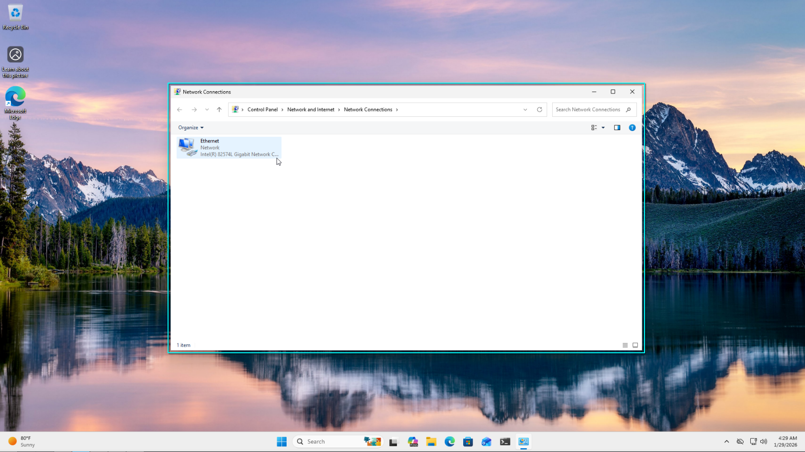
    <figcaption align="left"><i>Figure 5: The Network Connections window with available adapters.</i></figcaption>
   </figure>

2. **Viewing Adapter Properties**:
   - Right-click an adapter > **Properties**.
   - You'll see installed protocols: Client for Microsoft Networks, File and Printer Sharing, Internet Protocol Version 4/6.
   - Select "Internet Protocol Version 4" and click **Properties** to set a static IP.
   <figure>
    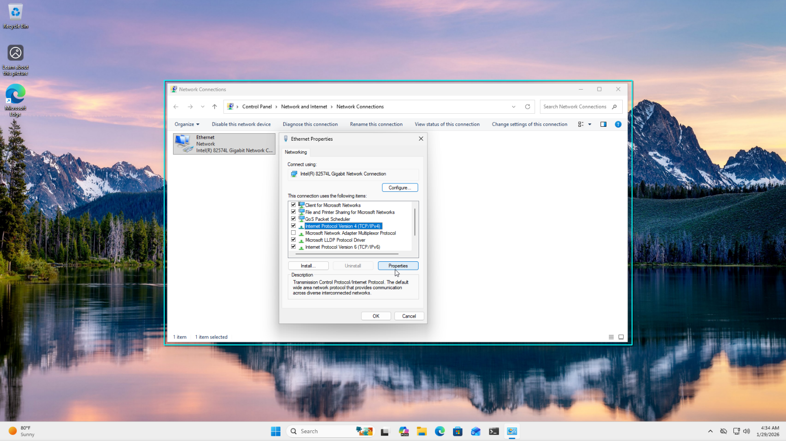
    <figcaption align="left"><i>Figure 6: Network adapter properties showing installed components.</i></figcaption>
   </figure>

3. **Configuring a Static IP**:
   - In the IPv4 Properties dialog, select "Use the following IP address."
   - Enter IP address, subnet mask (usually 255.255.255.0), and default gateway.
   - Set preferred DNS server (e.g., 8.8.8.8 for Google DNS).
   <figure>
    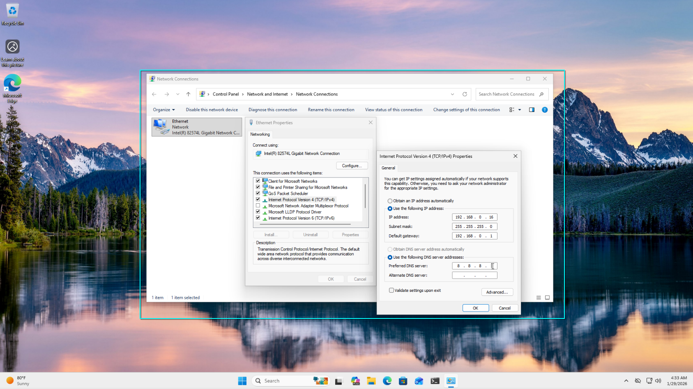
    <figcaption align="left"><i>Figure 7: Setting a static IP address manually.</i></figcaption>
   </figure>

4. **Network Reset**:
   - When nothing else works, reset all network components.
   - Go to **Settings** > **Network & internet** > **Advanced network settings**.
   - Click **Network reset** > **Reset now**. Your PC will restart.
   - This removes and reinstalls all adapters and resets settings to defaults.
   <figure>
    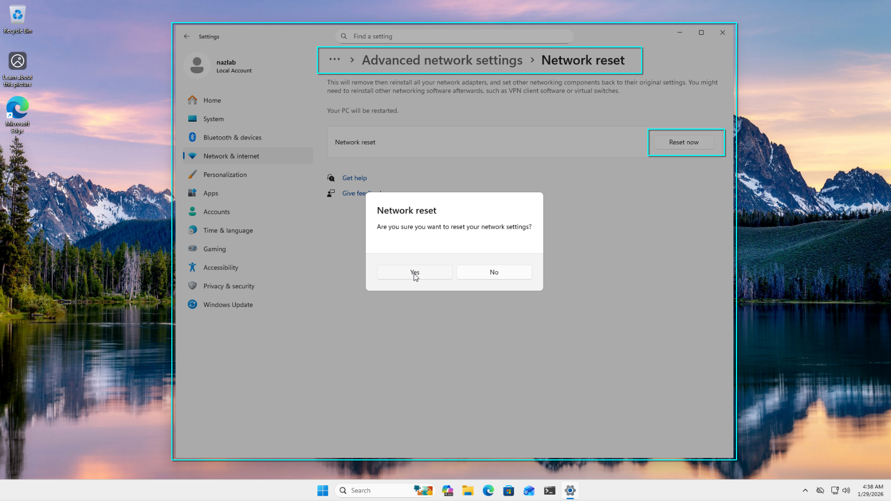
    <figcaption align="left"><i>Figure 8: The Network reset option for complete network troubleshooting.</i></figcaption>
   </figure>

---

## Lab 11.3: Configuring Remote Desktop

Remote Desktop lets you control your PC from anywhere over the network. You can access your work computer from home or help a family member fix their PC.

> **Note**: Hosting Remote Desktop requires Windows 11 Pro, Enterprise, or Education. The client app works on all editions (and even on phones and Macs).

### Procedure

1. **Enabling Remote Desktop**:
   - Go to **Settings** > **System** > **Remote Desktop**.
   - Toggle **Remote Desktop** to **On**.
   - Click **Confirm** when prompted about the security warning.
   <figure>
    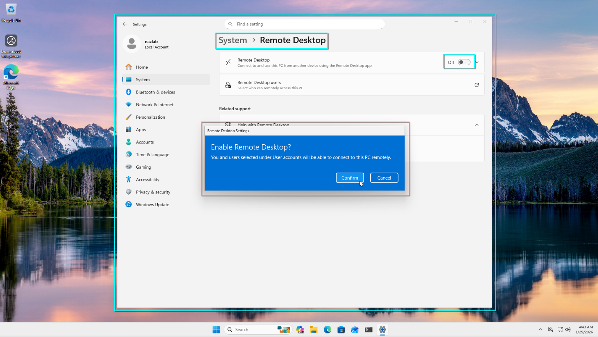
    <figcaption align="left"><i>Figure 9: Enabling Remote Desktop in Settings.</i></figcaption>
   </figure>

2. **Configuring Access**:
   - Note the **PC name** shown; you'll need this to connect.
   - Click **Remote Desktop users** to add users who can connect (Administrators can connect by default).
   - Keep "Require devices to use Network Level Authentication" checked for security.
   <figure>
    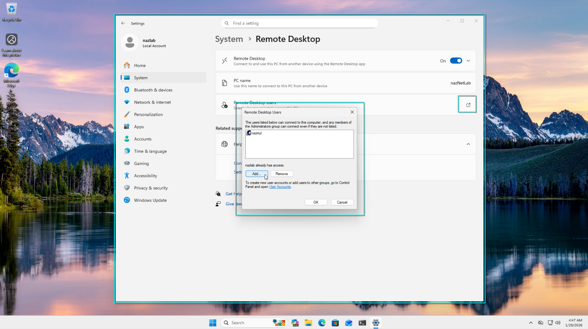
    <figcaption align="left"><i>Figure 10: Adding users who can access this PC remotely.</i></figcaption>
   </figure>

3. **Connecting from Another PC**:
   - On the remote PC, search for "Remote Desktop Connection" in Start.
   - Enter the target PC name or IP address.
   - Click **Connect**, then enter the username and password of an account on the host PC.
   <figure>
    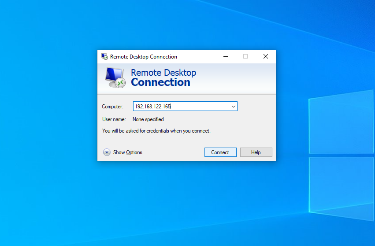
    <figcaption align="left"><i>Figure 11: The Remote Desktop Connection app ready to connect.</i></figcaption>
   </figure>

4. **Adjusting Connection Settings**:
   - Before connecting, click **Show Options** to expand settings.
   - Under **Display**, adjust resolution and color depth.
   - Under **Local Resources**, choose which local devices to share (clipboard, printers, drives).
   <figure>
    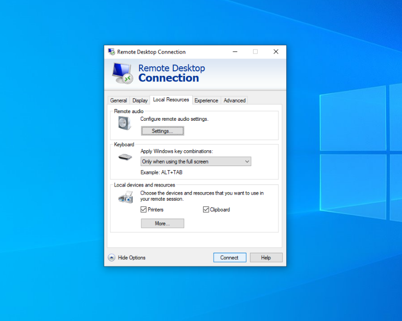
    <figcaption align="left"><i>Figure 12: Display and resource options for the remote session.</i></figcaption>
   </figure>

---

## Lab 11.4: Sharing Files and Folders

Sharing folders on your network lets colleagues or family members access files directly, so no USB drives or cloud uploads needed.

### Procedure

1. **Enabling Network Discovery and Sharing**:
   - Open **Settings** > **Network & internet** > **Advanced network settings**.
   - Click **Advanced sharing settings**.
   - For your current network profile (Private or Public), turn on:
     - **Network discovery**
     - **File and printer sharing**
   <figure>
    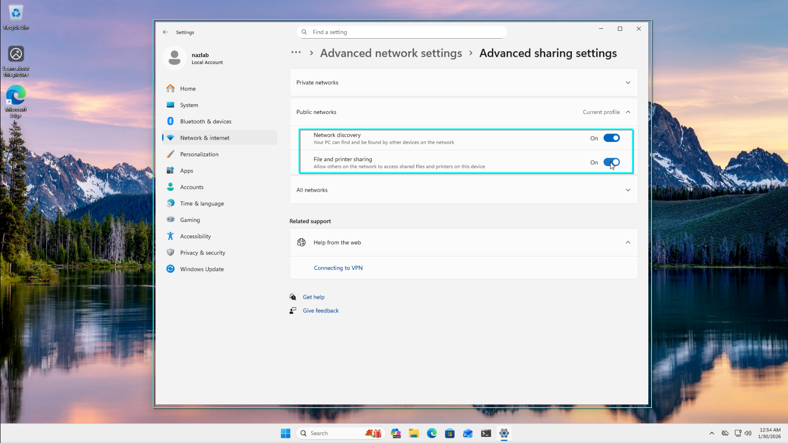
    <figcaption align="left"><i>Figure 13: Enabling network discovery and file sharing.</i></figcaption>
   </figure>

2. **Sharing a Folder**:
   - Right-click the folder you want to share > **Properties** > **Sharing** tab.
   - Click **Share...** to open the simple sharing dialog.
   - Type a username or select from the dropdown, then click **Add**.
   - Set permission level: **Read** (view only) or **Read/Write** (full access).
   - Click **Share**.
   <figure>
    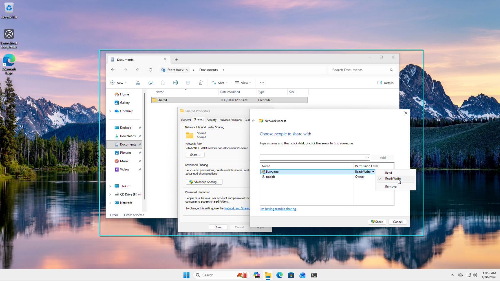
    <figcaption align="left"><i>Figure 14: Adding users and setting permissions for a shared folder.</i></figcaption>
   </figure>

3. **Using Advanced Sharing**:
   - In the Sharing tab, click **Advanced Sharing**.
   - Check **Share this folder**.
   - Set a share name (this is what others see on the network).
   - Click **Permissions** to set share-level access (usually Everyone: Read or Change).
   - Use the Security tab for granular NTFS permissions.
   <figure>
    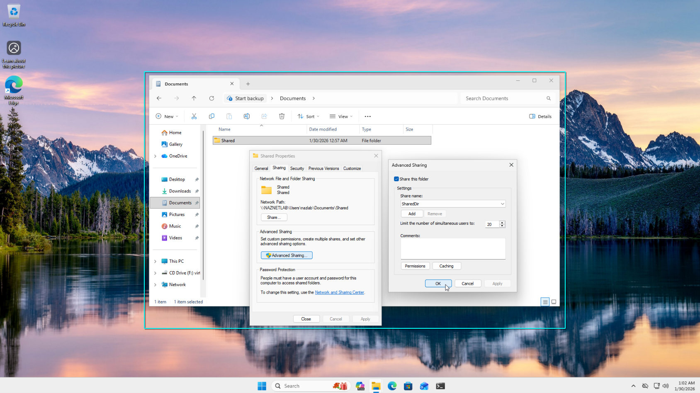
    <figcaption align="left"><i>Figure 15: Advanced Sharing options for custom share names.</i></figcaption>
   </figure>

4. **Accessing Shared Folders**:
   - On another PC, open File Explorer.
   - In the address bar, type `\\ComputerName` (e.g., `\\DESKTOP-ABC123`) or the IP address (e.g., `\\192.168.1.15`).
   - Press Enter to browse all shared folders on that PC.
   - Double-click a folder to open it; you may be prompted for credentials.
   <figure>
    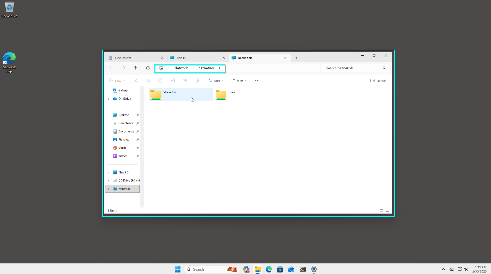
    <figcaption align="left"><i>Figure 16: Browsing shared folders on a network PC.</i></figcaption>
   </figure>

---

## Lab 11.5: Mapping Network Folders as Drives

Mapping a network folder to a drive letter (like Z:) makes it appear alongside your local drives in File Explorer.

### Procedure

1. **Mapping via File Explorer**:
   - Open File Explorer.
   - Click the **...** menu in the toolbar > **Map network drive**.
   - Choose a drive letter from the dropdown.
   - Enter the folder path: `\\ComputerName\ShareName` or `\\IPAddress\ShareName`
   - Check **Reconnect at sign-in** to make it persistent.
   - Click **Finish**.
   <figure>
    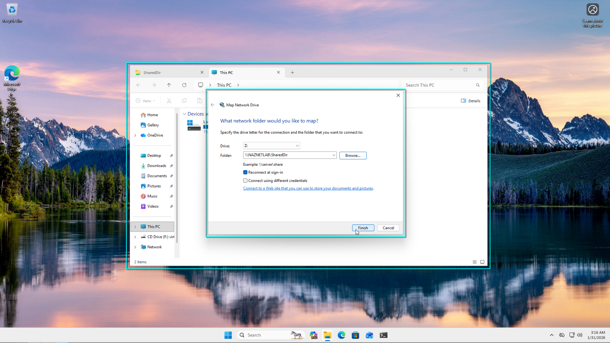
    <figcaption align="left"><i>Figure 17: The Map Network Drive dialog in File Explorer.</i></figcaption>
   </figure>

2. **Verifying the Mapped Drive**:
   - Open **This PC** in File Explorer.
   - The mapped drive appears under "Network locations."
   - Double-click to access files just like a local drive.
   <figure>
    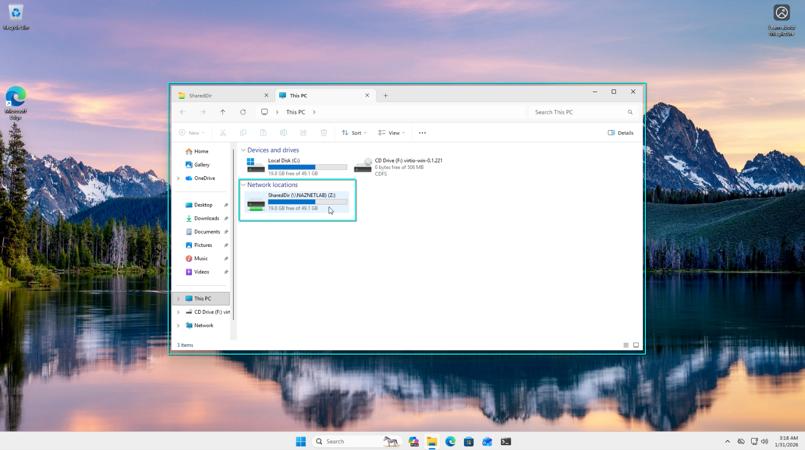
    <figcaption align="left"><i>Figure 18: A mapped network drive appearing in This PC.</i></figcaption>
   </figure>

3. **Mapping via Command Line**:
   - Open **Terminal**.
   - Run: `net use Z: \\ComputerName\ShareName` or `net use Z: \\192.168.1.15\ShareName`
   - Add `/persistent:yes` to reconnect after reboot.
   - To disconnect: `net use Z: /delete`
   <figure>
    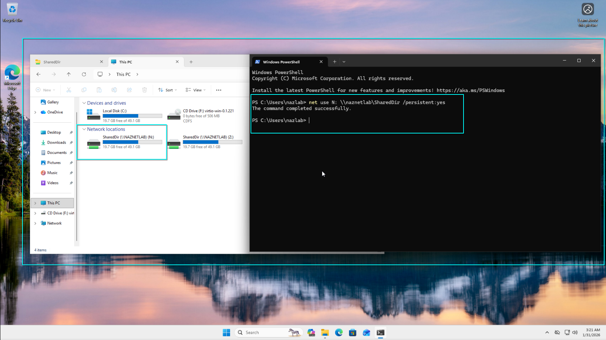
    <figcaption align="left"><i>Figure 19: Using net use to map a network drive from the command line.</i></figcaption>
   </figure>

---

## Lab 11.6: Connecting to a Network Printer

Adding a network printer lets you print from your PC without a direct cable connection. The printer just needs to be on the same network.

### Procedure

1. **Adding via Settings**:
   - Go to **Settings** > **Bluetooth & devices** > **Printers & scanners**.
   - Click **Add device**.
   - Windows scans for printers on the network. Click a printer to add it.
   <figure>
    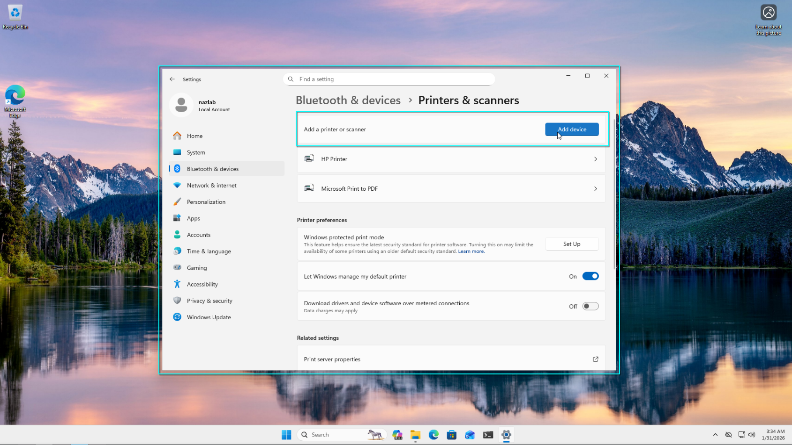
    <figcaption align="left"><i>Figure 20: The Printers & scanners page with Add device button.</i></figcaption>
   </figure>

2. **Adding Manually by IP Address**:
   - If the printer doesn't appear, click **Add manually** (or "The printer that I want isn't listed").
   - Select **Add a printer using a TCP/IP address or hostname**.
   - Choose **Auto-detect** for **Device type** (recommended).
   - Enter the printer's IP address in the **Hostname or IP address** field.
   - The **Port name** will populate automatically, you can leave it as-is.
   - Ensure **Query the printer and automatically select the driver to use** is checked.
   - Click **Next** and follow the prompts to install the driver.
   <figure>
    
    <figcaption align="left"><i>Figure 21: Adding a network printer using its IP address.</i></figcaption>
   </figure>

3. **Setting a Default Printer and Testing**:
   - In Printers & scanners, click the printer you want as default.
   - Click **Set as default**.
   - Click **Printer properties** > **Print Test Page** to verify the connection.
   <figure>
    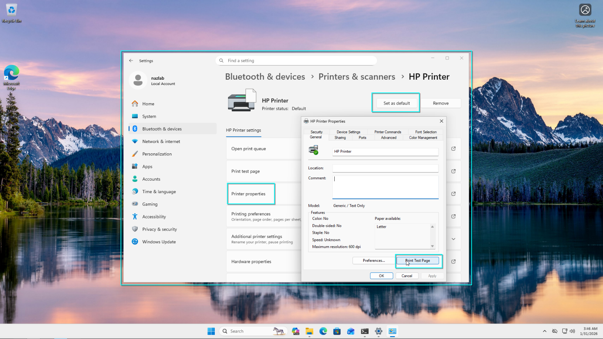
    <figcaption align="left"><i>Figure 22: Printer properties with the Print Test Page button.</i></figcaption>
   </figure>

---

## Lab 11.7: Sharing a Printer on the Network

If a printer connects directly to your PC via USB, you can share it so others on the network can print through your computer.

### Procedure

1. **Verifying Printer Sharing is Enabled**:
   - Go to **Settings** > **Network & internet** > **Advanced network settings**.
   - Click **Advanced sharing settings**.
   - Make sure **File and printer sharing** is turned on for your network profile.

2. **Sharing the Printer**:
   - Go to **Settings** > **Bluetooth & devices** > **Printers & scanners**.
   - Click the printer you want to share.
   - Click **Printer properties** > **Sharing** tab.
   - Check **Share this printer**.
   - Enter a share name (keep it short and simple, like "OfficeHP").
   <figure>
    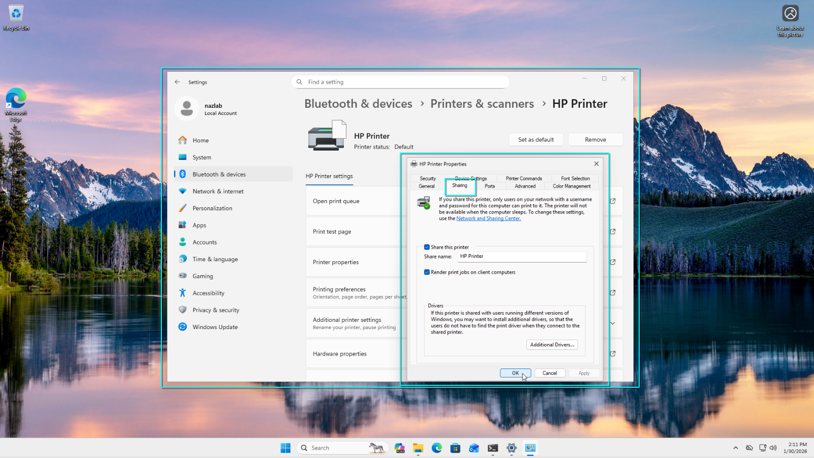
    <figcaption align="left"><i>Figure 23: Enabling printer sharing and setting a share name.</i></figcaption>
   </figure>

3. **Connecting from Another PC**:
   - On the other PC, go to **Printers & scanners** > **Add device**.
   - Click **The printer that I want isn't listed** (or **Add manually**).
   - Select **Select a shared printer by name**.
   - Type `\\ComputerName\ShareName` (e.g., `\\DESKTOP-ABC123\OfficeHP`) or `\\IPAddress\ShareName`.
   - Click **Next** and follow the prompts to install the driver.
   <figure>
    
    <figcaption align="left"><i>Figure 24: Adding a shared printer using its network path.</i></figcaption>
   </figure>

4. **Managing the Print Queue**:
   - On the sharing PC, click the printer > **Open print queue**.
   - View all pending jobs from local and network users.
   - Right-click a job to pause, resume, or cancel it.
   <figure>
    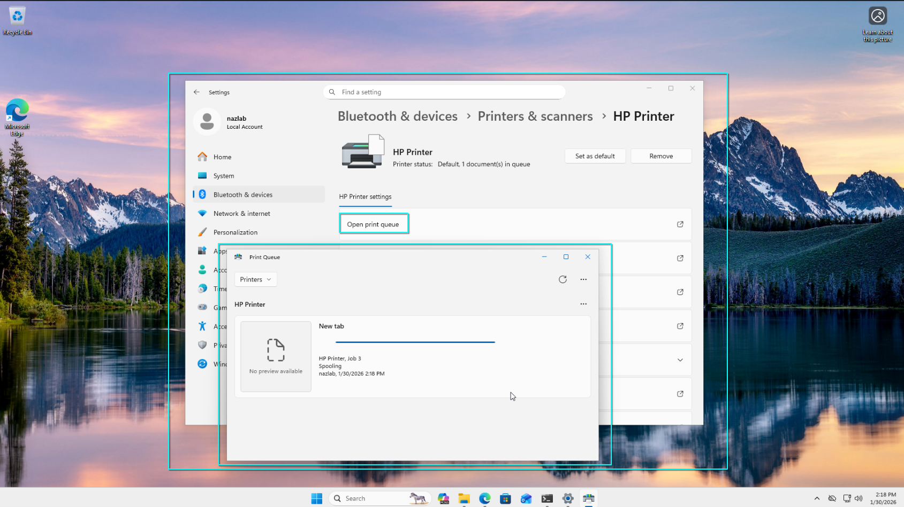
    <figcaption align="left"><i>Figure 25: The print queue showing pending documents.</i></figcaption>
   </figure>
