# Chapter 12: Windows Security and Privacy

Windows 11 packs in a full security suite, from antivirus and firewall to disk encryption and privacy controls. This chapter covers the tools you'll use to monitor threats, manage updates, lock down your data, and control what Windows shares about you.

---

## Lab 12.1: Monitoring Your Computer's Security

Windows Security is the central dashboard for checking your PC's protection status. If something needs attention, you'll see it here first.

### Procedure

1. **Opening Windows Security**:
   - Open **Settings** > **Privacy & security** > **Windows Security**.
   - Click **Open Windows Security** to launch the full app.
   <figure>
    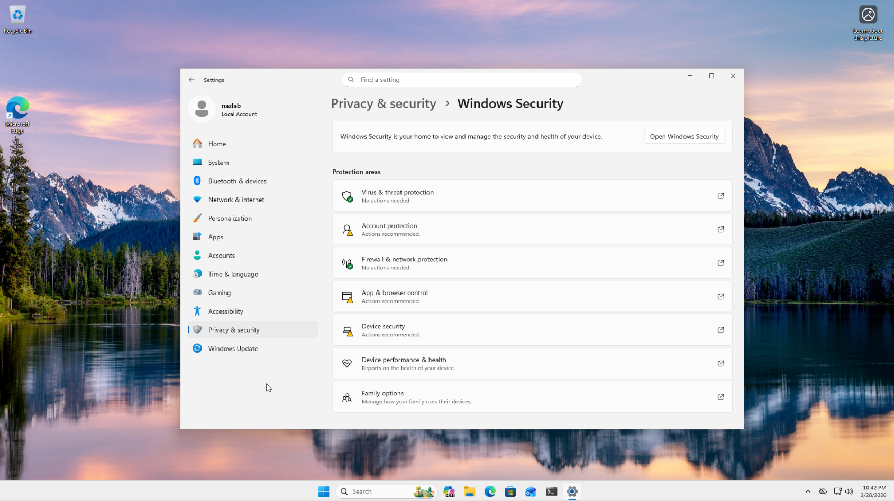
    <figcaption align="left"><i>Figure 1: The Windows Security shortcut in Settings.</i></figcaption>
   </figure>

2. **Reading the Security Dashboard**:
   - The home screen shows status tiles for each protection area: Virus & threat protection, Account protection, Firewall & network protection, App & browser control, Device security, Device performance & health, and Family options.
   - A green checkmark means that area is healthy. Yellow or red icons mean something needs your attention.
   <figure>
    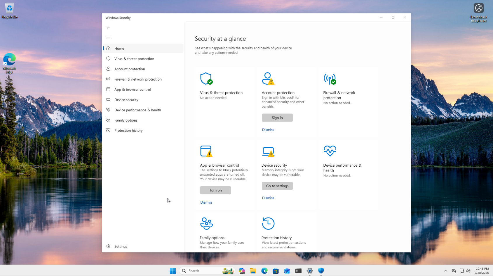
    <figcaption align="left"><i>Figure 2: The Windows Security dashboard with all protection areas.</i></figcaption>
   </figure>

3. **Checking Device Performance & Health**:
   - Click **Device performance & health** in the sidebar.
   - This reports on storage capacity, apps and software, Windows Time Service, and battery life (on laptops).
   - A **Fresh start** option is also here if you ever need to reinstall Windows while keeping personal files.
   <figure>
    
    <figcaption align="left"><i>Figure 3: Device performance and health report showing current status.</i></figcaption>
   </figure>

4. **Reviewing Protection History**:
   - Click **Virus & threat protection** > **Protection history**.
   - This lists recent actions: blocked threats, quarantined files, and recommendations.
   - Click any entry for details on what was found and how Windows handled it.
   <figure>
    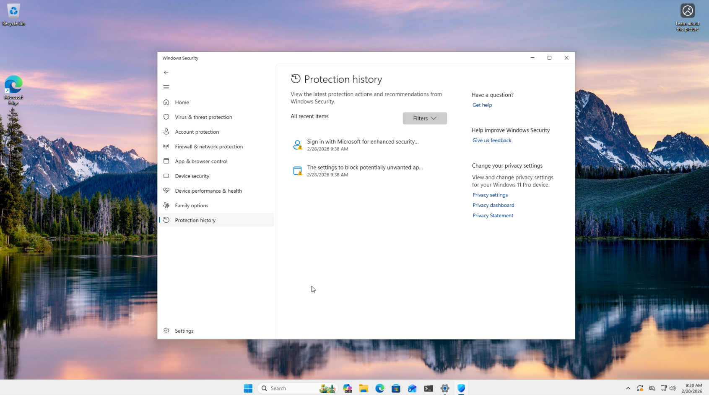
    <figcaption align="left"><i>Figure 4: Protection history showing recent security events.</i></figcaption>
   </figure>

---

## Lab 12.2: Deferring and Delaying Updates

Windows Update delivers security patches and feature upgrades automatically. Sometimes you need to postpone updates, especially during a big project or before verifying compatibility.

### Procedure

1. **Pausing Updates**:
   - Open **Settings** > **Windows Update**.
   - Click **Pause for 1 week** (or use the dropdown to pause for up to 5 weeks).
   - When paused, no updates install until the timer expires or you click **Resume updates**.
   <figure>
    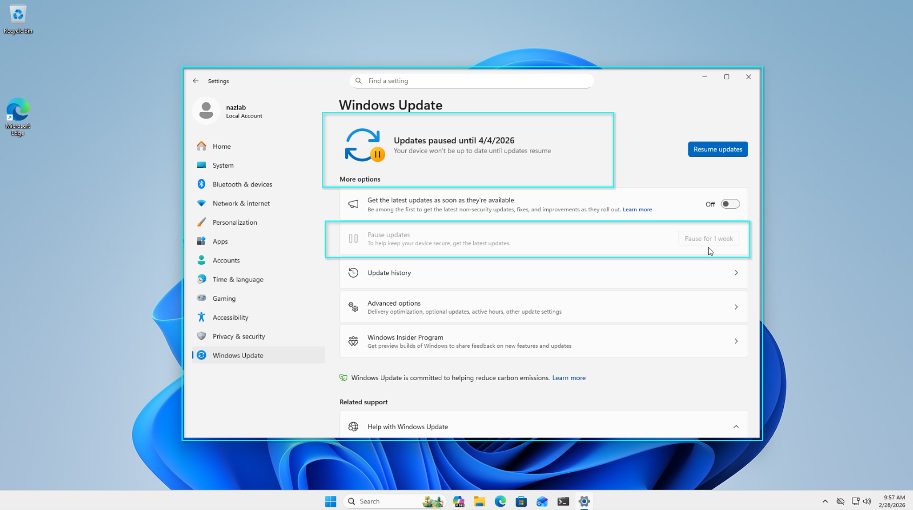
    <figcaption align="left"><i>Figure 1: Pausing Windows Update for a set number of weeks.</i></figcaption>
   </figure>

2. **Setting Active Hours**:
   - In Windows Update, click **Advanced options**.
   - Under **Active hours**, set the hours you typically use your PC.
   - Windows won't restart for updates during those hours. Choose **Manually** to define a custom range, or leave it on **Automatically** to let Windows figure it out.
   <figure>
    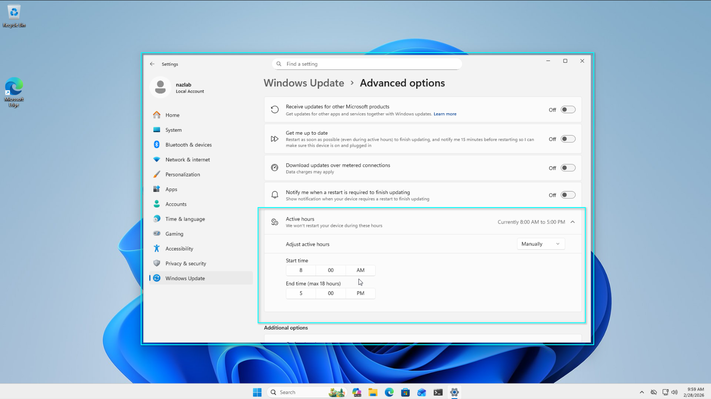
    <figcaption align="left"><i>Figure 2: Configuring active hours to prevent unexpected restarts.</i></figcaption>
   </figure>

3. **Using a metered connection**:
   - Navigate to Settings > Network & internet > Wi-Fi (or Ethernet)
   - Click your active network properties
   - Toggle Metered connection to On
   - This restricts large update downloads over limited networks
   <figure>
    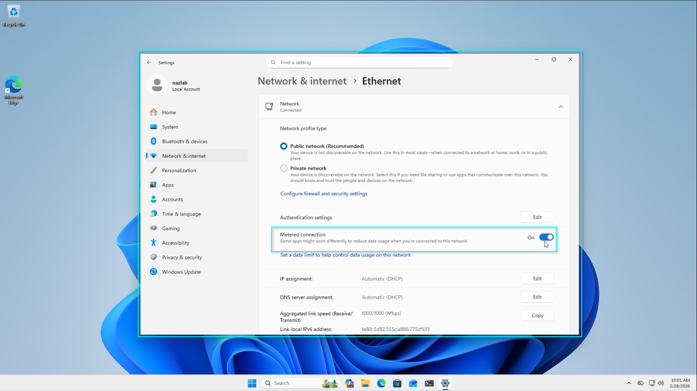
    <figcaption align="left"><i>Figure 3: Marking a connection as metered to limit data usage.</i></figcaption>
   </figure>

4. **Deferring feature updates** (Pro/Enterprise):
   - Press Win + R, type `gpedit.msc`, Enter
   - Navigate to Computer Configuration > Administrative Templates > Windows Components > Windows Update > Manage updates offered from Windows Update
   - Enable "Select when Preview Builds and Feature Updates are received"
   - You can defer feature updates up to 365 days for IT testing
   <figure>
    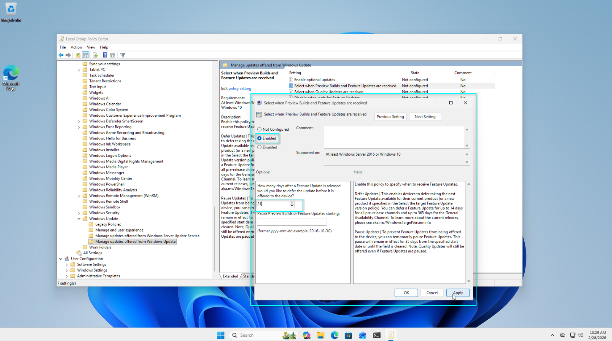
    <figcaption align="left"><i>Figure 4: Configuring update deferrals via Group Policy.</i></figcaption>
   </figure>

---

## Lab 12.3: Finding Technical Information About Updates

When you need to know exactly what a specific update changed or which KB was installed, Windows gives you several ways to dig into the details.

### Procedure

1. **Viewing Update History**:
   - Open **Settings** > **Windows Update** > **Update history**.
   - Updates are grouped by type: Feature Updates, Quality Updates, Driver Updates, Definition Updates, and Other Updates.
   - Click any entry to see the KB number and a link to the support article.
   <figure>
    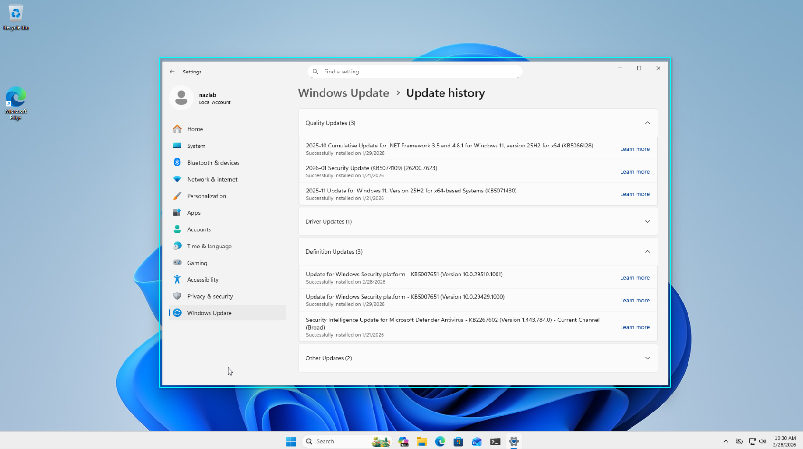
    <figcaption align="left"><i>Figure 1: The update history page grouped by update type.</i></figcaption>
   </figure>

2. **Checking Your Windows Version**:
   - Press **Win + R**, type `winver`, press Enter.
   - This shows your exact build number and version (e.g., 24H2, Build 26100.xxxx).
   - Handy when comparing against Microsoft's release notes to see if you're current.
   <figure>
    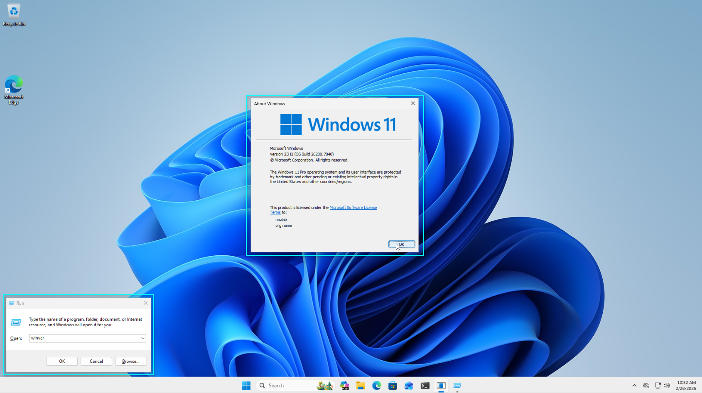
    <figcaption align="left"><i>Figure 2: The About Windows dialog showing version and build info.</i></figcaption>
   </figure>

3. **Using PowerShell for Update Details**:
   - Open **Terminal (Admin)**.
   - Run `Get-HotFix` to list installed updates with their KB IDs and install dates.
   - Run `Get-HotFix -Id KB5034765` (replace with the actual KB number) to check a specific patch.
   <figure>
    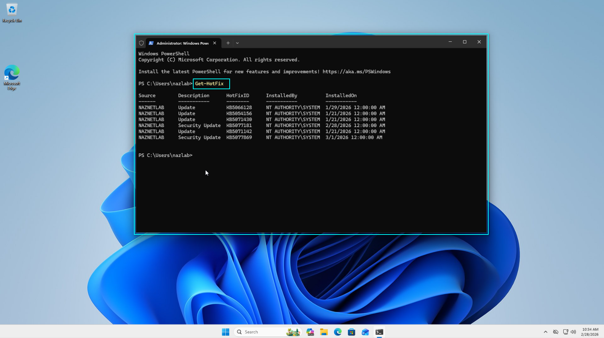
    <figcaption align="left"><i>Figure 3: PowerShell listing installed hotfixes with KB numbers.</i></figcaption>
   </figure>

4. **Reading the Microsoft Update Catalog**:
   - Open a browser and go to `catalog.update.microsoft.com`.
   - Search by KB number to find the standalone installer, file details, and supported architectures.
   - You can download updates here for offline installation on machines without internet access.
   <figure>
    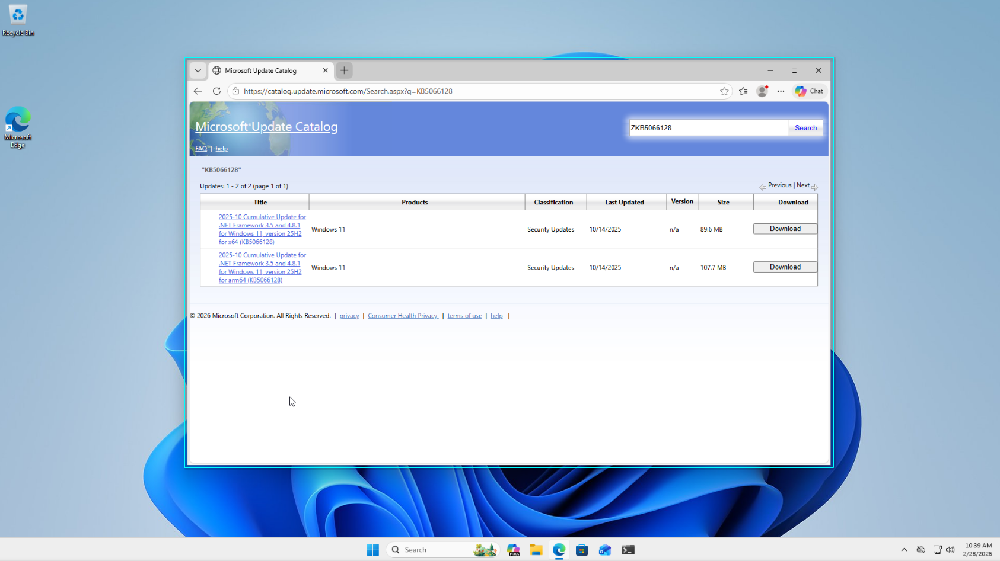
    <figcaption align="left"><i>Figure 4: The Microsoft Update Catalog showing a KB search result.</i></figcaption>
   </figure>

---

## Lab 12.4: Troubleshooting Update Problems

Updates occasionally fail. Error codes, stuck downloads, and failed installs are common issues. Here's how to work through them.

### Procedure

1. **Running the Windows Update Troubleshooter**:
   - Open **Settings** > **System** > **Troubleshoot** > **Other troubleshooters**.
   - Click **Run** next to **Windows Update**.
   - The troubleshooter checks for common problems and attempts fixes automatically.
   <figure>
    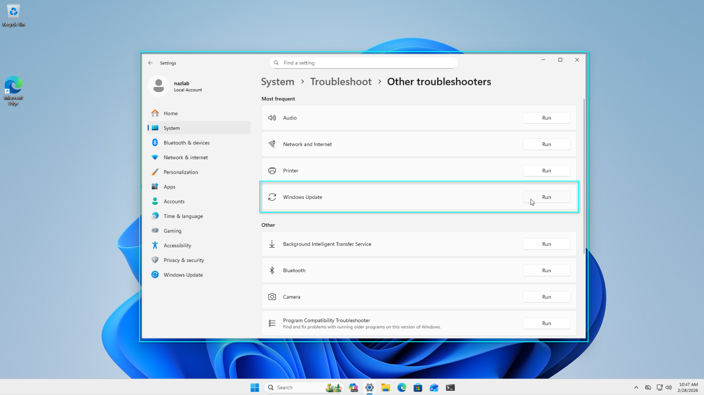
    <figcaption align="left"><i>Figure 1: Running the built-in Windows Update troubleshooter.</i></figcaption>
   </figure>

2. **Using DISM and SFC to Fix Corruption**:
   - In **Terminal (Admin)**, run these in order:
     - `DISM /Online /Cleanup-Image /RestoreHealth` (downloads clean copies of damaged system files)
     - `sfc /scannow` (scans and repairs protected system files)
   - Restart the PC, then try Windows Update again.
   <figure>
    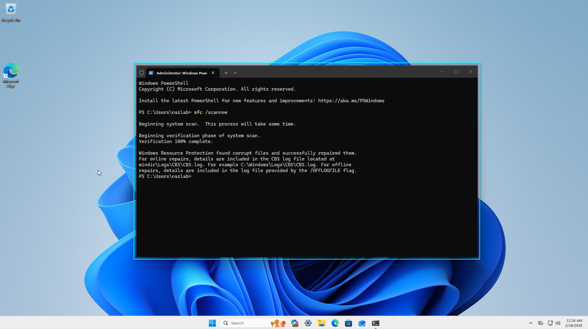
    <figcaption align="left"><i>Figure 2: Running DISM and SFC to repair system file damage.</i></figcaption>
   </figure>

3. **Installing Updates Manually**:
   - If an update keeps failing, note the KB number from **Update history**.
   - Go to `catalog.update.microsoft.com`, search for the KB, download the `.msu` file.
   - Double-click the downloaded file to install it directly.

---

## Lab 12.5: Configuring Privacy Options

Windows 11 collects diagnostic data and gives apps access to hardware like your camera and microphone. You control all of this from one place.

### Procedure

1. **Managing Location Access**:
   - Open **Settings** > **Privacy & security** > **Location**.
   - Toggle **Location services** on or off globally.
   - Below that, toggle access per app. An app grayed out here hasn't requested location access.
   <figure>
    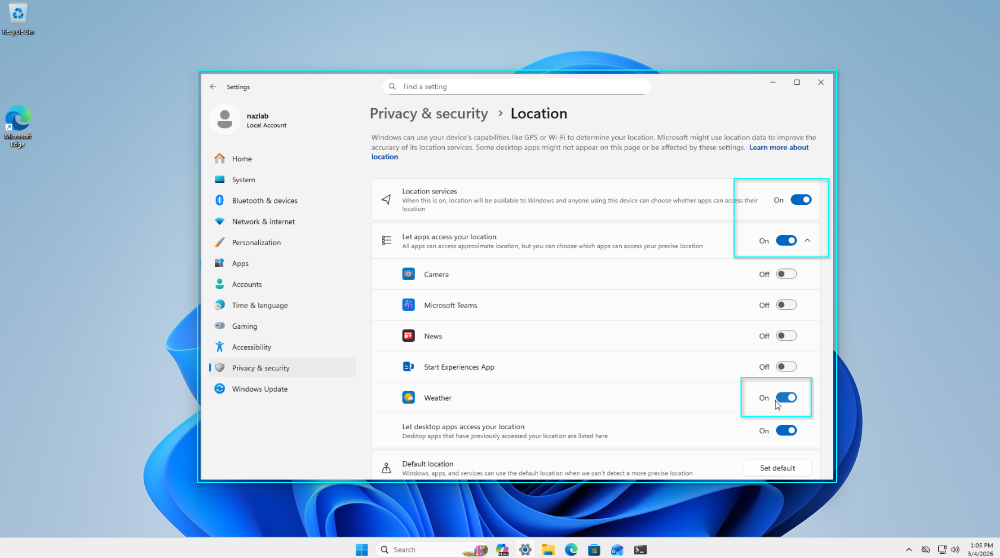
    <figcaption align="left"><i>Figure 1: Controlling which apps can access your location.</i></figcaption>
   </figure>

2. **Controlling Camera and Microphone**:
   - Go to **Privacy & security** > **Camera** (and separately, **Microphone**).
   - Toggle the master switch to block all apps, or manage access per app.
   - Desktop apps that don't use the modern API show up under a separate section at the bottom.
   <figure>
    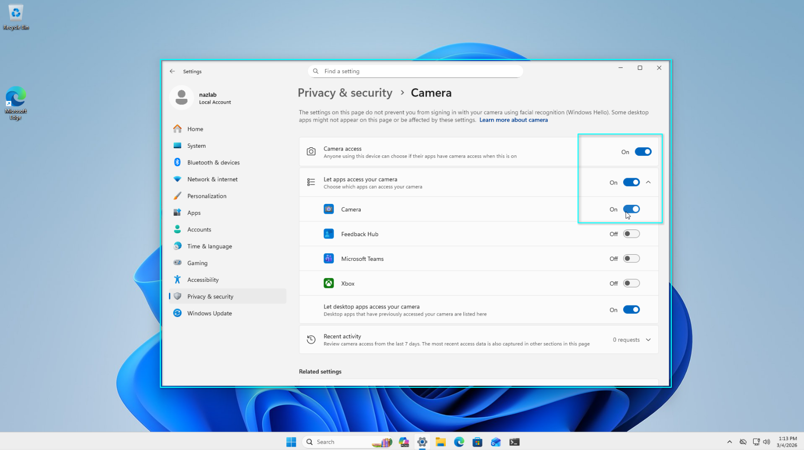
    <figcaption align="left"><i>Figure 2: Per-app camera access controls.</i></figcaption>
   </figure>

3. **Adjusting Diagnostic Data**:
   - Go to **Privacy & security** > **Diagnostics & feedback**.
   - **Required diagnostic data** is the minimum Windows sends to Microsoft. You can't turn this off.
   - Toggle **Send optional diagnostic data** off if you don't want to share usage patterns and browsing data.
   - Click **Delete diagnostic data** to clear what's already been collected.
   <figure>
    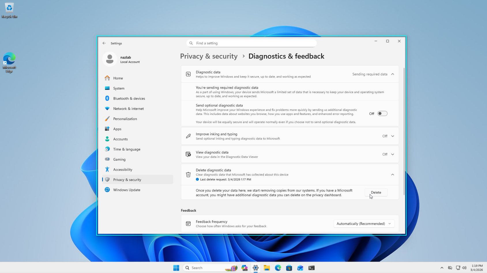
    <figcaption align="left"><i>Figure 3: Diagnostic data settings with the delete option.</i></figcaption>
   </figure>

---

## Lab 12.6: Modifying UAC Settings

User Account Control (UAC) prompts you before apps make system-level changes. You can adjust the sensitivity or, if you understand the risk, turn it off entirely.

### Procedure

1. **Opening the UAC Slider**:
   - Search for **UAC** in Start > select **Change User Account Control settings**.
   - The slider has four levels, from "Always notify" (most secure) to "Never notify" (disabled).
   <figure>
    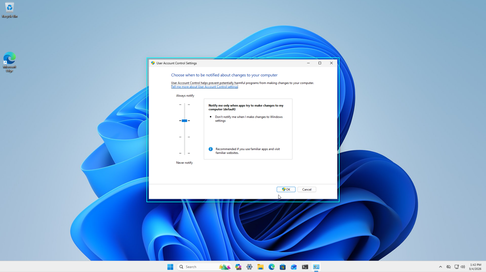
    <figcaption align="left"><i>Figure 1: The four UAC notification levels.</i></figcaption>
   </figure>

2. **Understanding Each Level**:
   - **Always notify**: Prompts for every system change, including your own settings changes. Most secure but most intrusive.
   - **Default** (second notch): Prompts only when apps try to make changes. Your own changes go through silently.
   - **Third notch**: Same as default but doesn't dim the desktop. Slightly less secure since malware could potentially interact with the prompt.
   - **Never notify**: UAC is off. No prompts at all. Only use this in isolated test environments.
   <figure>
    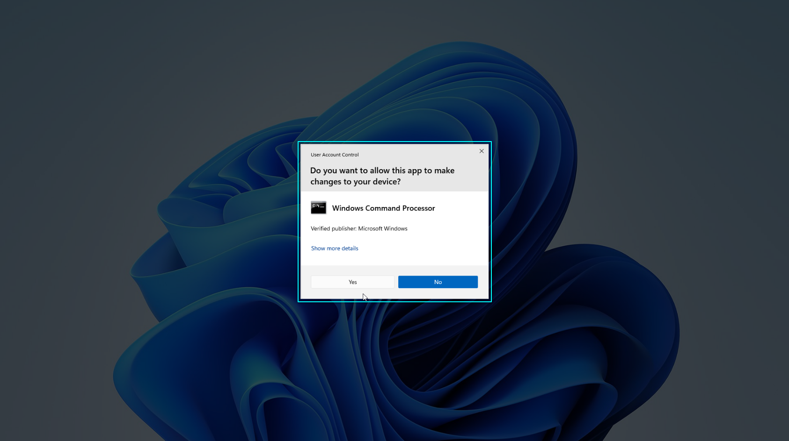
    <figcaption align="left"><i>Figure 2: A typical UAC consent prompt.</i></figcaption>
   </figure>

3. **Configuring UAC via Group Policy** (Pro/Enterprise):
   - Press **Win + R**, type `gpedit.msc`, press Enter.
   - Navigate to **Computer Configuration** > **Windows Settings** > **Security Settings** > **Local Policies** > **Security Options**.
   - Look for policies starting with "User Account Control:" to fine-tune behavior, such as requiring Ctrl+Alt+Del at the secure desktop or elevating without prompting for built-in admins.
   <figure>
    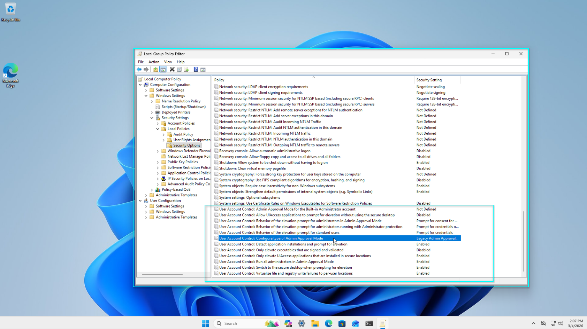
    <figcaption align="left"><i>Figure 3: UAC-related policies in the Local Group Policy Editor.</i></figcaption>
   </figure>

---

## Lab 12.7: Blocking Malware

Microsoft Defender Antivirus runs in the background and scans files as you open them. You can also run manual scans and review what it's caught.

### Procedure

1. **Checking Real-Time Protection**:
   - Open **Windows Security** > **Virus & threat protection**.
   - Under **Virus & threat protection settings**, click **Manage settings**.
   - Verify **Real-time protection** is on. This scans files when you download, open, or copy them.
   - **Cloud-delivered protection** and **Automatic sample submission** improve detection by checking suspicious files against Microsoft's cloud database.
   <figure>
    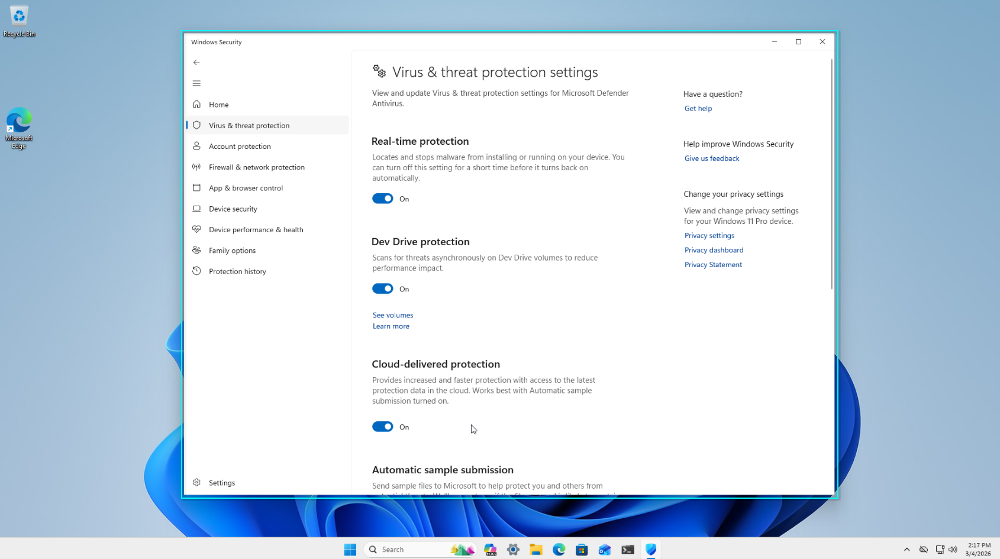
    <figcaption align="left"><i>Figure 1: Real-time protection and cloud protection toggles.</i></figcaption>
   </figure>

2. **Running a Manual Scan**:
   - On the Virus & threat protection page, click **Quick scan** for a fast check of common malware locations.
   - For a deeper scan, click **Scan options** > choose **Full scan** (checks every file on the disk) or **Custom scan** (pick specific folders).
   - **Microsoft Defender Offline scan** reboots your PC into a recovery environment to catch rootkits that hide while Windows is running.
   <figure>
    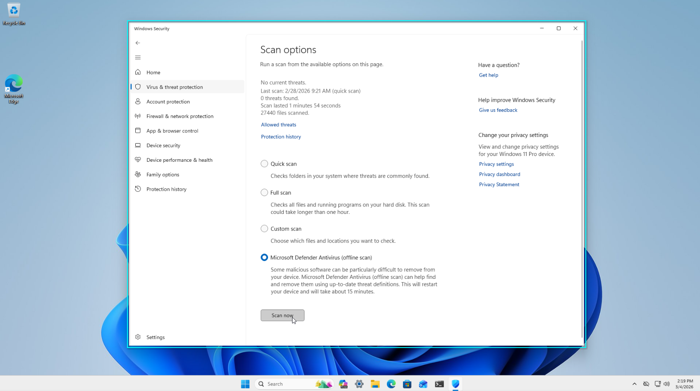
    <figcaption align="left"><i>Figure 2: Scan type options including offline scan.</i></figcaption>
   </figure>

3. **Managing Exclusions**:
   - In **Virus & threat protection settings** > **Manage settings**, scroll to **Exclusions** > **Add or remove exclusions**.
   - Click **Add an exclusion** and choose file, folder, file type, or process.
   - Use this for development folders or apps that trigger false positives. Keep exclusions tight to avoid blind spots.
   <figure>
    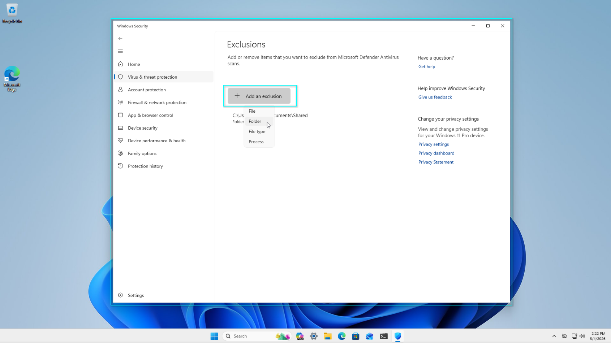
    <figcaption align="left"><i>Figure 3: Adding a folder exclusion for Defender scans.</i></figcaption>
   </figure>

4. **Reviewing Threat History**:
   - Click **Protection history** on the Virus & threat protection page.
   - Each entry shows the threat name, severity, affected file, and the action taken (quarantined, removed, or allowed).
   - You can restore a quarantined file if you're sure it's safe, or remove it permanently.
   <figure>
    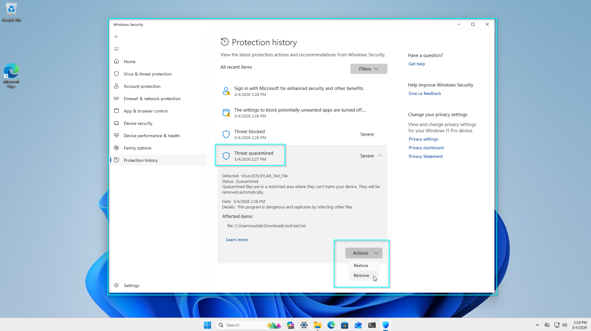
    <figcaption align="left"><i>Figure 4: A quarantined threat with action options.</i></figcaption>
   </figure>

---

## Lab 12.8: Encrypting with BitLocker and BitLocker To Go

BitLocker encrypts your entire drive so no one can read your data without the proper credentials, even if they pull the drive and connect it to another PC.

> **Note**: BitLocker requires Windows 11 Pro, Enterprise, or Education. Home edition supports Device Encryption on supported hardware but not the full BitLocker management interface.

### Procedure

1. **Enabling BitLocker on the System Drive**:
   - Open **Control Panel** > **System and Security** > **BitLocker Drive Encryption**.
   - Click **Turn on BitLocker** next to your OS drive (usually C:).
   - If your PC has a TPM chip (most modern PCs do), BitLocker uses it automatically. Without TPM, you'll need to enable a Group Policy setting to allow a startup password or USB key instead.
   <figure>
    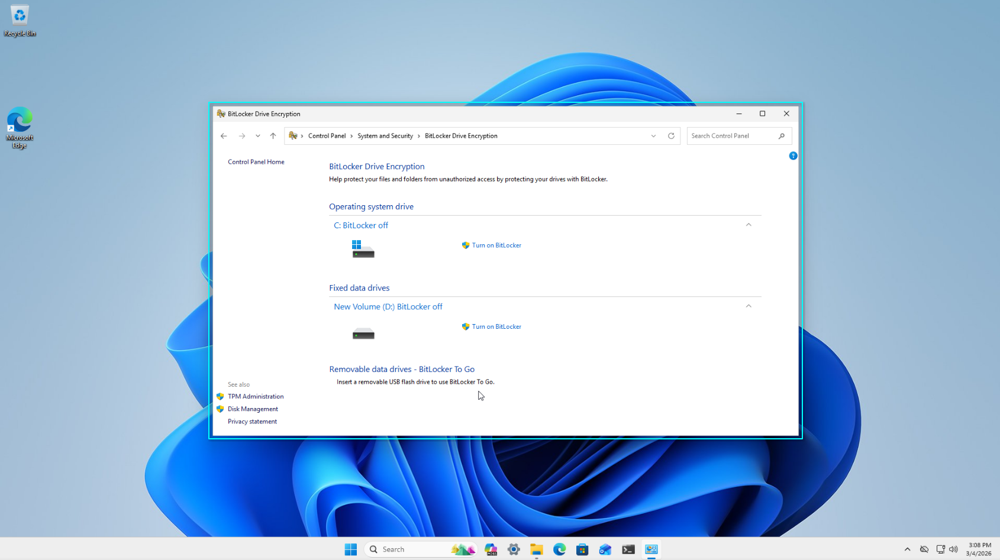
    <figcaption align="left"><i>Figure 1: The BitLocker management page showing available drives.</i></figcaption>
   </figure>

2. **Choosing a Recovery Key Backup**:
   - Windows asks where to save the recovery key. Options include:
     - **Save to your Microsoft account** (syncs across devices)
     - **Save to a USB flash drive**
     - **Save to a file** (not on the encrypted drive itself)
     - **Print the recovery key**
   - Pick at least two methods. If you lose the recovery key and forget the password, your data is gone.
   <figure>
    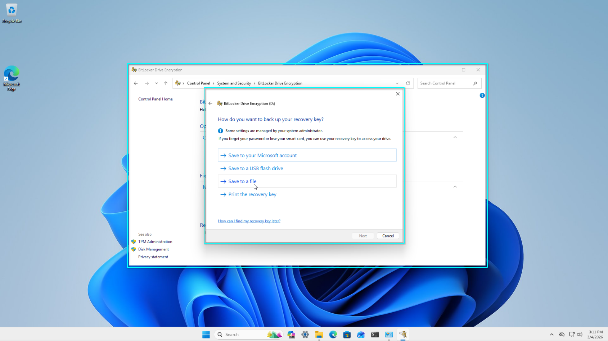
    <figcaption align="left"><i>Figure 2: Backup options for the BitLocker recovery key.</i></figcaption>
   </figure>

3. **Selecting Encryption Options**:
   - Choose **Encrypt used disk space only** (faster, good for new drives) or **Encrypt entire drive** (better for drives already in use).
   - Select **New encryption mode** (XTS-AES, recommended for fixed drives) or **Compatible mode** (for removable drives you'll use on older Windows versions).
   - Click **Start encrypting**. The process runs in the background; you can keep using the PC.
   <figure>
    
    <figcaption align="left"><i>Figure 3: Choosing between new and compatible encryption modes.</i></figcaption>
   </figure>

4. **Using BitLocker To Go**:
   - Insert a USB flash drive.
   - In BitLocker Drive Encryption, find the removable drive and click **Turn on BitLocker**.
   - Set a password to unlock the drive.
   - The same recovery key and encryption options apply.
   - When you plug this drive into another PC, Windows asks for the password before showing the contents.
   <figure>
    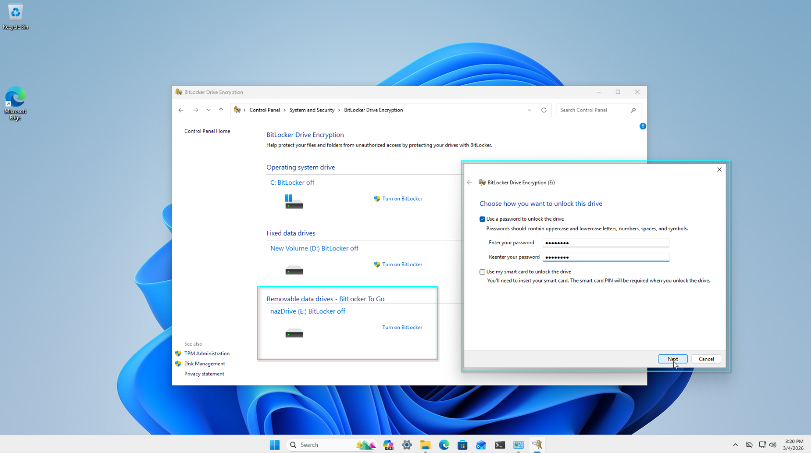
    <figcaption align="left"><i>Figure 4: Setting a password for a BitLocker To Go drive.</i></figcaption>
   </figure>

---

## Lab 12.9: Using Encrypting File System (EFS)

EFS encrypts individual files and folders on NTFS drives. Unlike BitLocker, which locks the whole drive, EFS protects specific data while leaving the rest accessible.

> **Note**: EFS is available on Pro, Enterprise, and Education editions. It doesn't work on FAT32 or exFAT drives.

### Procedure

1. **Encrypting a Folder**:
   - Right-click the folder > **Properties** > **General** tab > **Advanced**.
   - Check **Encrypt contents to secure data** > **OK** > **Apply**.
   - Choose **Apply changes to this folder, subfolders and files** when prompted.
   - The folder name turns green in File Explorer, confirming encryption is active.
   <figure>
    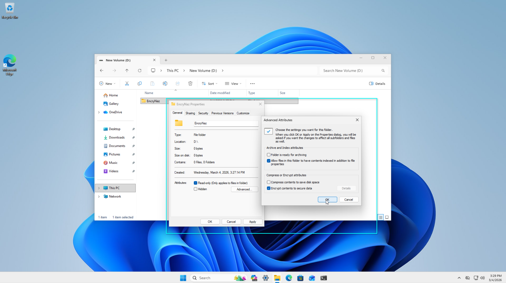
    <figcaption align="left"><i>Figure 1: Enabling EFS encryption on a folder.</i></figcaption>
   </figure>

2. **Backing Up Your EFS Certificate**:
   - When you first encrypt a file, a notification balloon appears in the taskbar. Click it.
   - Or open a command prompt and run `cipher /x <backup_path>` to export the certificate.
   - Alternatively, press **Win + R**, type `certmgr.msc` > expand **Personal** > **Certificates**.
   - Right-click your EFS certificate > **All Tasks** > **Export**. Save the .pfx file to a USB drive or secure location.
   - Without this certificate, you can't access your encrypted files if your user profile is lost or you reinstall Windows.
   <figure>
    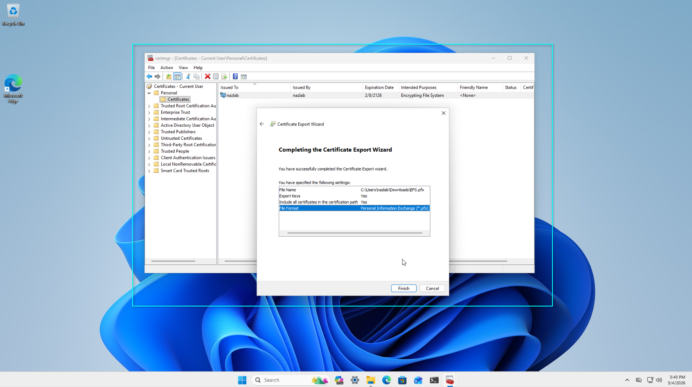
    <figcaption align="left"><i>Figure 2: Exporting the EFS certificate from Certificate Manager.</i></figcaption>
   </figure>

3. **Granting Other Users Access**:
   - Select a file inside the encrypted folder. You can share files, but not the folder itself.
   - Right-click the file > **Properties** > **General** > **Advanced** > **Details**.
   - Click **Add** and select the other user's EFS certificate.
   - Note: The other user needs an EFS certificate first. They get one automatically by logging in and encrypting any file.
   <figure>
    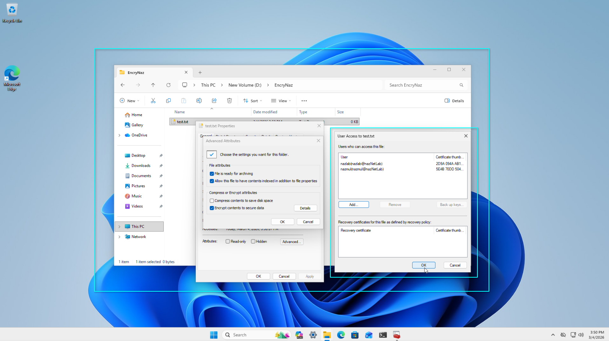
    <figcaption align="left"><i>Figure 3: Adding another user's certificate for shared access.</i></figcaption>
   </figure>

4. **Using cipher from the Command Line**:
   - Open **Terminal**.
   - `cipher /e /s:C:\SensitiveData` encrypts a folder and all its contents.
   - `cipher /d /s:C:\SensitiveData` decrypts it.
   - `cipher /w:C:\` wipes free space to overwrite deleted file remnants, so they can't be recovered.
   <figure>
    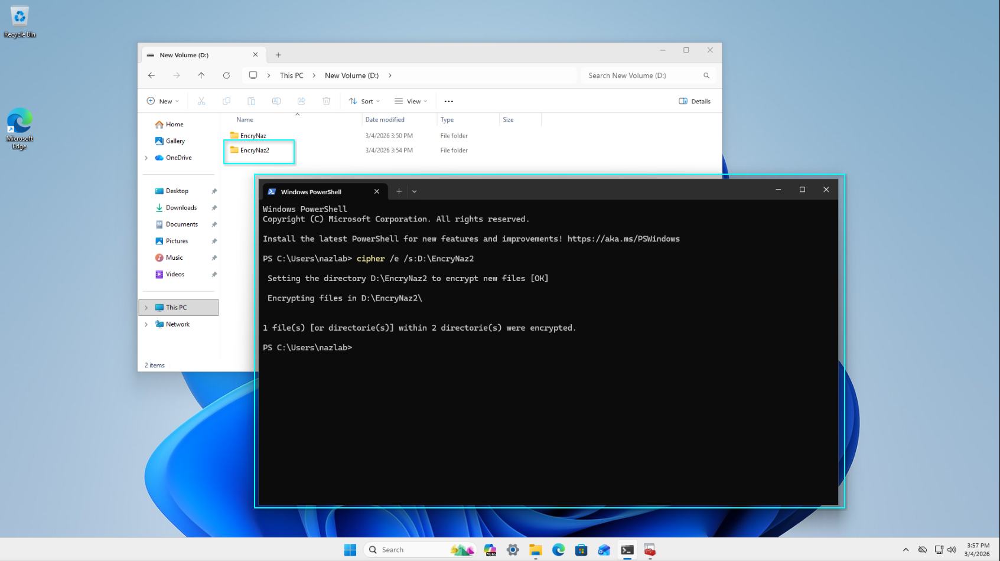
    <figcaption align="left"><i>Figure 4: Using the cipher command to encrypt a folder.</i></figcaption>
   </figure>

---

## Lab 12.10: Managing Windows Defender Firewall

The built-in firewall blocks unsolicited inbound connections and can restrict outbound traffic too. It runs separate profiles for private and public networks.

### Procedure

1. **Checking Firewall Status**:
   - Open **Windows Security** > **Firewall & network protection**.
   - You'll see three profiles: **Domain network**, **Private network**, and **Public network**.
   - The active profile is labeled "(active)." Each profile should show "Firewall is on."
   <figure>
    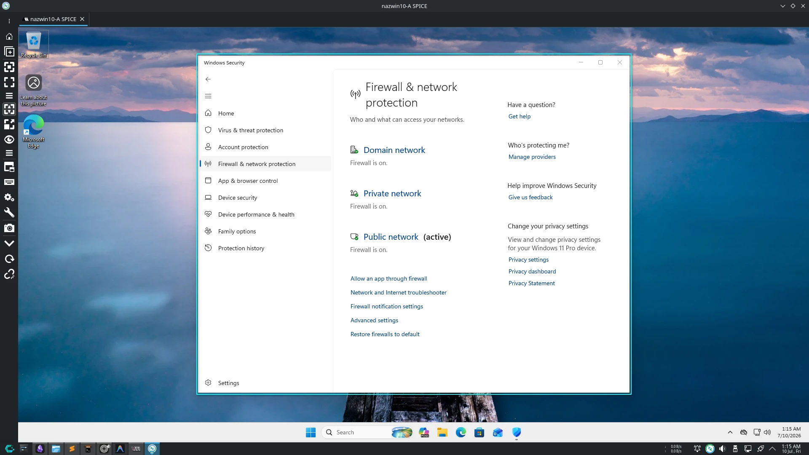
    <figcaption align="left"><i>Figure 1: Firewall status for each network profile.</i></figcaption>
   </figure>

2. **Allowing an App Through the Firewall**:
   - Click **Allow an app through firewall**.
   - Click **Change settings** (requires admin rights), then **Allow another app**.
   - Browse to the app's .exe file, click **Add**.
   - Check the boxes for **Private** and/or **Public** networks depending on where the app should work.
   <figure>
    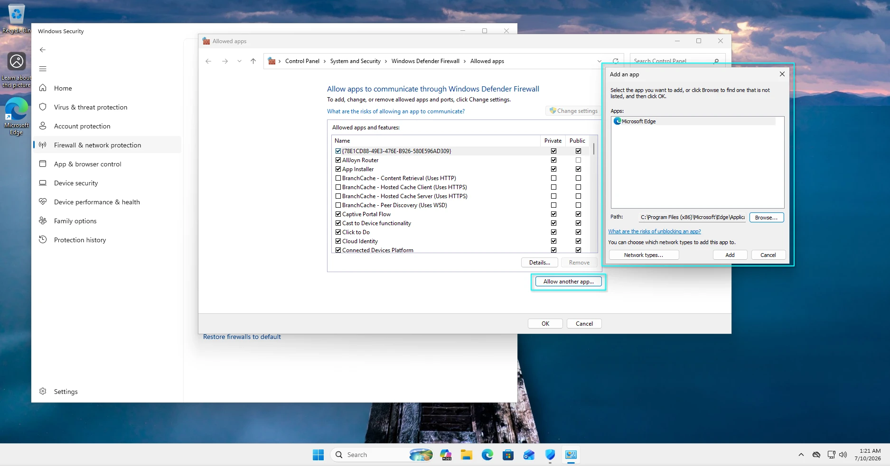
    <figcaption align="left"><i>Figure 2: Adding an app to the firewall exception list.</i></figcaption>
   </figure>

3. **Using Windows Defender Firewall with Advanced Security**:
   - Press **Win + R**, type `wf.msc`, press Enter.
   - The left pane shows **Inbound Rules** and **Outbound Rules**.
   - Click **Inbound Rules** to see all existing rules. Green checkmarks are enabled; gray circles are disabled.
   <figure>
    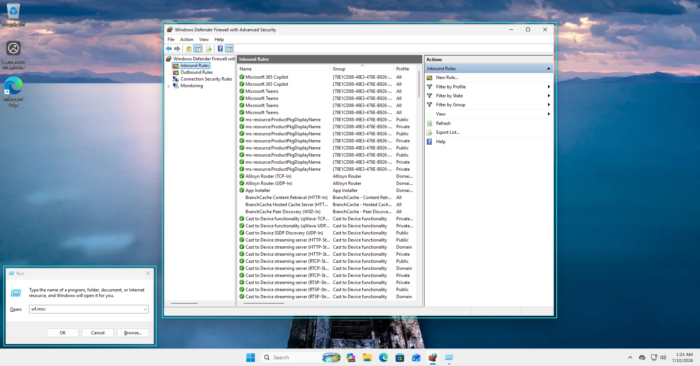
    <figcaption align="left"><i>Figure 3: The Windows Defender Firewall with Advanced Security console.</i></figcaption>
   </figure>

4. **Creating a Custom Inbound Rule**:
   - In the Advanced Security console, right-click **Inbound Rules** > **New Rule**.
   - Choose rule type: **Program**, **Port**, **Predefined**, or **Custom**.
   - For a port rule: select TCP or UDP, enter the port number (e.g., 8080).
   - Choose **Allow the connection** or **Block the connection**.
   - Select which profiles apply (Domain, Private, Public).
   - Name the rule and click **Finish**.
   <figure>
    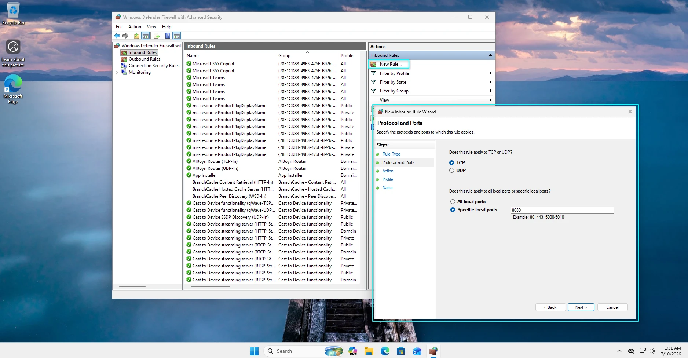
    <figcaption align="left"><i>Figure 4: Creating a new firewall rule for a specific port.</i></figcaption>
   </figure>

---

## Lab 12.11: Adding or Removing User Accounts

Controlling who has access to the PC is a basic security measure. You can manage accounts through Settings for quick changes or Computer Management for more control.

### Procedure

1. **Adding an Account via Settings**:
   - Open **Settings** > **Accounts** > **Other users**.
   - Click **Add account**.
   - To create a local account: click **I don't have this person's sign-in information** > **Add a user without a Microsoft account**.
   - Enter a username, password, and three security questions.
   <figure>
    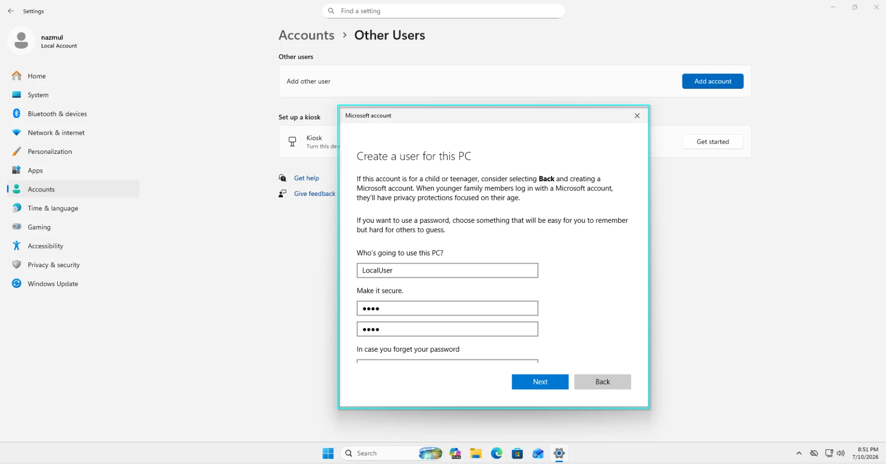
    <figcaption align="left"><i>Figure 1: Adding a new local account through Settings.</i></figcaption>
   </figure>

2. **Adding via Computer Management** (Pro/Enterprise):
   - Right-click Start > **Computer Management** > expand **Local Users and Groups** > **Users**.
   - Right-click in the user list > **New User**.
   - Fill in the username and password. Uncheck **User must change password at next logon** if you're setting a permanent password.
   <figure>
    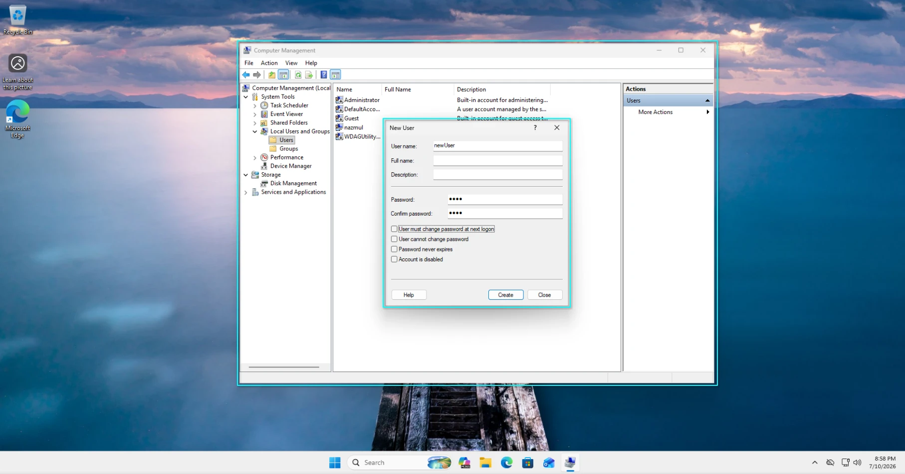
    <figcaption align="left"><i>Figure 2: Creating a user account in Computer Management.</i></figcaption>
   </figure>

3. **Removing an Account via Settings**:
   - Go to **Settings** > **Accounts** > **Other users**.
   - Select the account > **Remove**.
   - Windows asks if you want to delete the account and data, or keep the files. Deleting removes the user's profile folder from `C:\Users`.
   <figure>
    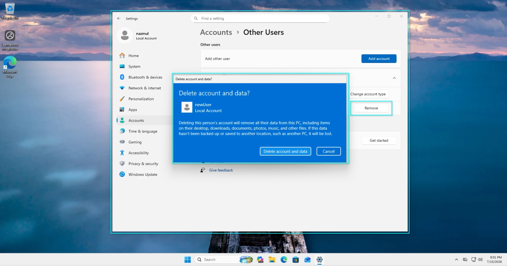
    <figcaption align="left"><i>Figure 3: The confirmation dialog when removing a user account.</i></figcaption>
   </figure>

4. **Removing via Computer Management**:
   - In **Local Users and Groups** > **Users**, right-click the account > **Delete**.
   - This only removes the account object. The profile folder in `C:\Users` remains until you manually delete it.
   - To also remove group memberships, delete the user from each group first (or the deletion handles it automatically).
   <figure>
    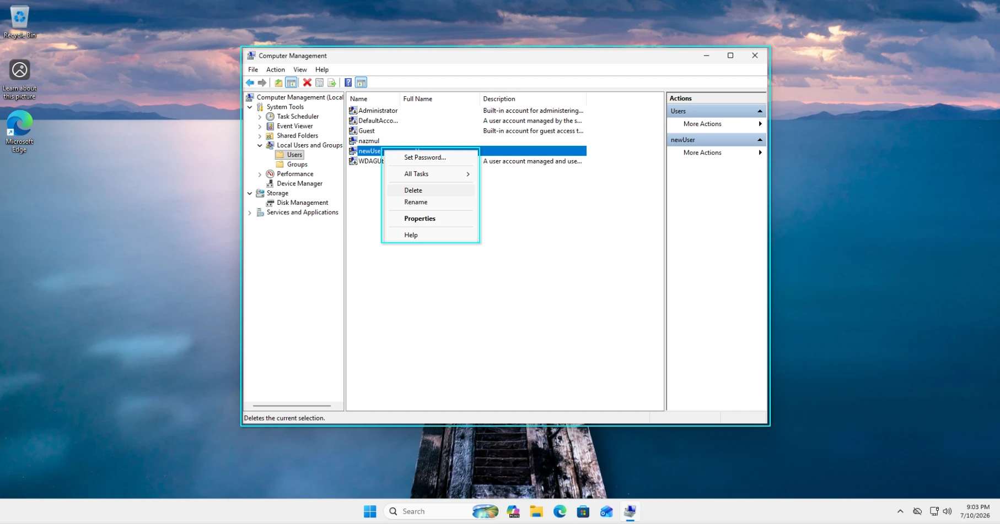
    <figcaption align="left"><i>Figure 4: Deleting a user account from Computer Management.</i></figcaption>
   </figure>

---

## Lab 12.12: Restoring Backed-Up System Files

Corrupted or missing system files can cause crashes, failed updates, and strange behavior. Windows includes built-in tools to scan for damage and restore original files automatically.

### Procedure

1. **Running System File Checker (SFC)**:
   - Open **Terminal (Admin)**.
   - Run `sfc /scannow`.
   - The scan takes 10-15 minutes. It checks every protected system file and replaces corrupted ones from a cached copy.
   - When done, you'll see one of three results: no integrity violations found, files were repaired, or files couldn't be repaired (in which case, run DISM first).
   <figure>
    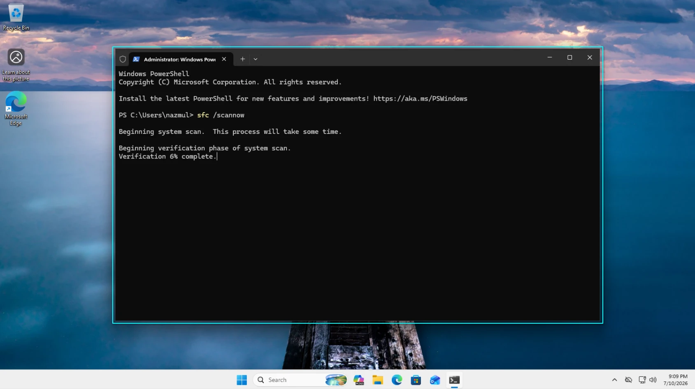
    <figcaption align="left"><i>Figure 1: The sfc /scannow command checking system file integrity.</i></figcaption>
   </figure>

2. **Using DISM to Fix the Component Store**:
   - Still in **Terminal (Admin)**, run: `DISM /Online /Cleanup-Image /CheckHealth` to check for corruption.
   - If issues are found, run: `DISM /Online /Cleanup-Image /RestoreHealth`.
   - DISM downloads clean copies from Windows Update. If there's no internet, you can point it to a Windows installation image: `DISM /Online /Cleanup-Image /RestoreHealth /Source:D:\Sources\install.wim`
   - After DISM finishes, run `sfc /scannow` again to verify repairs.
   <figure>
    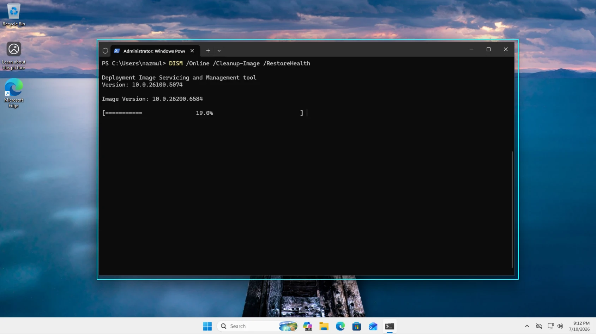
    <figcaption align="left"><i>Figure 2: DISM restoring damaged system files from Windows Update.</i></figcaption>
   </figure>

3. **Reviewing the SFC Log**:
   - SFC writes detailed results to `C:\Windows\Logs\CBS\CBS.log`, but it's huge.
   - To extract just the SFC entries, run: `findstr /c:"[SR]" C:\Windows\Logs\CBS\CBS.log > C:\sfclog.txt`
   - Open `C:\sfclog.txt` in Notepad to see exactly which files were repaired or couldn't be fixed.
   <figure>
    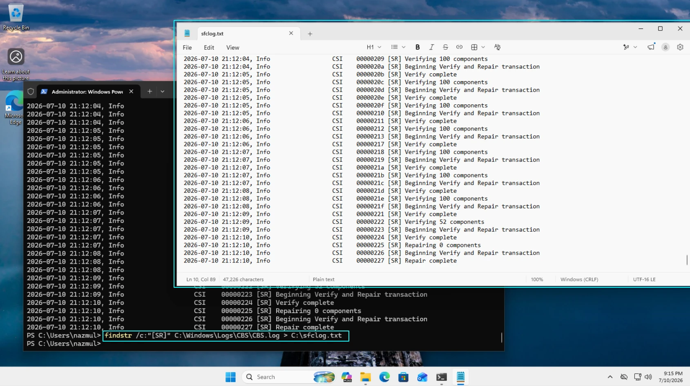
    <figcaption align="left"><i>Figure 3: Filtered SFC log showing repaired system files.</i></figcaption>
   </figure>

4. **Using System Restore as a Fallback**:
   - If SFC and DISM don't fix the problem, try rolling back to a restore point.
   - Search for **Create a restore point** in Start.
   - Click **System Restore** > **Next** > select a restore point from before the issue started.
   - This reverts system files, installed programs, and registry settings. Personal files aren't affected.
   <figure>
    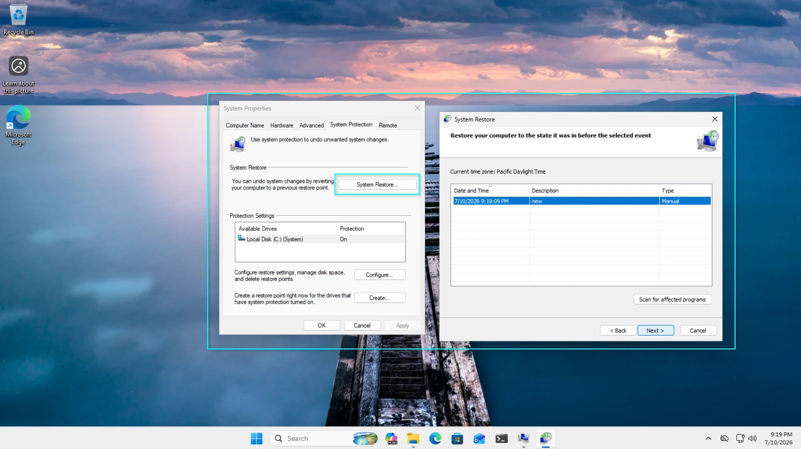
    <figcaption align="left"><i>Figure 4: Selecting a system restore point to revert changes.</i></figcaption>
   </figure>
