# Chapter 13: Managing Hardware and Devices

Windows 11 handles most hardware automatically, but there are times you'll need to step in: enabling a disabled device, rolling back a bad driver, pairing Bluetooth accessories, or tweaking display and audio settings. This chapter covers the hands-on tasks for managing the hardware connected to your PC.

---

## Lab 13.1: Enabling and Disabling Devices

Sometimes you need to disable a device temporarily, whether it's a built-in webcam you don't trust, a network adapter you're troubleshooting, or a touchpad that conflicts with an external mouse.

### Procedure

1. **Opening Device Manager**:
   - Right-click Start > **Device Manager**.
   - Alternative: Press **Win + R**, type `devmgmt.msc`, press Enter.
   - Devices are grouped by category (Display adapters, Network adapters, Sound controllers, etc.).
   <figure>
    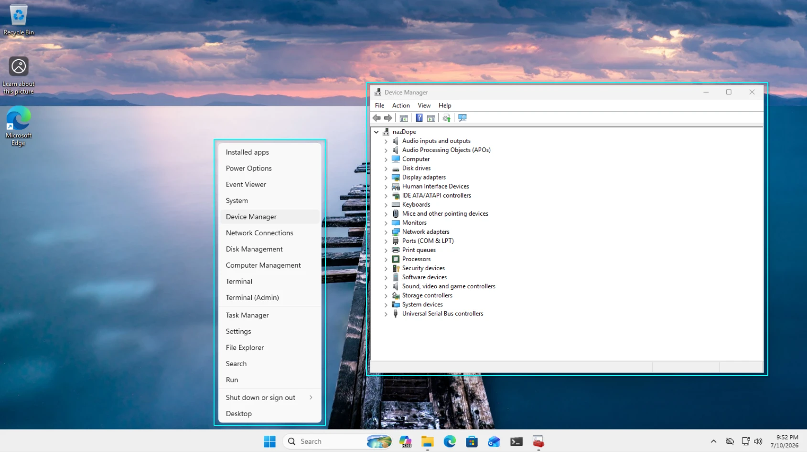
    <figcaption align="left"><i>Figure 1: Device Manager showing device categories.</i></figcaption>
   </figure>

2. **Disabling a Device**:
   - Expand the relevant category.
   - Right-click the device > **Disable device**.
   - Click **Yes** on the confirmation prompt.
   - A small down arrow appears on the device icon, showing it's disabled.
   - The device stays installed but stops functioning until you re-enable it.
   <figure>
    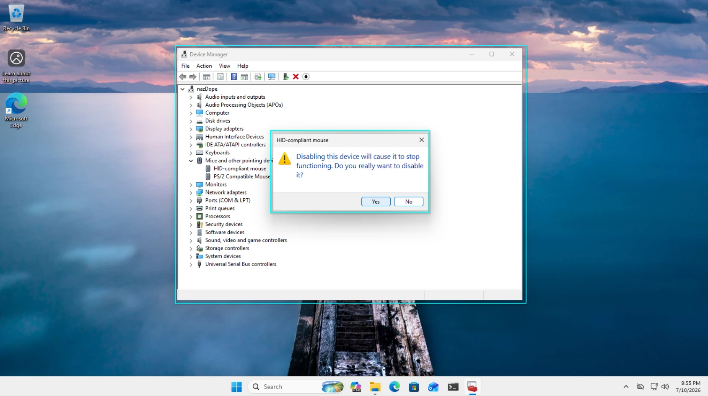
    <figcaption align="left"><i>Figure 2: Disabling a device from the right-click menu.</i></figcaption>
   </figure>

3. **Re-enabling a Device**:
   - Right-click the disabled device > **Enable device**.
   - The down arrow disappears and the device starts working again immediately. No restart needed in most cases.
   <figure>
    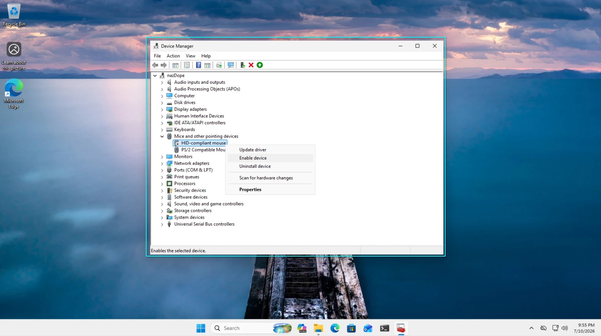
    <figcaption align="left"><i>Figure 3: Re-enabling a previously disabled device.</i></figcaption>
   </figure>

4. **Checking for Hardware Changes**:
   - If a device doesn't appear in Device Manager, click **Action** > **Scan for hardware changes** in the menu bar.
   - Windows rescans all buses and re-detects connected hardware.
   - This is useful after physically connecting a device that wasn't auto-detected.
   <figure>
    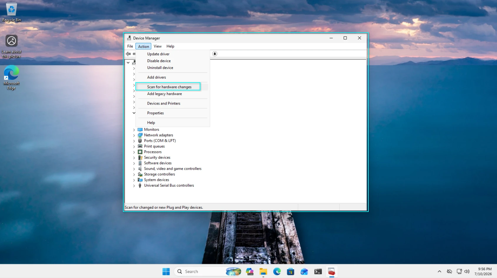
    <figcaption align="left"><i>Figure 4: Scanning for hardware changes from the Action menu.</i></figcaption>
   </figure>

---

## Lab 13.2: Adjusting Advanced Device Settings

Device Manager's Properties dialog gives you access to driver details, resource assignments, and power management options that aren't available anywhere else.

### Procedure

1. **Viewing Device Properties**:
   - In Device Manager, double-click any device (or right-click > **Properties**).
   - The **General** tab shows device status. "This device is working properly" means no issues.
   - If there's a problem, the status box shows an error code and a link to troubleshooting info.
   <figure>
    
    <figcaption align="left"><i>Figure 1: The General tab showing device status.</i></figcaption>
   </figure>

2. **Checking Driver Details**:
   - Click the **Driver** tab.
   - You'll see the driver provider, date, version, and digital signer.
   - **Driver Details** shows the actual .sys files loaded for this device.
   - This tab is also where you find **Roll Back Driver**, **Update Driver**, **Disable Device**, and **Uninstall Device** buttons.
   <figure>
    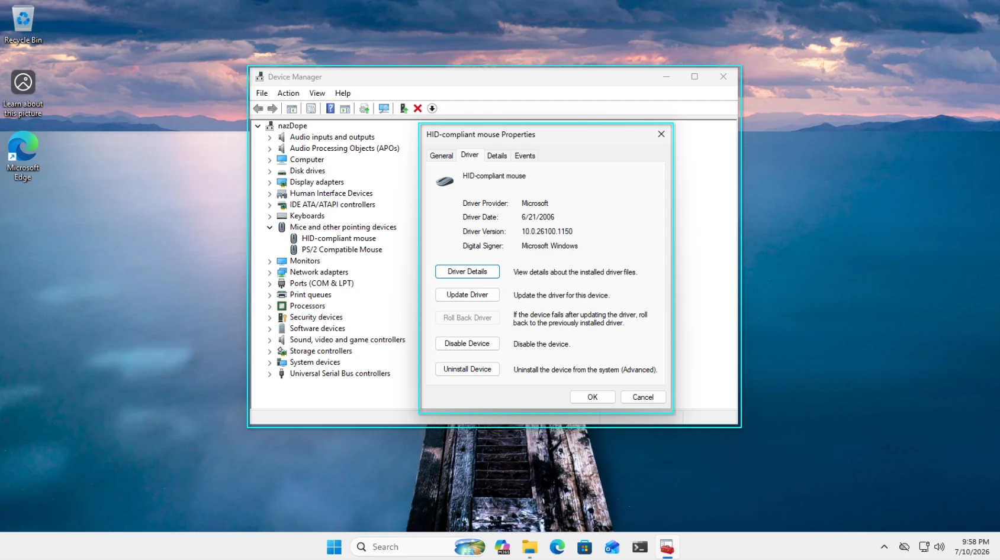
    <figcaption align="left"><i>Figure 2: The Driver tab with version info and management buttons.</i></figcaption>
   </figure>

3. **Configuring Power Management**:
   - Click the **Power Management** tab (not all devices have this).
   - Uncheck **Allow the computer to turn off this device to save power** if the device keeps disconnecting, which is common with USB Wi-Fi adapters and external drives.
   - Check **Allow this device to wake the computer** if you want it to wake the PC from sleep (useful for network adapters in Wake-on-LAN setups).
   <figure>
    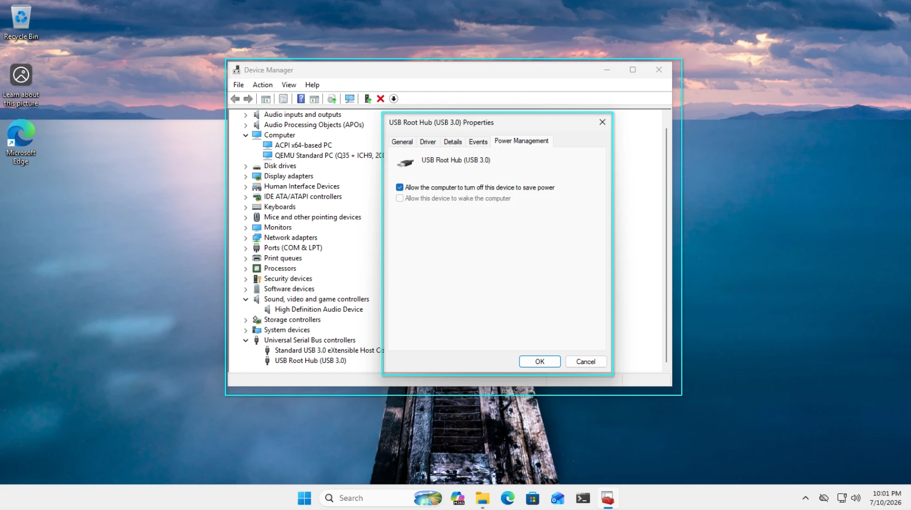
    <figcaption align="left"><i>Figure 3: Power management settings for a USB device.</i></figcaption>
   </figure>

4. **Viewing Resource Assignments**:
   - Click the **Resources** tab (available on some hardware).
   - Shows IRQ, I/O range, and memory range assigned to the device.
   - If there's a conflict, it appears in the "Conflicting device list" at the bottom.
   - Modern PCI Express devices rarely have conflicts, but legacy hardware might.
   <figure>
    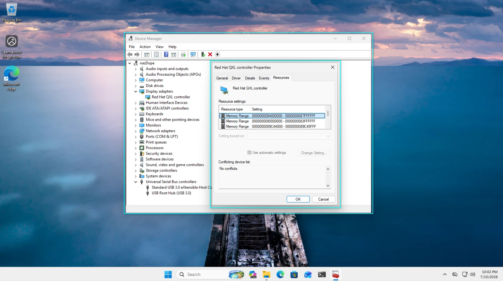
    <figcaption align="left"><i>Figure 4: Hardware resource assignments for a device.</i></figcaption>
   </figure>

---

## Lab 13.3: Setting Up a Bluetooth Device

Bluetooth connects wireless keyboards, mice, headphones, game controllers, and phones. Windows 11 handles pairing through the Settings app.

### Procedure

1. **Turning On Bluetooth**:
   - Open **Settings** > **Bluetooth & devices**.
   - Toggle **Bluetooth** to **On** if it isn't already.
   - You can also toggle it from the Quick Settings panel (click the network/volume icons in the taskbar).
   <figure>
    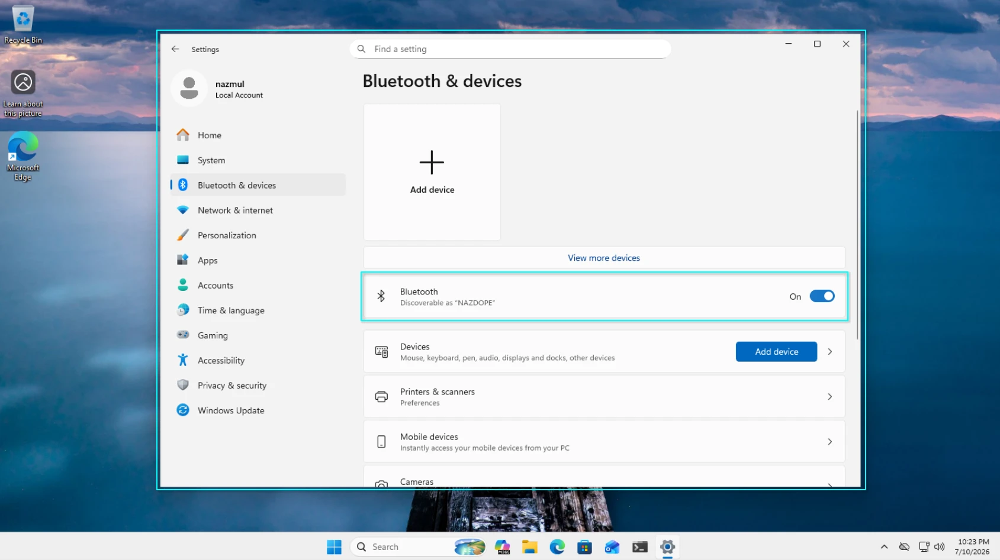
    <figcaption align="left"><i>Figure 1: Enabling Bluetooth from the Settings app.</i></figcaption>
   </figure>

2. **Pairing a Device**:
   - Put your Bluetooth device into pairing mode (check the device's manual for how).
   - In Settings, click **Add device** > **Bluetooth**.
   - Windows scans and lists discovered devices. Click your device to pair.
   - Some devices ask you to confirm a PIN or passkey on both ends.
   <figure>
    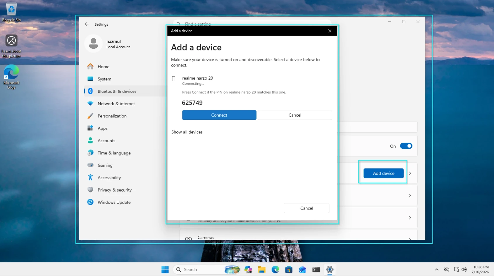
    <figcaption align="left"><i>Figure 2: Discovering and selecting a Bluetooth device to pair.</i></figcaption>
   </figure>

3. **Managing Paired Devices**:
   - Paired devices appear under **Bluetooth & devices** > **Devices**.
   - Click the three-dot menu next to a device to **Disconnect**, **Remove device**, or access its **Properties**.
   - If a device stops connecting, remove it and pair again from scratch.
   <figure>
    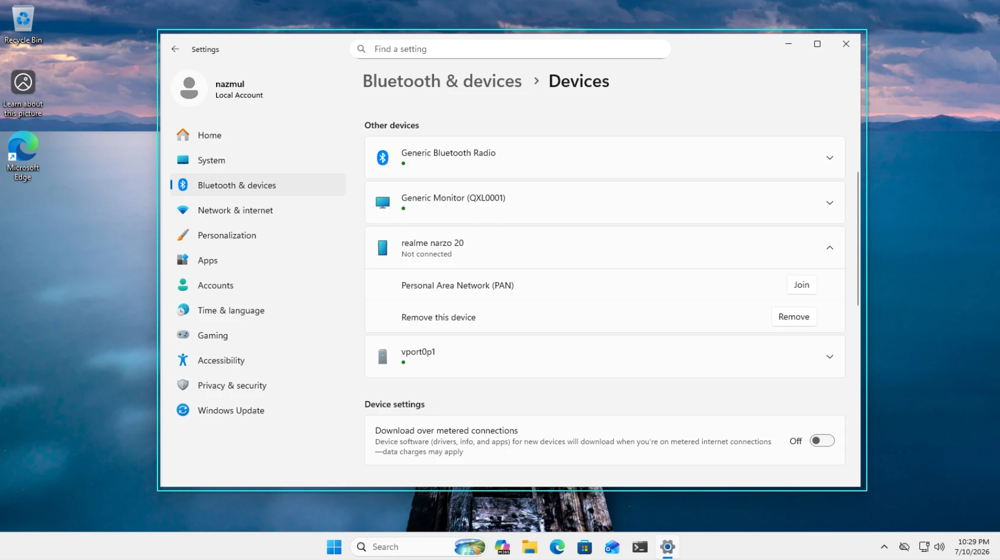
    <figcaption align="left"><i>Figure 3: Managing a paired Bluetooth device.</i></figcaption>
   </figure>

4. **Sending and Receiving Files via Bluetooth**:
   - Right-click the Bluetooth icon in the system tray > **Receive a File** (or **Send a File**).
   - To send: select the target device, then browse and pick the file.
   - To receive: start the receive wizard on your PC first, then send the file from the other device.
   - Transfer speeds are slow compared to Wi-Fi, so Bluetooth file transfer works best for small files.
   <figure>
    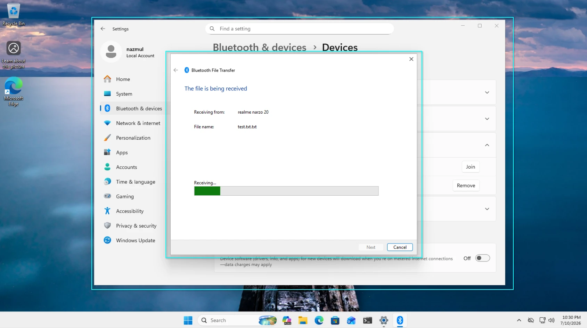
    <figcaption align="left"><i>Figure 4: Bluetooth file transfer wizard receiving a file.</i></figcaption>
   </figure>

---

## Lab 13.4: Updating a Device Driver Manually

Windows Update handles most driver updates, but sometimes you need a specific version from the manufacturer, especially for GPUs, audio interfaces, or specialty hardware.

### Procedure

1. **Updating via Device Manager**:
   - In Device Manager, right-click the device > **Update driver**.
   - Choose **Search automatically for drivers**. Windows checks its local store and Windows Update.
   - If Windows finds a newer driver, it installs automatically.
   <figure>
    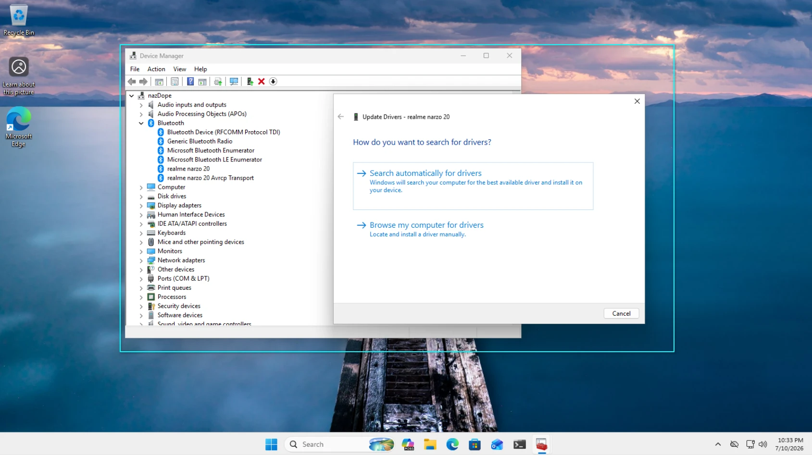
    <figcaption align="left"><i>Figure 1: The two driver update options in Device Manager.</i></figcaption>
   </figure>

2. **Installing from a Downloaded File**:
   - Download the driver from the manufacturer's website (e.g., NVIDIA, Realtek, Intel).
   - If the download is an .exe installer, just run it directly.
   - If it's a .zip with .inf files inside, extract it. In Device Manager, right-click the device > **Update driver** > **Browse my computer for drivers**.
   - Point to the extracted folder. Windows finds and installs the .inf file.
   <figure>
    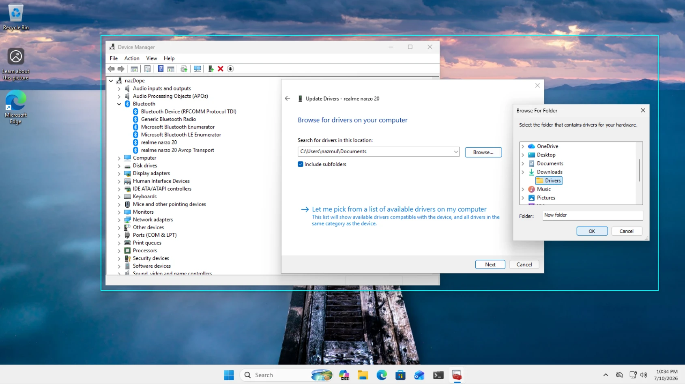
    <figcaption align="left"><i>Figure 2: Browsing to a manually downloaded driver folder.</i></figcaption>
   </figure>

3. **Checking Optional Updates in Windows Update**:
   - Open **Settings** > **Windows Update** > **Advanced options** > **Optional updates**.
   - Driver updates from manufacturers sometimes show up here.
   - Check the ones you want and click **Download & install**.
   <figure>
    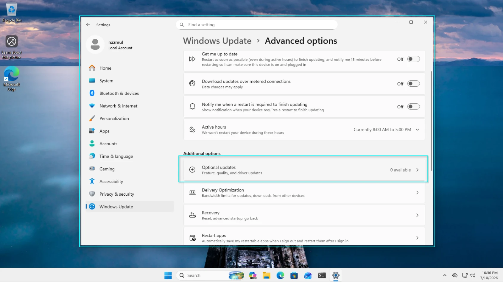
    <figcaption align="left"><i>Figure 3: Driver updates available through Windows Update's optional section.</i></figcaption>
   </figure>

4. **Rolling Back a Bad Driver**:
   - If a new driver causes problems, open Device Manager, double-click the device.
   - Go to the **Driver** tab > click **Roll Back Driver**.
   - Select a reason and click **Yes**. Windows reverts to the previous driver version.
   - This button is grayed out if there's no previous driver to roll back to.
   <figure>
    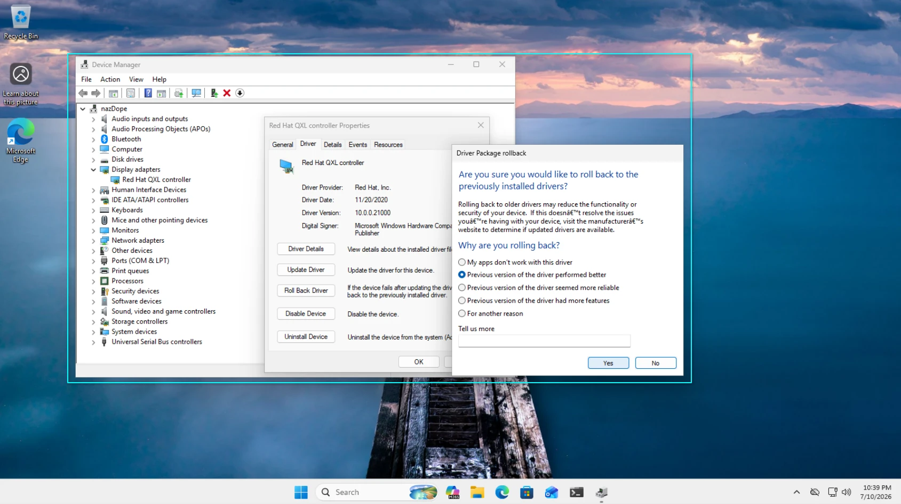
    <figcaption align="left"><i>Figure 4: Rolling back to a previous driver version.</i></figcaption>
   </figure>

---

## Lab 13.5: Uninstalling a Device Driver

You might need to remove a driver when swapping hardware, fixing conflicts, or cleaning up leftover drivers from devices you no longer use.

### Procedure

1. **Uninstalling via Device Manager**:
   - Right-click the device > **Uninstall device**.
   - In the confirmation dialog, check **Attempt to remove the driver for this device** if you want to delete the driver files completely. Without this checkbox, Windows keeps the driver and may reinstall it automatically.
   - Click **Uninstall**.
   <figure>
    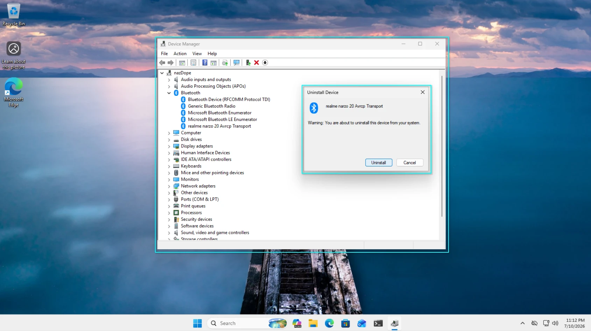
    <figcaption align="left"><i>Figure 1: The uninstall confirmation with the remove driver checkbox.</i></figcaption>
   </figure>

2. **Showing Hidden Devices**:
   - Click **View** > **Show hidden devices** in Device Manager.
   - Grayed-out entries are drivers for hardware that's no longer connected.
   - Right-click any of these to uninstall their leftover drivers.
   <figure>
    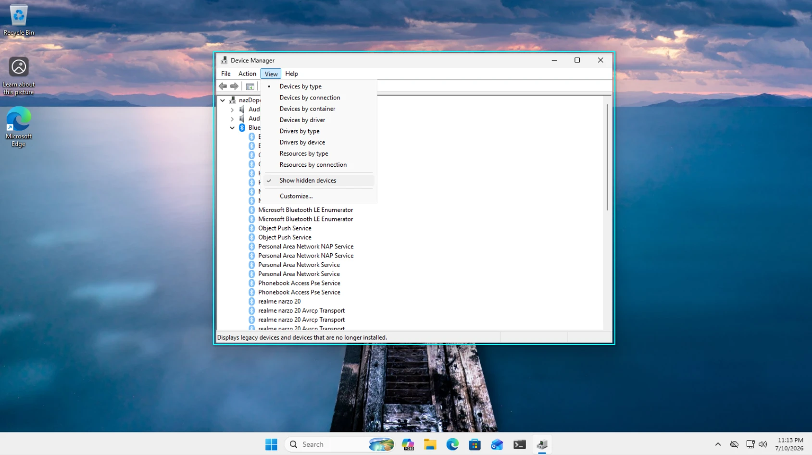
    <figcaption align="left"><i>Figure 2: Hidden devices revealed, showing disconnected hardware.</i></figcaption>
   </figure>

3. **Removing a Driver Package with pnputil**:
   - Open **Terminal (Admin)**.
   - Run `pnputil /enum-drivers` to list all third-party driver packages in the driver store.
   - Find the one you want to remove and note its "Published Name" (e.g., `oem45.inf`).
   - Run `pnputil /delete-driver oem45.inf /uninstall` to remove it.
   <figure>
    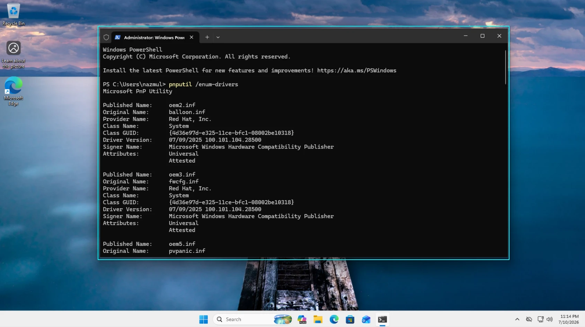
    <figcaption align="left"><i>Figure 3: Listing and removing a driver package with pnputil.</i></figcaption>
   </figure>

4. **Preventing Windows from Reinstalling a Driver**:
   - After uninstalling, Windows Update may reinstall the same driver.
   - To block this temporarily: open **Settings** > **System** > **About** > **Advanced system settings**.
   - Click the **Hardware** tab > **Device Installation Settings**.
   - Select **No** and click **Save Changes**.
   - Remember to turn this back on later so you don't miss important driver updates.
   <figure>
    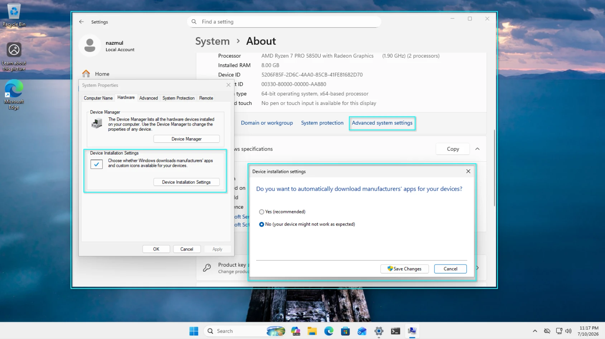
    <figcaption align="left"><i>Figure 4: Blocking automatic driver downloads from Windows Update.</i></figcaption>
   </figure>

---

## Lab 13.6: Sharing a Printer

If a printer connects directly to your PC via USB, you can share it so other PCs on the local network can print through your computer.

### Procedure

1. **Enabling File and Printer Sharing**:
   - Go to **Settings** > **Network & internet** > **Advanced network settings**.
   - Click **Advanced sharing settings**.
   - Turn on **File and printer sharing** for your active network profile (Private or Public).
   <figure>
    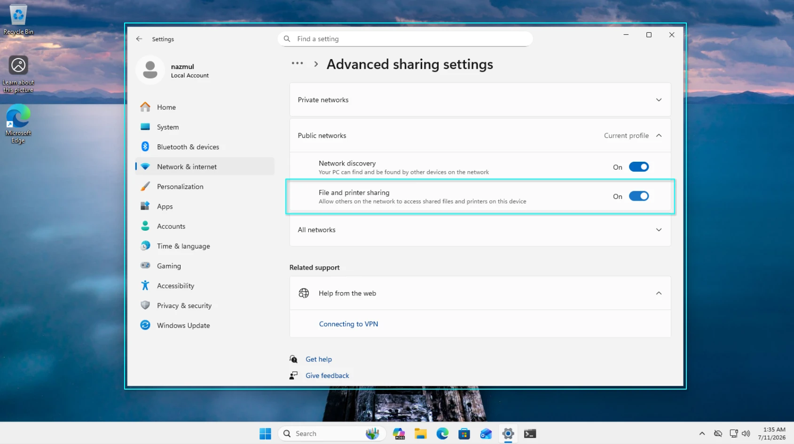
    <figcaption align="left"><i>Figure 1: Enabling printer sharing in advanced network settings.</i></figcaption>
   </figure>

2. **Sharing the Printer**:
   - Go to **Settings** > **Bluetooth & devices** > **Printers & scanners**.
   - Click the printer you want to share.
   - Click **Printer properties** > **Sharing** tab.
   - Check **Share this printer** and give it a short share name (e.g., "MainPrinter").
   <figure>
    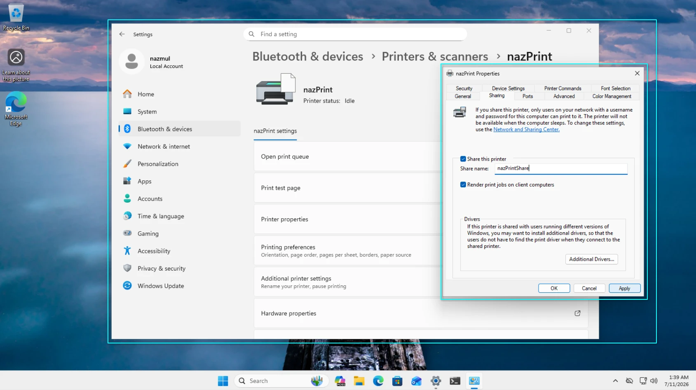
    <figcaption align="left"><i>Figure 2: Enabling sharing and setting a share name.</i></figcaption>
   </figure>

3. **Connecting from Another PC**:
   - On the other PC, go to **Settings** > **Bluetooth & devices** > **Printers & scanners** > **Add device**.
   - If it doesn't appear automatically, click **Add manually** > **Select a shared printer by name**.
   - Type `\\ComputerName\ShareName` (e.g., `\\DESKTOP-ABC\MainPrinter`).
   - Click **Next** and install the driver when prompted.
   <figure>
    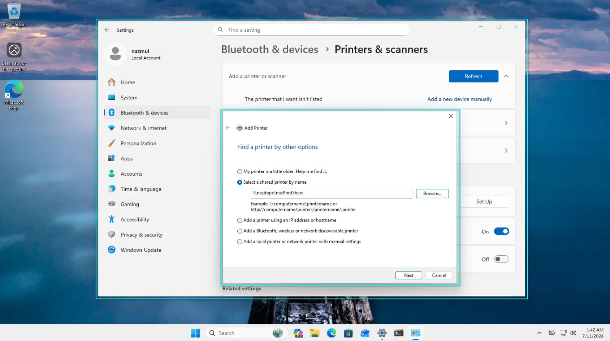
    <figcaption align="left"><i>Figure 3: Connecting to a shared printer by network path.</i></figcaption>
   </figure>

4. **Managing the Print Queue**:
   - On the sharing PC, click the printer in **Printers & scanners** > **Open print queue**.
   - All print jobs from local and network users appear here.
   - Right-click a job to pause, resume, restart, or cancel it.
   - If a stuck job blocks the queue, cancel all documents and restart the Print Spooler service: open **Terminal (Admin)** and run `Restart-Service -Name Spooler -Force`.
   <figure>
    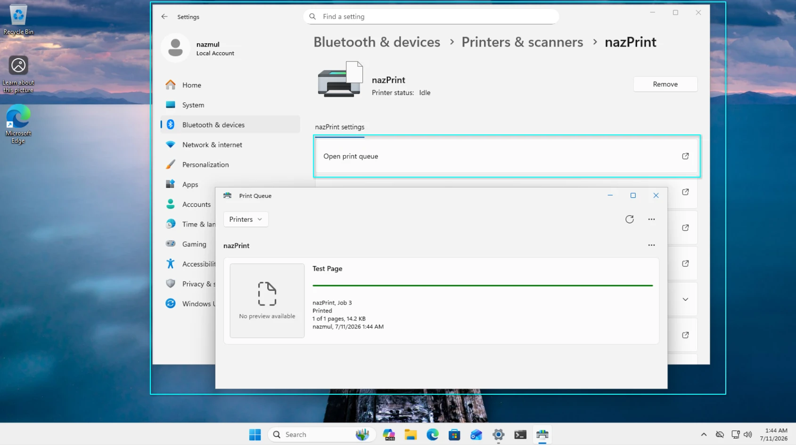
    <figcaption align="left"><i>Figure 4: The print queue showing pending jobs from multiple users.</i></figcaption>
   </figure>

---

## Lab 13.7: Changing Display Settings

Whether you're adjusting resolution on a new monitor, setting up a multi-display arrangement, or tweaking the refresh rate for gaming, everything runs through the Display settings page.

### Procedure

1. **Accessing Display Settings**:
   - Right-click the desktop > **Display settings**.
   - Or open **Settings** > **System** > **Display**.
   - If multiple monitors are connected, they appear as numbered rectangles at the top. Click **Identify** to flash the number on each screen.
   <figure>
    
    <figcaption align="left"><i>Figure 1: Display settings showing detected monitors.</i></figcaption>
   </figure>

2. **Changing Resolution and Scaling**:
   - Select a display, then scroll to **Display resolution**. Pick the recommended resolution for the sharpest image.
   - Adjust **Scale** (100%, 125%, 150%, etc.) to make text and UI elements larger or smaller. Useful on high-DPI displays where everything looks tiny at native resolution.
   <figure>
    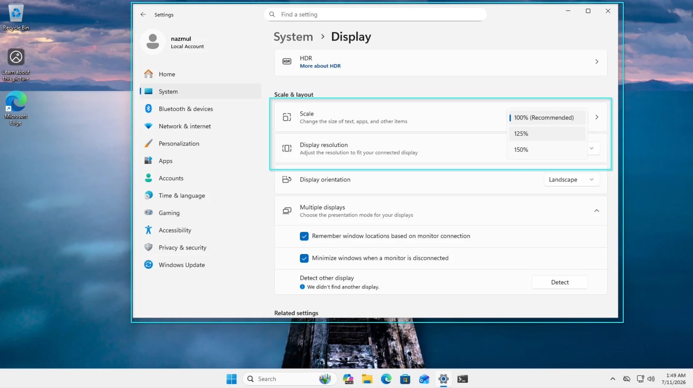
    <figcaption align="left"><i>Figure 2: Setting display resolution and scale percentage.</i></figcaption>
   </figure>

3. **Arranging Multiple Displays**:
   - Drag the numbered display rectangles to match the physical layout on your desk.
   - Choose how displays work together: **Extend these displays** (separate desktops), **Duplicate these displays** (mirror), or **Show only on 1/2**.
   - Set one as the main display by checking **Make this my main display**. The taskbar and Start menu live here.

4. **Adjusting Refresh Rate and HDR**:
   - Click **Advanced display** at the bottom of the Display settings page.
   - Select a monitor and change the **Refresh rate** (60 Hz, 144 Hz, etc.). Higher refresh rates give smoother motion but your monitor and GPU need to support it.
   - If your display supports HDR, toggle **Use HDR** to on. Click **HDR** in the Display settings for fine-tuning SDR content brightness.

---

## Lab 13.8: Setting Up Speakers, Microphones, and Headsets

Windows 11 handles audio devices through the Settings app and the classic Sound control panel. You choose your default output and input devices here, and adjust volume levels and spatial audio.

### Procedure

1. **Selecting the Default Output Device**:
   - Open **Settings** > **System** > **Sound**.
   - Under **Output**, click the dropdown to pick your speakers or headphones.
   - Click the arrow next to your device for detailed settings: volume, audio format (sample rate and bit depth), and spatial audio.
   <figure>
    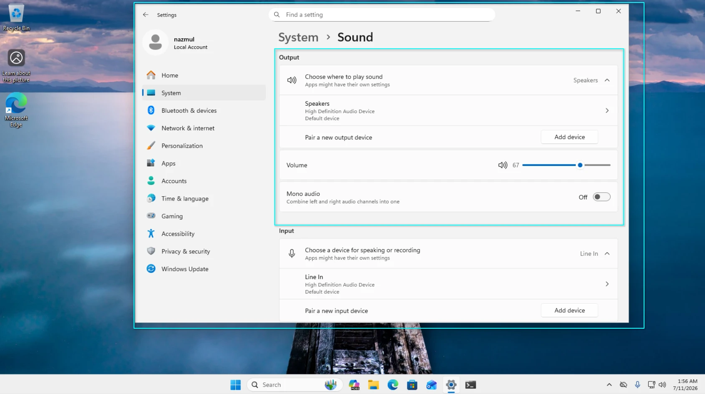
    <figcaption align="left"><i>Figure 1: Choosing the default audio output device.</i></figcaption>
   </figure>

2. **Selecting the Default Input Device**:
   - Scroll to the **Input** section on the same page.
   - Choose your microphone from the dropdown.
   - Click the arrow next to it to adjust input volume and test the mic. The level meter moves as you speak.
   <figure>
    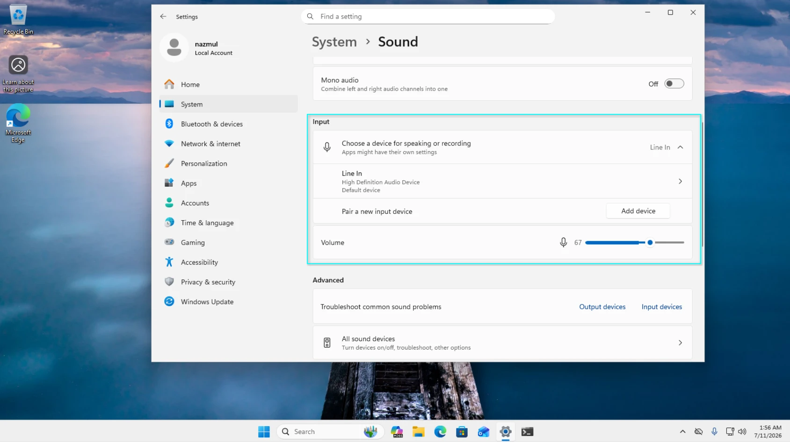
    <figcaption align="left"><i>Figure 2: Setting the default microphone and testing input levels.</i></figcaption>
   </figure>

3. **Using the Volume Mixer**:
   - Scroll down in Sound settings and click **Volume mixer**.
   - This shows volume sliders for each running app. You can lower the volume of your browser without affecting your music player.
   - Set the output device per app if you want different apps to play through different speakers or headphones.
   <figure>
    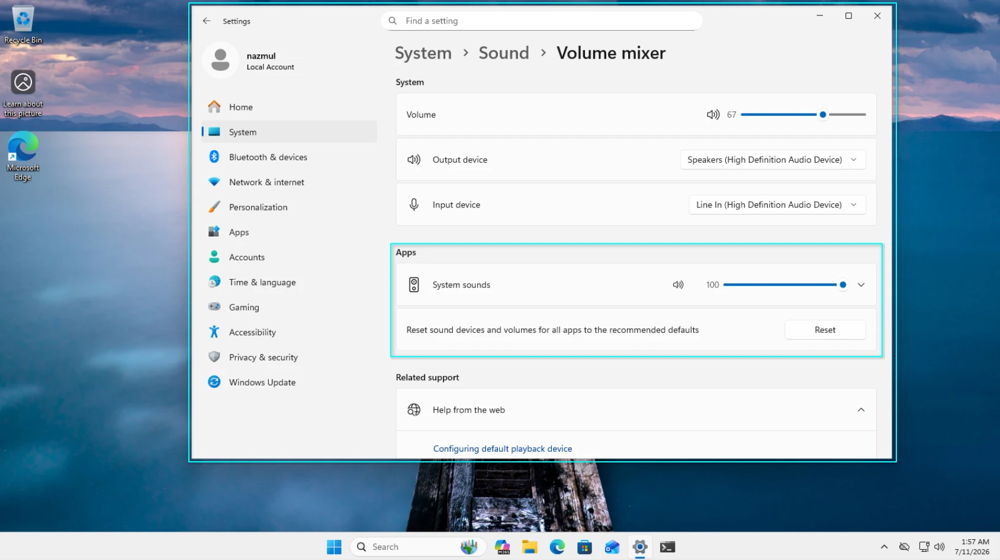
    <figcaption align="left"><i>Figure 3: The volume mixer with per-app volume controls.</i></figcaption>
   </figure>

4. **Configuring via the Classic Sound Panel**:
   - Scroll to the bottom of the Sound settings page and click **More sound settings**.
   - The **Playback** tab shows all output devices. Right-click one to set as default, test, or configure surround sound.
   - The **Recording** tab does the same for microphones. Right-click a mic > **Properties** > **Levels** tab to boost a quiet mic.
   - The **Enhancements** tab (on some devices) lets you enable bass boost, virtual surround, or loudness equalization.
   <figure>
    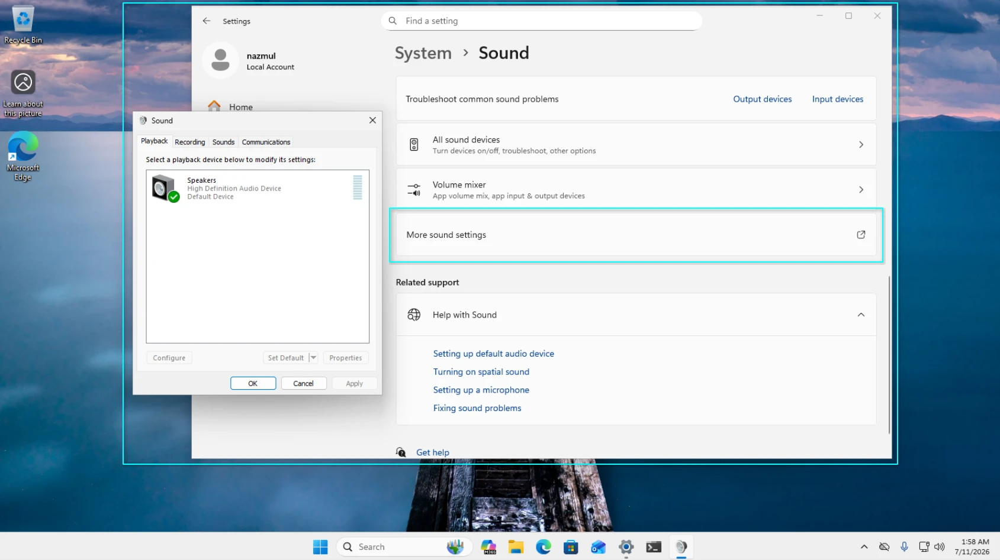
    <figcaption align="left"><i>Figure 4: The classic Sound control panel with playback device options.</i></figcaption>
   </figure>
