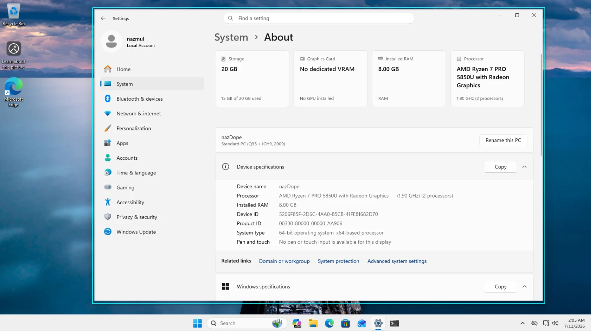
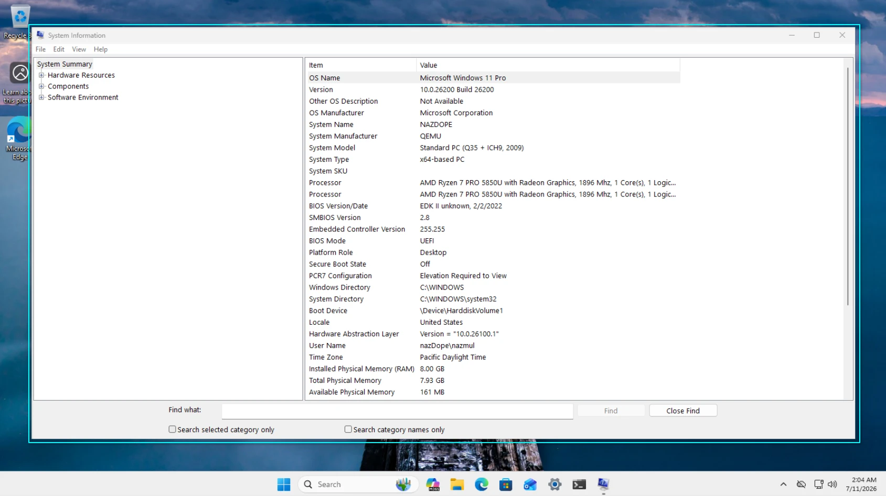
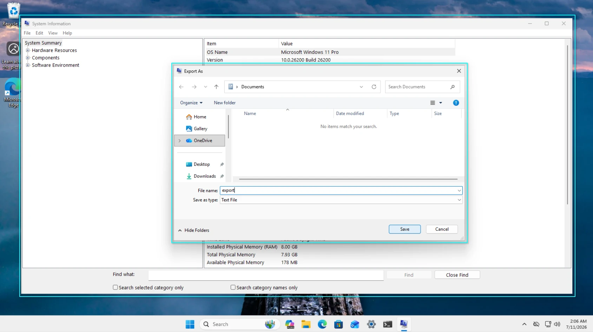
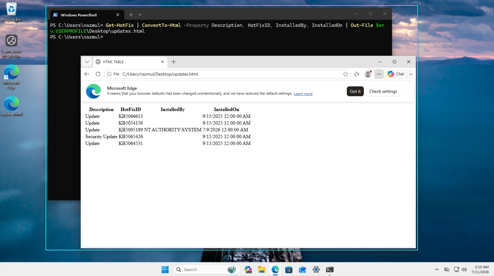
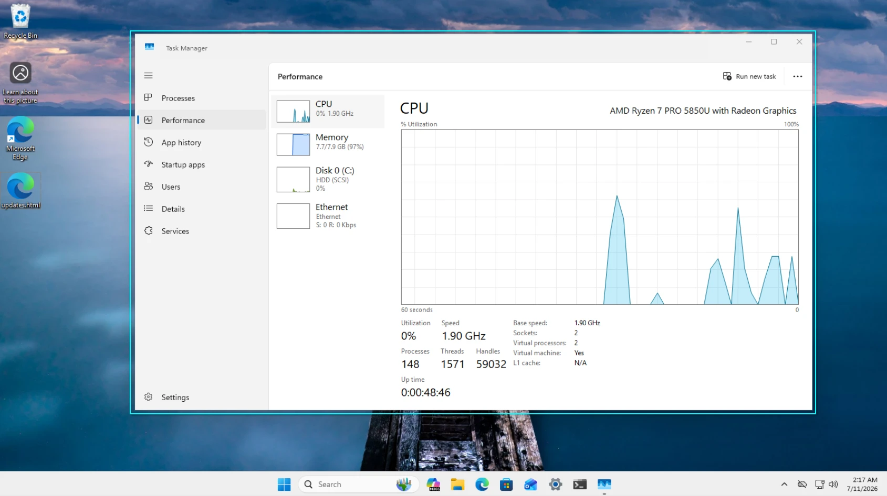
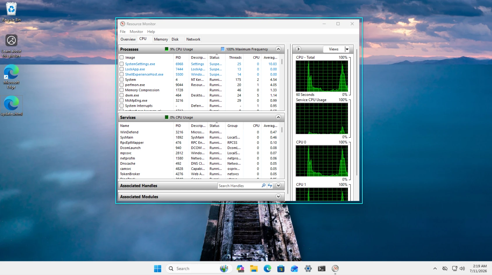
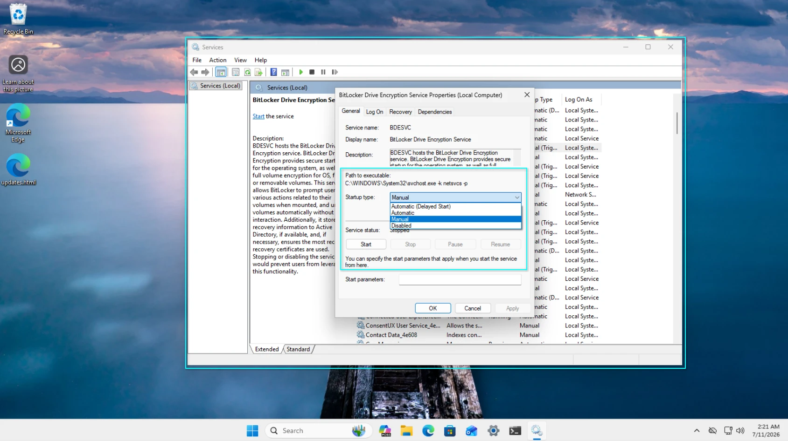
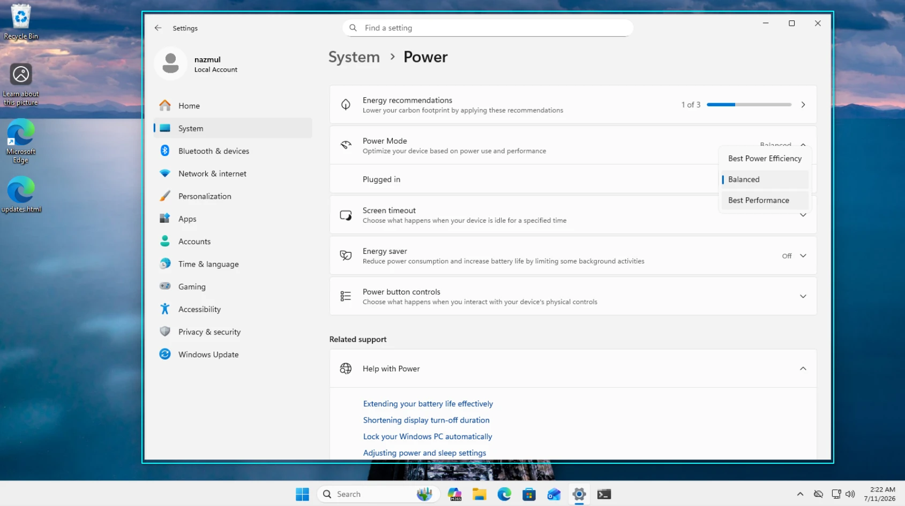

# Chapter 14: Performance and Power Management

Managing your Windows 11 system involves checking hardware specifications, tracking updates, monitoring resource usage, and configuring performance and power settings.

---

## Lab 14.1: Viewing Details About Your System

Check your PC's hardware, Windows edition, and version directly from the Settings app.

### Procedure

1. **Opening System About**:
   - Right-click Start > **Settings** > **System** > **About**
   - Review your Device specifications and Windows specifications
   <figure>
    
    <figcaption align="left"><i>Figure 1: Viewing system specifications in Settings.</i></figcaption>
   </figure>

---

## Lab 14.2: Viewing System Information with msinfo32

Use the System Information tool to see an in-depth look at hardware resources, components, and software environments.

### Procedure

1. **Opening System Information**:
   - Press **Win + R**, type `msinfo32`, Enter
   <figure>
    
    <figcaption align="left"><i>Figure 1: The msinfo32 interface showing system summary.</i></figcaption>
   </figure>

2. **Saving data as an .nfo or text file**:
   - **File** > **Save** to create a `.nfo` file for another PC to read
   - **File** > **Export** to save the details as a plain text file
   <figure>
    
    <figcaption align="left"><i>Figure 2: Exporting system information.</i></figcaption>
   </figure>

---

## Lab 14.3: Generating an HTML Report of Windows Updates via PowerShell

Use PowerShell to check installed updates and format them as an HTML webpage.

### Procedure

1. **Running the PowerShell command**:
   - Right-click Start > **Terminal**
   - Run: `Get-HotFix | ConvertTo-Html -Property Description, HotFixID, InstalledBy, InstalledOn | Out-File $env:USERPROFILE\Desktop\updates.html`
   - Open `updates.html` on your desktop to view the updates table
   <figure>
    
    <figcaption align="left"><i>Figure 1: Generating the HTML update report.</i></figcaption>
   </figure>

---

## Lab 14.4: Monitoring Real-Time Performance with Task Manager

Task Manager gives you a quick overview of running processes and system utilization.

### Procedure

1. **Viewing the Performance tab**:
   - Right-click Start > **Task Manager** > **Performance** tab
   - Click through CPU, Memory, Disk, and Network to see current usage graphs
   <figure>
    
    <figcaption align="left"><i>Figure 1: Real-time CPU usage in Task Manager.</i></figcaption>
   </figure>

---

## Lab 14.5: Monitoring Real-Time Performance with Resource Monitor

When Task Manager lacks detail, Resource Monitor breaks down usage per process and file.

### Procedure

1. **Launching Resource Monitor**:
   - Press **Win + R**, type `resmon`, Enter
   - Alternative: **Task Manager** > **Performance** tab > Click the three dots (menu) > **Resource Monitor**
   <figure>
    
    <figcaption align="left"><i>Figure 1: Detailed process breakdown in Resource Monitor.</i></figcaption>
   </figure>

---

## Lab 14.6: Managing and Configuring Windows Services

Control background applications and core Windows features using the Services console.

### Procedure

1. **Modifying service startup types**:
   - Press **Win + R**, type `services.msc`, Enter
   - Double-click any service to open its properties
   - Change Startup type (Automatic, Manual, Disabled) or use the Start/Stop buttons
   <figure>
    
    <figcaption align="left"><i>Figure 1: Configuring Windows service startup behavior.</i></figcaption>
   </figure>

---

## Lab 14.7: Power Management on Desktop Systems

Configure how your computer handles sleep states and display timeouts to balance performance and energy use.

### Procedure

1. **Adjusting power plans**:
   - Right-click Start > **Settings** > **System** > **Power**
   - Change the Power mode (e.g., Best performance or Best power efficiency)
   - Configure screen off and sleep timeouts
   <figure>
    
    <figcaption align="left"><i>Figure 1: Configuring desktop power management settings.</i></figcaption>
   </figure>
