# Chapter 3: Using Windows 11

This chapter covers the essential interface customizations in Windows 11. You'll learn how to organize your workspace, manage notifications, and use productivity features like snap layouts and virtual desktops.

---

## Lab 3.1: Customizing the Start Menu

The Start menu is your central hub for apps and files. You can pin frequently used items and organize them into folders to keep things tidy.

### Procedure

1. **Pinning Apps**: 
   - Open the Start menu and click **All apps** at the top right.
   - Right-click an app you use often (like Calculator or Notepad) and select **Pin to Start**.

   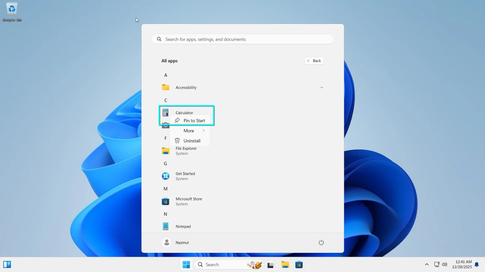
   *Figure 1: Right-clicking an app in the All apps list to pin it.*

   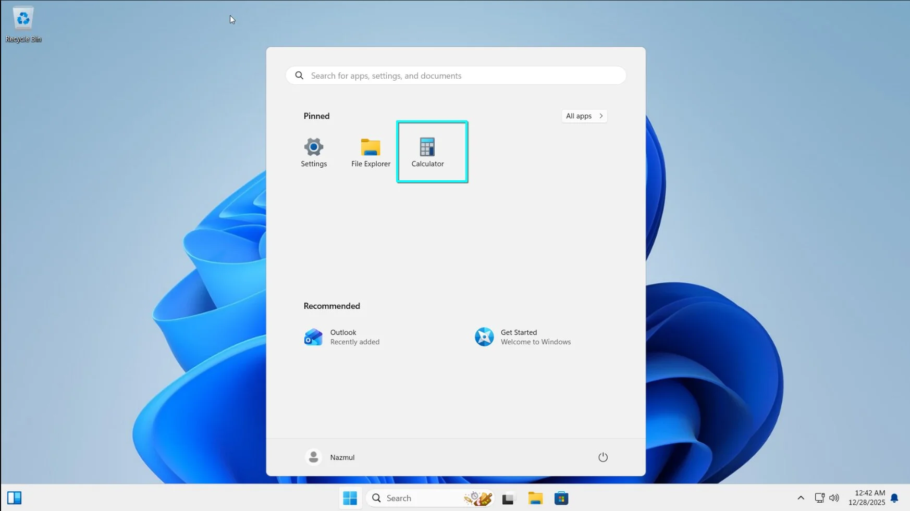
   *Figure 2: Verification of the pinned app in the Start menu.*

2. **Organizing with Folders**:
   - In the "Pinned" section, click and drag one app icon directly onto another.
   - Windows creates a folder automatically. Click the folder to open it, then click **Edit name** to give it a descriptive label like "Tools" or "Office".

   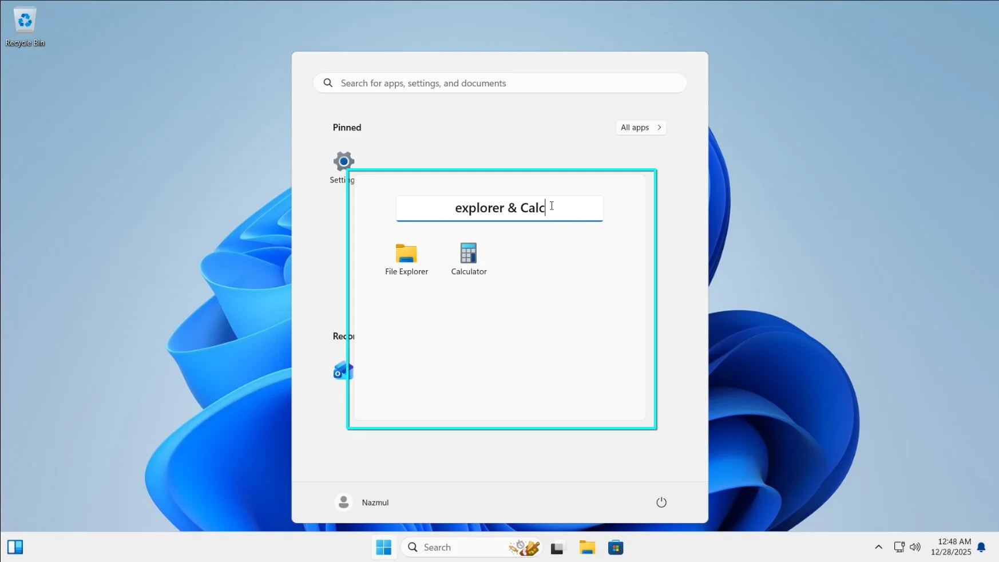
   *Figure 1: Two apps being merged into a folder, and the folder naming interface.*

3. **Adjusting the Layout**:
   - Go to **Settings > Personalization > Start**.
   - Pick "More pins", "Default", or "More recommendations". This changes how much space goes to pinned apps versus recent files.

   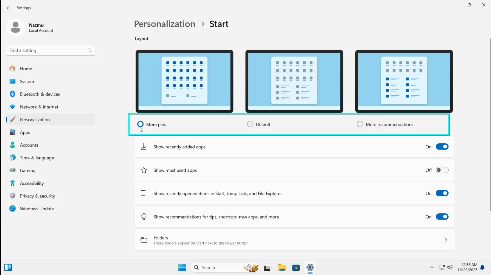
   *Figure 1: The Start settings page showing the three layout options.*

---

## Lab 3.2: Customizing the Taskbar

The taskbar is anchored to the bottom of the screen. You can change its alignment, hide it automatically, and control which icons appear in the system tray.

### Procedure

1. **Taskbar Alignment**:
   - Right-click an empty space on the taskbar and select **Taskbar settings**.
   - Scroll down to **Taskbar behaviors** and change **Taskbar alignment** from "Center" to "Left" if you prefer the classic Windows look.

   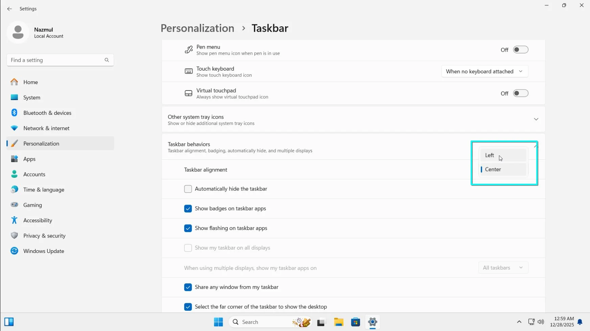
   *Figure 1: Taskbar settings window with the "Taskbar behaviors" section expanded and alignment dropdown visible.*

2. **Managing System Icons**:
   - In Taskbar settings, toggle the switches under **Taskbar items** to show or hide Search, Task view, Widgets, or Chat.

   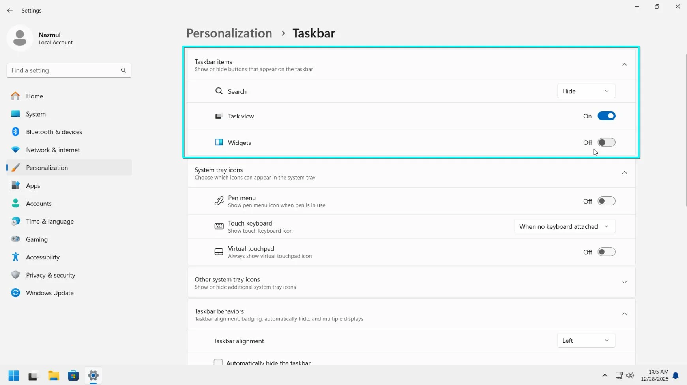
   *Figure 1: The "Taskbar items" section in Settings with various icons toggled on/off.*

3. **Pinning Running Apps**:
   - If an app is already open, right-click its icon on the taskbar and select **Pin to taskbar**. It'll stay there even after you close the app.

---

## Lab 3.3: Quick Settings Pane Customization

Quick Settings give you fast access to Wi-Fi, Bluetooth, and volume. You can add or remove buttons to suit your workflow.

### Procedure

1. **Accessing Quick Settings**: 
   - Click the set of icons in the bottom right (Network, Volume, and Battery) or press **Win + A**.

   
   *Figure 1: The Quick Settings panel open in the bottom-right corner.*

2. **Editing the Panel**:
   - Click the **Edit quick settings** (pencil icon) at the bottom.
   - Click **Unpin** on any icon you don't need.
   - Click **Add** to include features like "Night light" or "Mobile hotspot".
   - Drag items to rearrange them.

   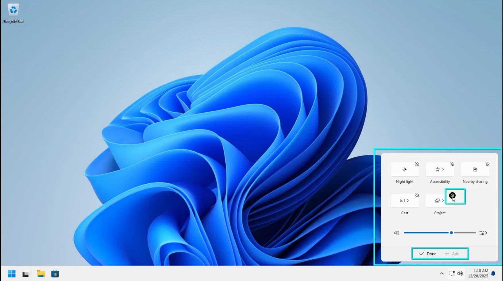
   *Figure 1: Quick Settings in edit mode, showing "Unpin" icons and the "Add" button.*

---

## Lab 3.4: Managing Notifications and Distractions

Windows 11 centralizes alerts in the Notification Center. You can silence them using Do Not Disturb or set up Focus sessions when you need to get work done.

### Procedure

1. **Checking Notifications**:
   - Click the Date and Time in the taskbar or press **Win + N**.
   - Click **Clear all** to wipe the list if it gets too cluttered.

   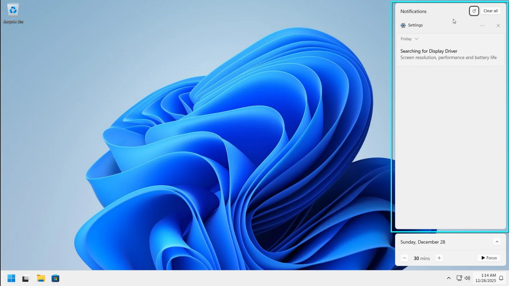
   *Figure 1: Notification Center open above the calendar flyout.*

2. **Enabling Do Not Disturb**:
   - Go to **Settings > System > Notifications**.
   - Pull the **Do not disturb** switch to "On" to silence alerts.
   - Under **Set priority notifications**, pick specific apps or people that can still reach you.

   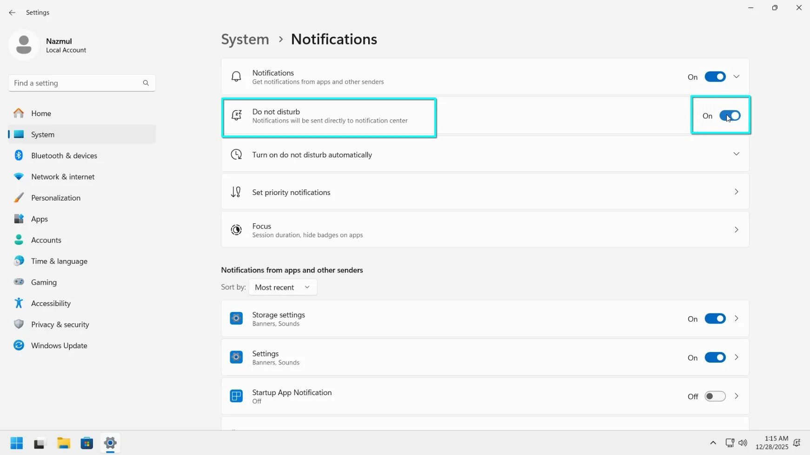
   *Figure 1: Notification settings page with Do Not Disturb turned on.*

3. **Focus Sessions**:
   - Open the **Clock** app and select **Focus sessions**.
   - Set a timer for your task and click **Start focus session**. This triggers Do Not Disturb and hides taskbar badges automatically.

---

## Lab 3.5: Emoji and Keyboard Voice

Windows has a built-in emoji picker with GIFs and symbols, plus a voice typing tool that's surprisingly accurate.

### Procedure

1. **The Emoji Picker**:
   - Click into any text field and press **Win + .** (period).
   - Use the tabs at the top to switch between Emojis, GIFs, Kaomoji, and Symbols.

   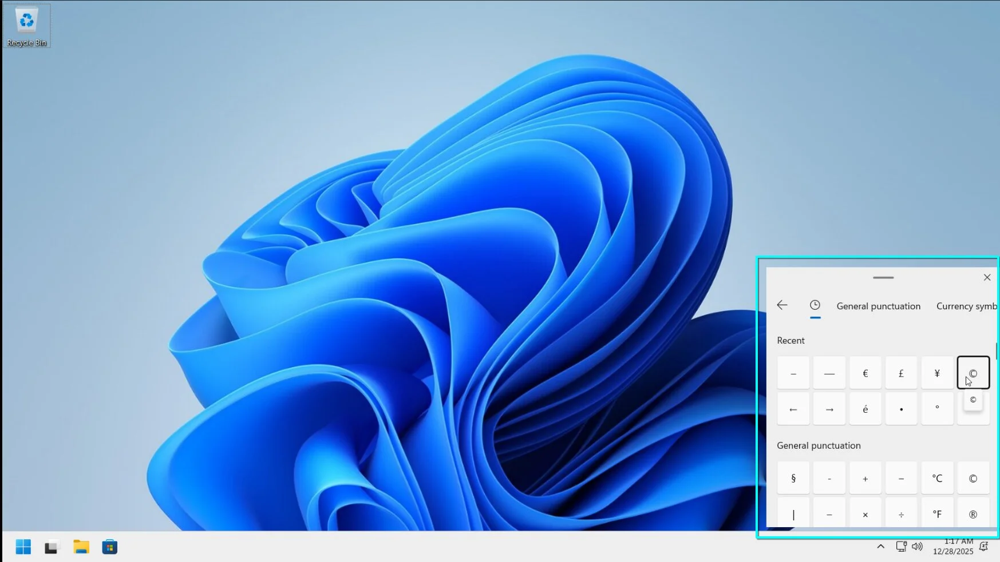
   *Figure 1: The Emoji panel open with the "Symbols" tab selected.*

2. **Voice Typing**:
   - Press **Win + H** to open the voice typing toolbar.
   - Click the microphone and start talking. Windows transcribes your words as you go.
   - Click the **Settings** (gear icon) on the toolbar to turn on **Auto-punctuation**.

   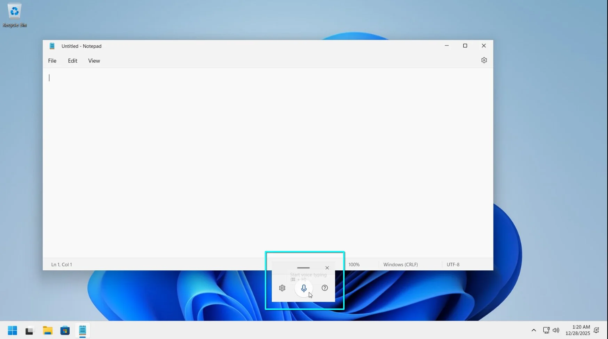
   *Figure 1: The small voice typing toolbar active on screen.*

---

## Lab 3.6: Arranging Windows (Snap Layouts)

Organizing multiple windows is easy with Snap Layouts. You can split your screen into halves, thirds, or quadrants without dragging windows manually.

### Procedure

1. **Using Snap Layouts**:
   - Hover your mouse over the **Maximize** button of any window. 
   - A grid of layout options pops up. Click a zone to snap the window there.

   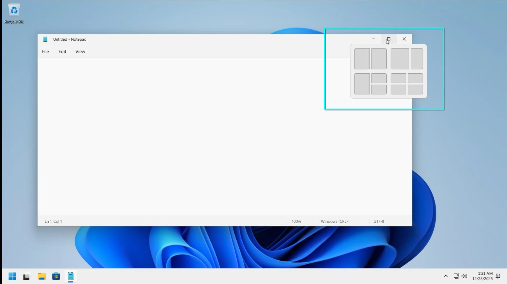
   *Figure 1: Mouse hovering over the maximize button, revealing the Snap Layouts flyout.*

2. **Snap Assist**:
   - Once you snap one window, **Snap Assist** shows your other open windows. Click one to fill the remaining space.

3. **Snap Groups**:
   - If you've snapped windows together, hover over the icon of one of those apps on the taskbar. You'll see the individual window preview AND the **Snap Group**. Click the group to bring back the whole layout at once.

   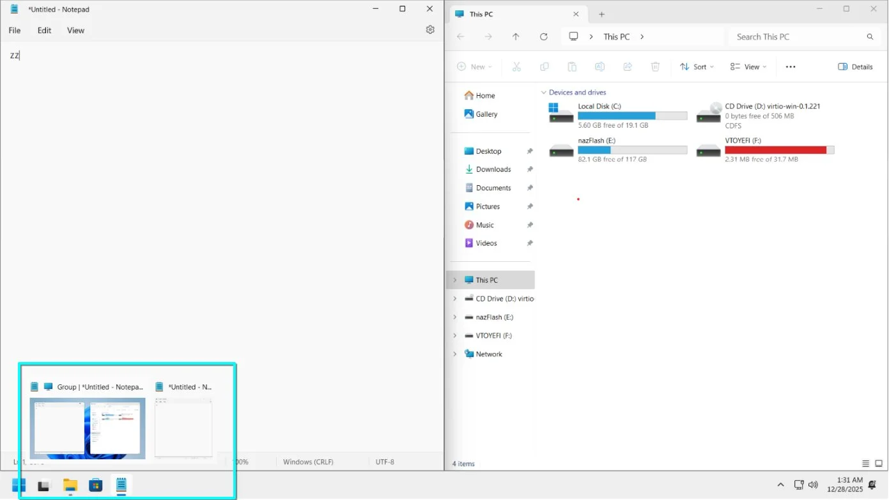
   *Figure 1: Taskbar preview showing a "Group" of windows.*

---

## Lab 3.7: Virtual Desktops

Virtual desktops help you separate "Work" from "Personal" (or different projects) on a single monitor.

### Procedure

1. **Creating a New Desktop**:
   - Press **Win + Tab** to open Task View.
   - Click **New desktop** at the bottom.

   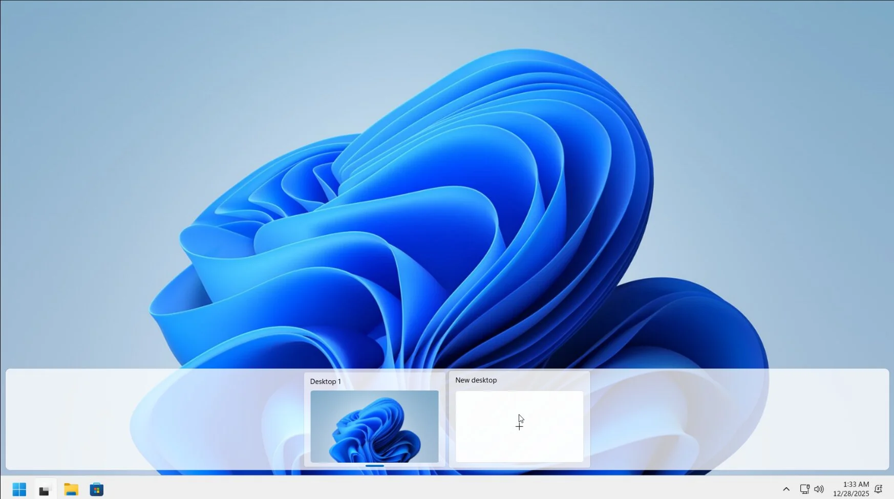
   *Figure 1: Task View screen with the "New desktop" button clearly visible.*

2. **Customizing Desktops**:
   - Right-click a desktop thumbnail to rename it or pick a custom background for just that desktop.

3. **Switching quickly**:
   - Use the shortcut **Win + Ctrl + Left/Right Arrow** to glide between desktops instantly.
