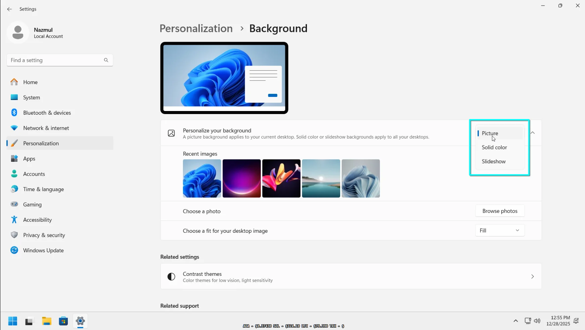
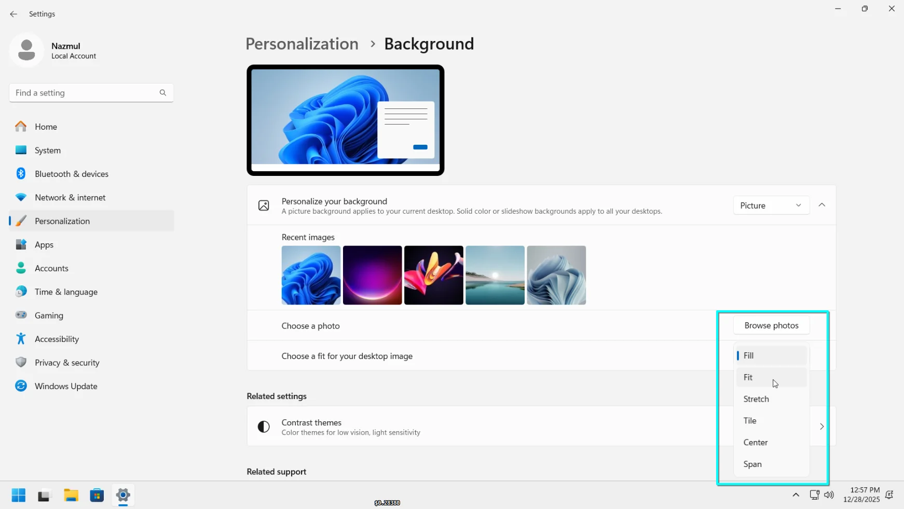
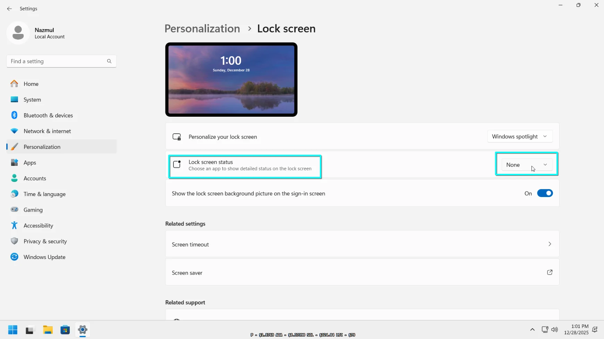
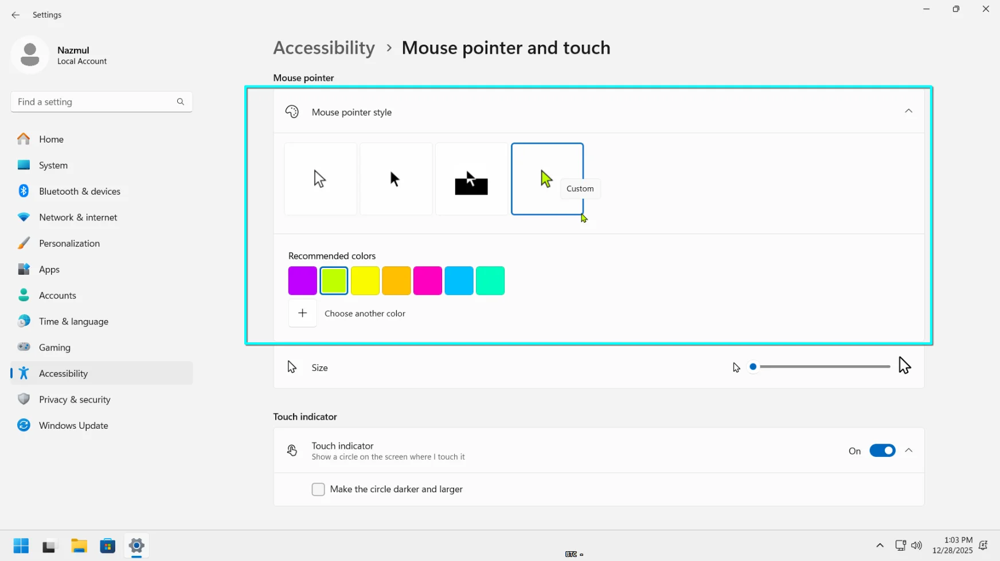
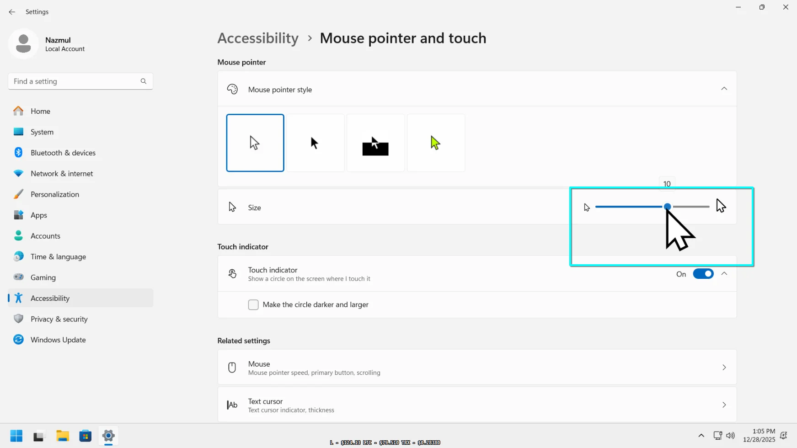
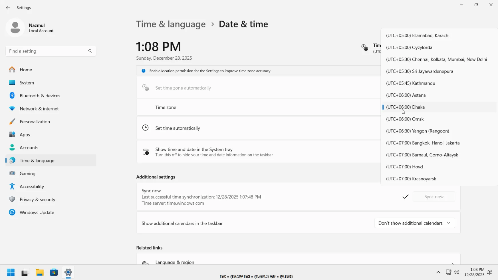
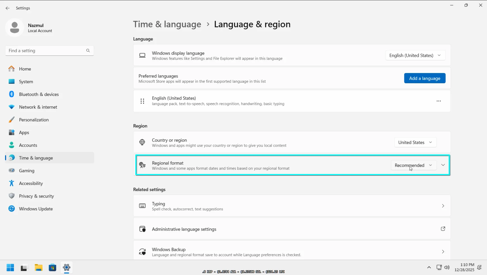
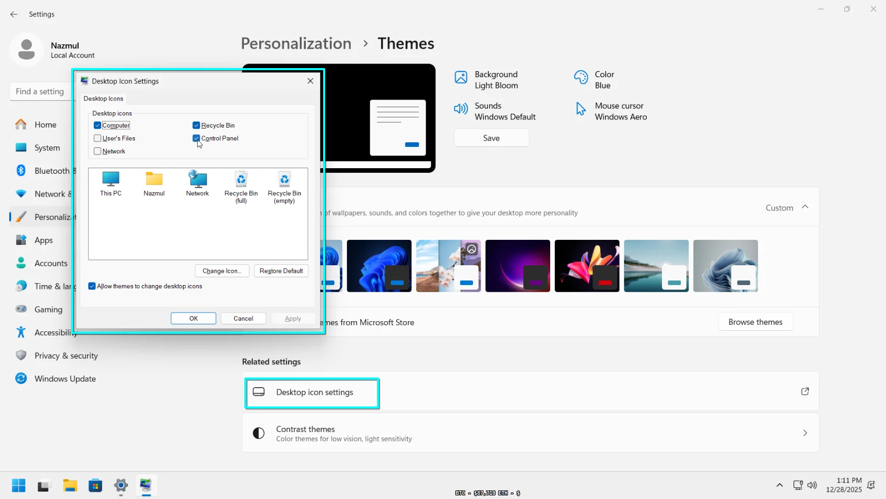
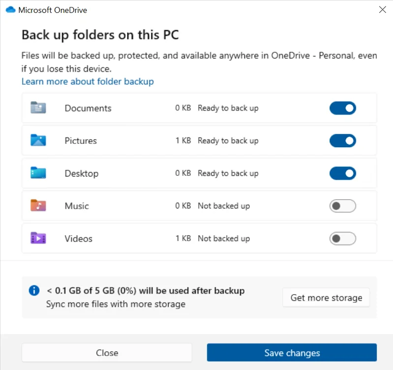

# Chapter 4: Personalizing Windows 11

Personalization allows you to tailor your Windows experience to your visual preferences and ergonomic needs. This chapter covers everything from changing your wallpaper and mouse pointer to managing regional settings and cloud backups.

---

## Lab 4.1: Changing the Desktop Background

Your desktop background (wallpaper) is the most visible part of your workspace. You can use a single picture, a solid color, or a rotating collection of images.

### Procedure

1. **Accessing Background Settings**:
   - Right-click an empty area on your desktop and choose **Personalize**.
   - Select **Background** from the list of options.

2. **Choosing a Background Type**:
   - Click the dropdown menu next to **Personalize your background**.
   - Pick **Picture** for a single image, **Solid color** for a plain background, or **Windows Spotlight** to let Windows download a fresh image every day.

   
   *Figure 1: The Background settings page showing the personalization dropdown.*

3. **Picking your image**:
   - If you chose "Picture", click **Browse photos** to select an image from your computer.
   - Use the **Choose a fit for your desktop image** dropdown to adjust how the image fills your screen (e.g., Fill, Fit, or Stretch).

   
   *Figure 2: The "Choose a fit" dropdown menu visible in Background settings.*

---

## Lab 4.2: Customizing the Lock Screen

The lock screen appears when you first start your PC or wake it from sleep. You can customize its appearance and choose which apps show detailed information.

### Procedure

1. **Changing the Lock Screen Look**:
   - Go to **Settings > Personalization > Lock screen**.
   - Under **Personalize your lock screen**, choose between Windows Spotlight, a single Picture, or a Slideshow.

2. **Adding App Status**:
   - Locate the **Lock screen status** setting. 
   - Click the icon to choose an app (like Calendar, Weather, or Mail) that will show detailed info on your lock screen.

   
   *Figure 1: Lock screen settings page showing the status app selection menu.*

3. **Managing the Sign-in Screen**:
   - Toggle the switch for **Show lock screen background picture on the sign-in screen** to "On" if you want a seamless transition when logging in.

---

## Lab 4.3: Customizing the Mouse Pointer

If the default mouse pointer is hard to see, Windows allows you to change its color, size, and style for better visibility.

### Procedure

1. **Opening Pointer Settings**:
   - Go to **Settings > Accessibility > Mouse pointer and touch**.

2. **Changing Pointer Style**:
   - Select one of the four styles: **White**, **Black**, **Inverted**, or **Custom**.
   - If you choose **Custom**, you can pick from several vibrant colors.

   
   *Figure 1: The mouse pointer style selection area with the custom color palette visible.*

3. **Adjusting Size**:
   - Move the **Size** slider to make the pointer larger. You can slide it from 1 (default) all the way up to 15.

   
   *Figure 1: The pointer size slider being adjusted.*

---

## Lab 4.4: Regional Settings (Date, Time, and Language)

Accurate regional settings ensure your PC shows the right time and uses the correct format for dates and currency.

### Procedure

1. **Adjusting Date and Time**:
   - Go to **Settings > Time & language > Date & time**.
   - Ensure **Set time automatically** is toggled "On" to keep your clock accurate via the internet.
   - If the time zone is wrong, toggle off **Set time zone automatically** and manually pick your zone from the list.

   
   *Figure 1: Date & time settings page with "Set time automatically" and Time zone dropdown.*

2. **Language and Region**:
   - Go to **Settings > Time & language > Language & region**.
   - Under **Region**, set your **Country or region** and ensure **Regional format** matches your local preference for date and time display.

   
   *Figure 1: Language & region page showing the regional format settings.*

---

## Lab 4.5: Configuring Desktop Icons

By default, fresh Windows installations only show the Recycle Bin. You can bring back classic icons like "This PC" or "Control Panel".

### Procedure

1. **Accessing Icon Settings**:
   - Go to **Settings > Personalization > Themes**.
   - Scroll down and click **Desktop icon settings**.

2. **Enabling Icons**:
   - In the popup window, check the boxes for the icons you want (e.g., Computer, User's Files, Network, Control Panel).
   - Click **OK**.

   
   *Figure 1: The small "Desktop Icon Settings" dialog box with varios checkboxes checked.*

---

## Lab 4.6: Working with Fonts

Windows 11 makes it easy to view, install, and manage fonts for your creative projects.

### Procedure

1. **Viewing Fonts**:
   - Go to **Settings > Personalization > Fonts**.
   - You'll see a list of all installed fonts. Click any font to see family details and a preview.

2. **Installing New Fonts**:
   - If you have a font file on your PC, simply drag it from File Explorer and drop it into the **Drag and drop to install** box at the top of the page.

   
   *Figure 1: The Fonts settings page showing the drag-and-drop installation area.*

---

## Lab 4.7: Windows Backup

Windows Backup keeps your folders, settings, and apps synced to your Microsoft account, making it easy to restore them if you switch to a new PC.

### Procedure

1. **Configuring Backup**:
   - Go to **Settings > Accounts > Windows Backup**.

2. **Syncing Folders**:
   - Click **Manage sync settings** next to **OneDrive folder syncing**.
   - Choose which folders (Desktop, Documents, Pictures) you want to back up to the cloud.

   
   *Figure 1: The Windows Backup page showing the OneDrive sync options.*

3. **Remembering Apps and Preferences**:
   - Ensure **Remember my apps** and **Remember my preferences** are toggled "On". This saves your app list and system settings like passwords and language preferences.
