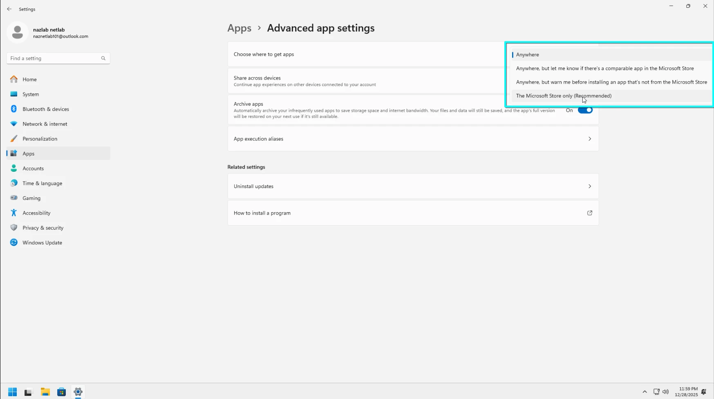
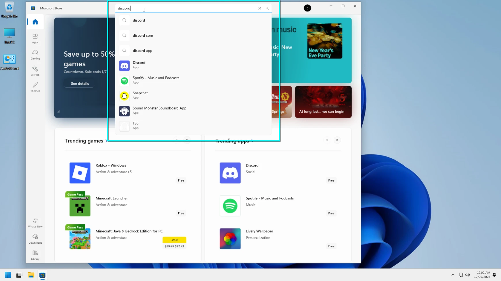
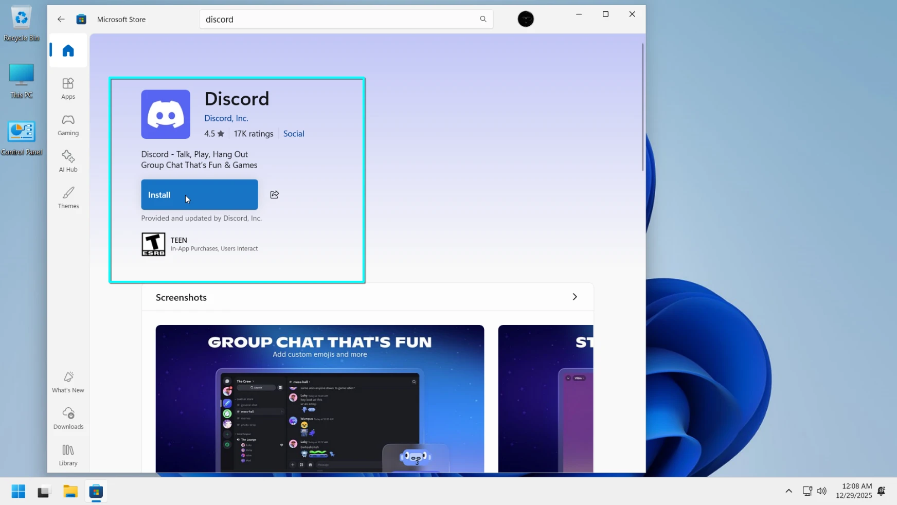
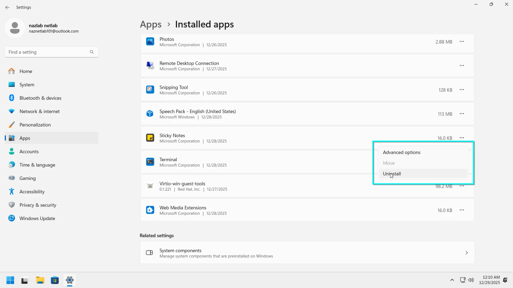
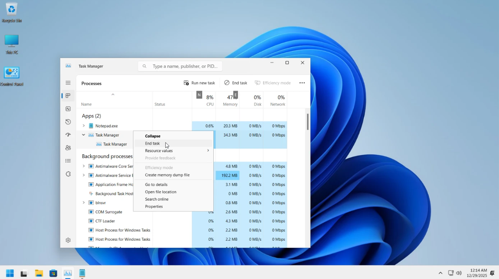
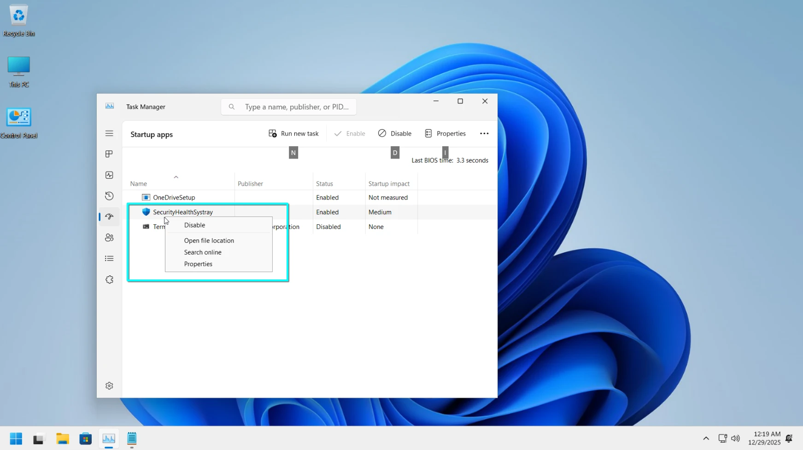
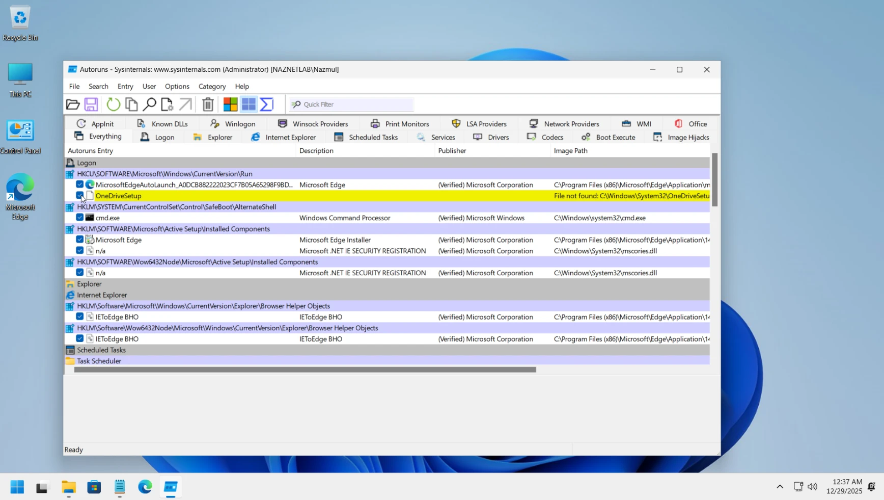
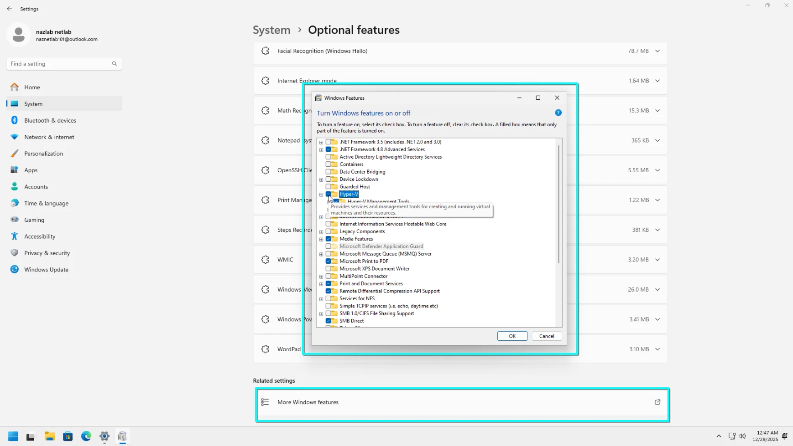

# Chapter 5: Installing and Configuring Apps

Managing how apps are installed and what runs in the background is crucial for keeping your PC fast and secure. This chapter covers app distribution, system tools for managing active software, and advanced startup management.

---

## Lab 5.1: Customizing App Download Source

By default, Windows 11 allows you to install apps from anywhere. However, you can restrict this to the Microsoft Store to improve security.

### Procedure

1. **Accessing App Settings**:
   - Go to **Settings > Apps > Advanced app settings**.

2. **Choosing Your Source**:
   - Click the dropdown menu next to **Choose where to get apps**.
   - Pick **The Microsoft Store only** if you want to ensure all apps are verified by Microsoft.
   - Alternatively, choose **Anywhere, but warn me...** to stay flexible while maintaining a layer of safety.

   
   *Figure 1: The Advanced app settings page with the "Choose where to get apps" dropdown.*

---

## Lab 5.2: Finding Apps in the Microsoft Store

The Microsoft Store is the safest place to download apps, games, and movies. It also handles updates for your installed apps automatically.

### Procedure

1. **Opening the Store**:
   - Click the **Microsoft Store** icon on your taskbar or find it in the Start menu.

2. **Searching for an App**:
   - Type the name of an app (like "WhatsApp" or "Slack") into the search bar at the top and press **Enter**.
   - Select the app from the results to view its details, reviews, and screenshots.

   
   *Figure 2: Search results in the Microsoft Store.*

3. **Installing**:
   - Click the **Get** or **Install** button. Windows will handle the download and installation in the background.

   
   *Figure 3: An app detail page showing the install button.*

---

## Lab 5.3: Uninstalling Apps

If you no longer need an app, you should uninstall it to free up disk space and reduce clutter.

### Procedure

1. **The Settings Method**:
   - Go to **Settings > Apps > Installed apps**.
   - Scroll through the list or use the search bar to find the app you want to remove.
   - Click the **three dots (... )** next to the app and select **Uninstall**.

   
   *Figure 4: Uninstalling an app from the Installed apps list.*

2. **Removing Optional Features**:
   - Go to **Settings > System > Optional features**.
   - Here you can uninstall built-in Windows components like Notepad, Paint, or Windows Media Player.

---

## Lab 5.4: Managing Processes with Task Manager

Task Manager allows you to see what's currently running on your PC and terminate apps that have frozen or are using too many resources.

### Procedure

1. **Opening Task Manager**:
   - Press **Ctrl + Shift + Esc** or right-click the **Start** button and select **Task Manager**.

2. **Terminating a Process**:
   - In the **Processes** tab, look for apps under the "Apps" or "Background processes" sections.
   - If an app is not responding, right-click it and select **End task**.

   
   *Figure 5: Ending a task in Task Manager.*

3. **Checking Performance**:
   - Click the **Performance** tab on the left to see real-time graphs of your CPU, Memory, and Disk usage.

---

## Lab 5.5: Managing Startup Apps with Task Manager

Many apps set themselves to start automatically when you log in, which can slow down your PC's boot time.

### Procedure

1. **Viewing Startup Impact**:
   - In Task Manager, click the **Startup apps** tab on the left navigation bar.
   - Look at the **Startup impact** column to see which apps are slowing down your boot process the most (High, Medium, or Low).

2. **Disabling an App**:
   - Select an app that you don't need immediately after login.
   - Click **Disable** at the top right (or right-click the app and choose **Disable**).

   
   *Figure 6: Disabling startup apps in Task Manager.*

---

## Lab 5.6: Managing Startup with Autoruns Tool

For a more advanced look at everything that starts with Windows, you can use the **Autoruns** tool from Microsoft Sysinternals.

### Procedure

1. **Downloading and Running**:
   - Download the **Autoruns** utility from the official Microsoft Sysinternals website.
   - Extract the files and run `Autoruns64.exe` as an administrator.

2. **Inspecting Entries**:
   - Look at the **Everything** tab for a complete list, or use the **Logon** tab for traditional startup apps.
   - Uncheck the box next to an entry to prevent it from starting. This is more powerful than Task Manager as it includes browser extensions, drivers, and background services.

   
   *Figure 7: Using the Autoruns tool to manage startup entries.*

---

## Lab 5.7: Turning Windows Features On or Off

Some advanced features, like virtualization tools or legacy components, aren't installed by default. You can enable them through the Windows Features dialog.

### Procedure

1. **Accessing the Dialog**:
   - Go to **Settings > System > Optional features**.
   - Scroll to the bottom and click **More Windows features**.

2. **Toggling Features**:
   - In the **Windows Features** popup, check the box next to a tool you want to enable (for example, "Hyper-V" or "Windows Sandbox").
   - Click **OK**. Windows may need to download files and ask you to restart your PC.

   
   *Figure 8: Enabling optional Windows features.*
