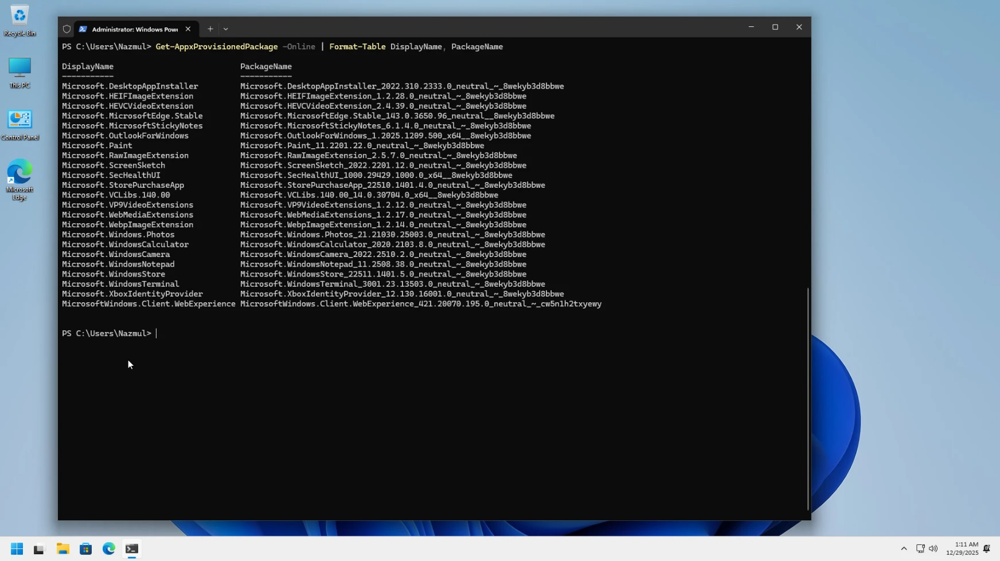
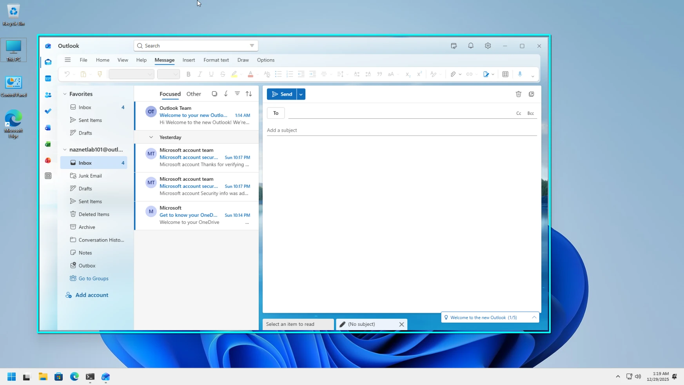
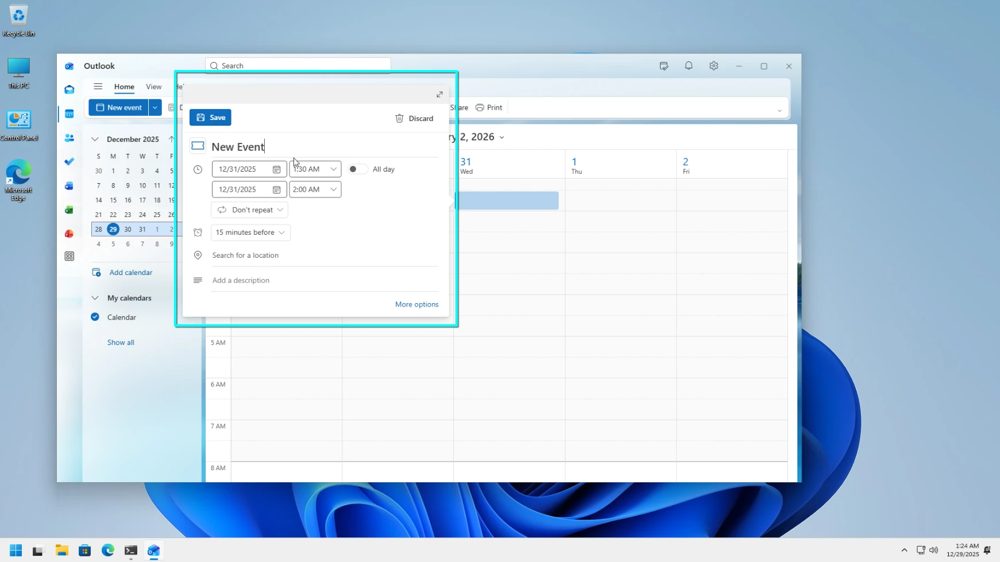
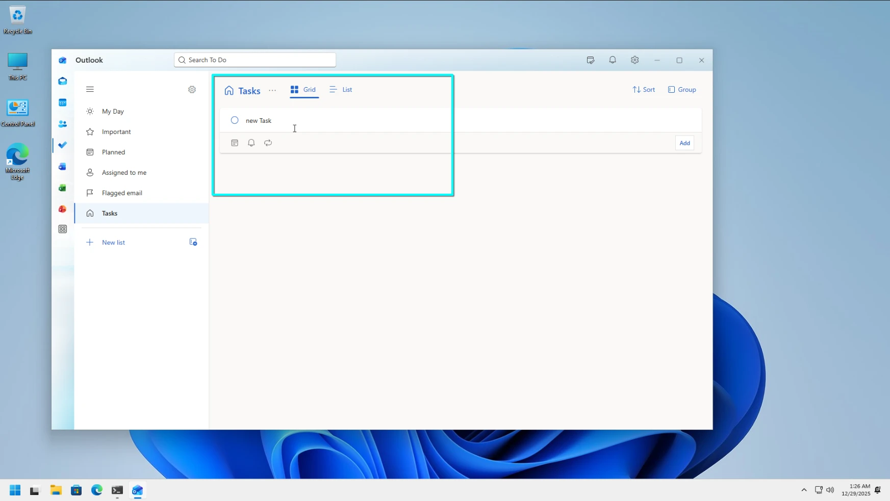
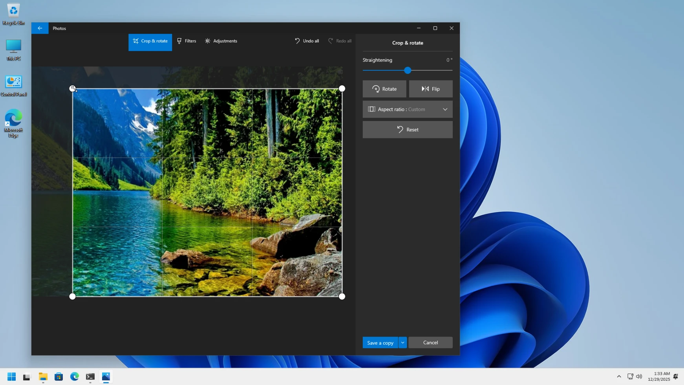
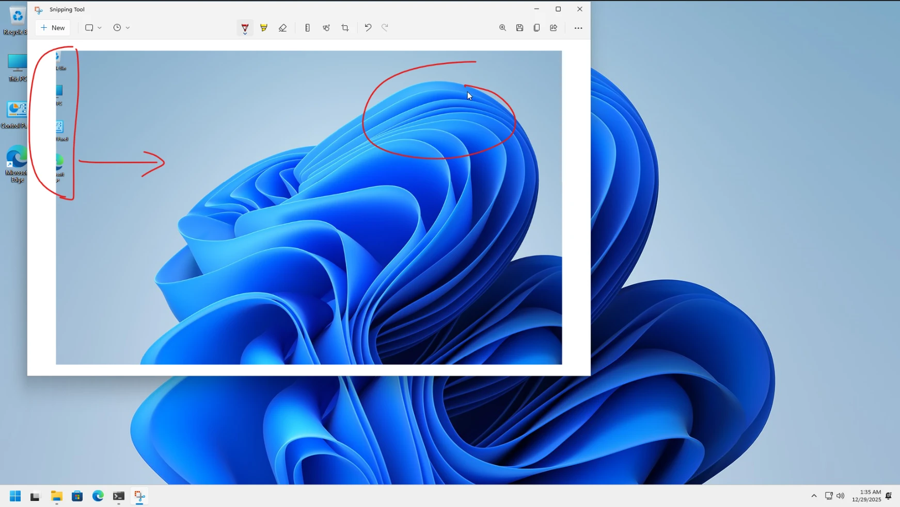

# Chapter 6: Using and Managing Built-in Windows Apps

Windows 11 comes with a suite of built-in applications for productivity, communication, and system management. This chapter covers how to manage these apps, use core tools like Mail and Calendar, and utilize utility apps like the Snipping Tool and Maps.

---

## Lab 6.1: Windows System Apps

System apps are core Windows components located in protected system folders. They handle fundamental tasks like the Start menu, Settings, and printing.

### Procedure

1. **Viewing System App Folders**:
   - Open File Explorer and navigate to `C:\Windows\SystemApps`. This folder contains core packages like the Start menu and Shell experience host.
   - Navigate to `C:\Windows\ImmersiveControlPanel`. This is the home of the modern Settings app.

2. **Listing System Apps with PowerShell**:
   - Right-click the **Start** button and select **Terminal (Admin)** or **PowerShell (Admin)**.
   - Run the following command to see a list of signature-verified system apps and their install locations:
   ```powershell
   Get-AppxPackage -PackageTypeFilter Main | ? { $_.SignatureKind -eq "System" } | Sort Name | Format-Table Name, InstallLocation
   ```

   
   *Figure 1: Using PowerShell to list verified system applications.*

---

## Lab 6.2: Provisioned Windows Apps

Provisioned apps are pre-installed packages that are automatically added to every new user account created on the PC.

### Procedure

1. **Listing Provisioned Packages**:
   - Open PowerShell as an administrator.
   - Run this command to see which apps are staged for new users:
   ```powershell
   Get-AppxProvisionedPackage -Online | Format-Table DisplayName, PackageName
   ```

   
   *Figure 2: Viewing apps that are provisioned for all new user profiles.*

---

## Lab 6.3: Outlook – Reading and Composing Email

The new Outlook app replaces the legacy Mail and Calendar apps. It provides a more modern interface for managing your communications and schedule.

### Procedure

1. **Adding an Account**:
   - Open the **Outlook** app from the Start menu.
   - If it's your first time, follow the prompts to add your Microsoft account, Gmail, or other email address.
   - To add more accounts, click the **Settings** (gear icon) at the top right, then go to **Accounts > Email accounts > Add Account**.

2. **Managing Your Inbox**:
   - Use the **Focused** tab for important messages and **Other** for everything else.
   - Click **New mail** at the top left to start writing a message.

   
   *Figure 3: The Outlook app inbox and message composition view.*

---

## Lab 6.4: Setting Up and Using the Outlook Calendar

The calendar is now built directly into the Outlook app, making it easier to switch between your email and your schedule.

### Procedure

1. **Accessing the Calendar**:
   - Click the **Calendar** icon on the left-hand navigation bar within the Outlook app.

2. **Adding an Event**:
   - Click on any date in the calendar or click the **New event** button at the top left.
   - Fill in the event title, set the time, and click **Save**.

   
   *Figure 4: Creating a new appointment in the modern Outlook Calendar.*

---

## Lab 6.5: People and Microsoft To Do

Use the People app to manage contacts and To Do to keep track of your daily tasks.

### Procedure

1. **Managing Contacts**:
   - Open the **People** app. Your contacts from your linked email accounts should appear automatically.
   - Click the **+** (plus) icon to manually add a new contact details.

2. **Tracking Tasks**:
   - Open **Microsoft To Do**.
   - Click **Add a task** at the bottom to quickly jot something down.
   - Use **My Day** to focus on specific tasks for the current 24 hours.

   
   *Figure 5: Organizing tasks within the Microsoft To Do app.*

---

## Lab 6.6: Using Microsoft Teams

Windows 11 includes a personal version of Teams for chatting and video calling with friends and family.

### Procedure

1. **Starting a Conversation**:
   - Click the **Chat** icon on the taskbar or open **Microsoft Teams** from the Start menu.
   - Click **Chat** to start a text conversation or **Meet** to start an immediate video call.

---

## Lab 6.7: Media Player, Photos, and Video Editing

Windows includes built-in tools for enjoying and editing your media files without needing third-party software.

### Procedure

1. **Playing Media**:
   - Use the **Media Player** app to open music or video files from your library.

2. **Editing Photos**:
   - Open an image in the **Photos** app.
   - Click the **Edit image** icon at the top. You can crop, rotate, and adjust lighting or color from here.

   
   *Figure 6: Cropping and adjusting an image in the Photos app.*

3. **Editing Video with Clipchamp**:
   - Open **Clipchamp** from the Start menu.
   - Click **Create a new video**. Drag and drop video clips into the timeline to trim, split, and add transitions.

---

## Lab 6.8: Screen Captures with Snipping Tool

The Snipping Tool is the most versatile way to capture what's on your screen.

### Procedure

1. **Capture Shortcuts**:
   - **Alt + PrtScn**: Captures only the active window.
   - **Win + PrtScn**: Captures the whole screen and saves it to your "Screenshots" folder automatically.
   - **Win + Shift + S**: Opens the snip overlay, allowing you to draw a rectangle or freeform shape to capture.

2. **Editing Snips**:
   - After capturing, the Snipping Tool window opens. Use the pens and highlighters to mark up the image.

   
   *Figure 7: Using the Snipping Tool to capture and annotate the screen.*

