# Chapter 9: Using File Explorer

File Explorer is your command center for organizing data, integrating cloud storage, and recovering work. While it looks simple, it hides powerful tools for power users who know where to look.

---

## Lab 9.1: Working with Compressed Folders (Zip)
Zip files are the standard for bundling and sharing files. Windows 11 handles them natively, meaning you don't need third-party apps just to open an archive.

### Procedure
1. **Compressing files**:
   - Select the files you want to bundle.
   - Right-click the selection and choose **Compress to ZIP file**.
   - Type a name for the archive and hit Enter.
   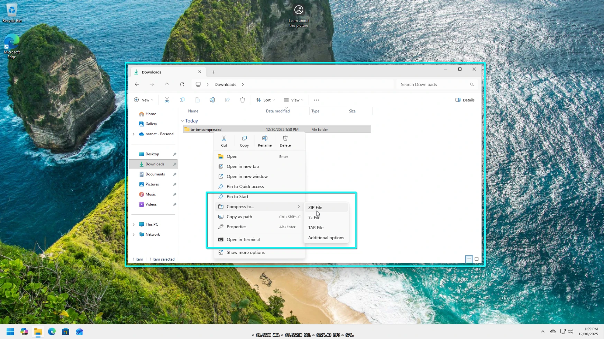
   *Figure 1: Creating a zip file directly from the context menu.*

2. **Extracting files**:
   - Right-click a `.zip` file and select **Extract All**.
   - The wizard asks for a destination (default is the current folder). Click **Extract**.
   - Keep the checkbox marked to see your files immediately.
   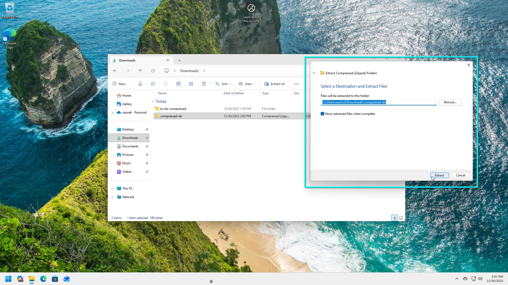
   *Figure 2: unpacking files using the native extraction tool.*

3. **Browsing inside Archives**:
   - Double-click a zip file to open it like a regular folder.
   - This "peek" view lets you drag single files out without extracting the entire package.
   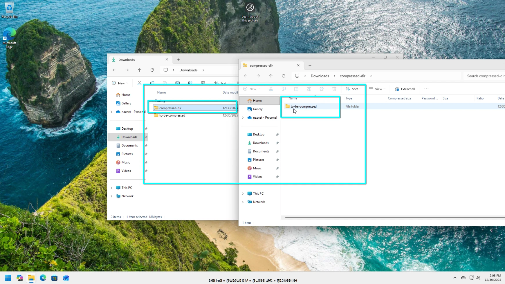
   *Figure 3: Viewing zip contents before extraction.*

---

## Lab 9.2: Managing Libraries
Libraries are virtual folders that merge content from multiple locations (like your C: drive and an external drive) into one view. They're often hidden by default in Windows 11.

### Procedure
1. **Showing Libraries**:
   - In File Explorer, right-click an empty space in the left **Navigation Pane**.
   - Select **Show libraries**. They will appear at the bottom of the list.
   - *Alternative*: Click the dots **(...)** in the command bar > **Options** > **View** > Check **Show libraries**.
   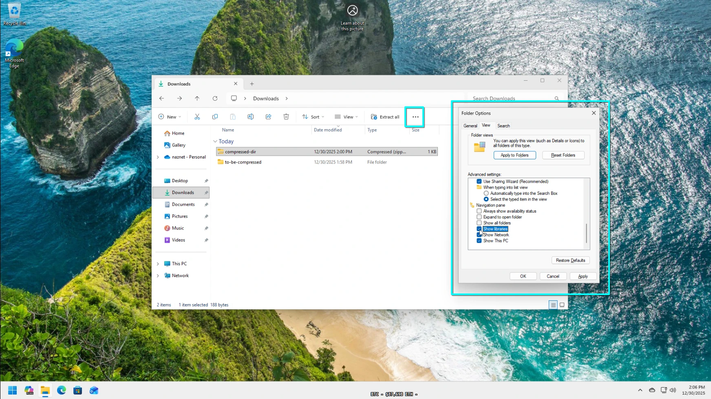
   *Figure 4: Toggling visibility for the Libraries node.*

2. **Creating a custom Library**:
   - Right-click the **Libraries** header in the left pane > **New** > **Library**.
   - Name it "Project Archives" or "Merged Media".
   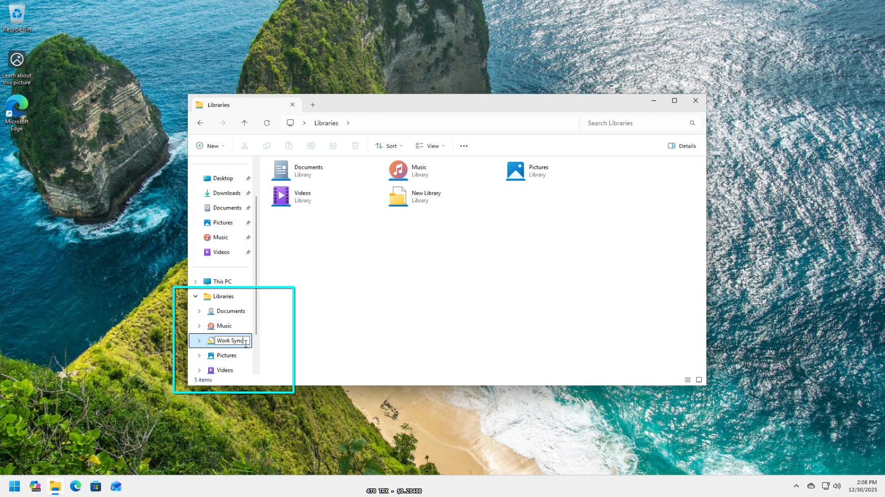
   *Figure 5: Adding a custom collection.*

3. **Adding folders**:
   - Right-click your new library > **Properties**.
   - Click **Add...** to link folders from different drives.
   - Use the "Optimize for" dropdown to tell Windows if it should show thumbnails (Pictures) or details (Documents).
   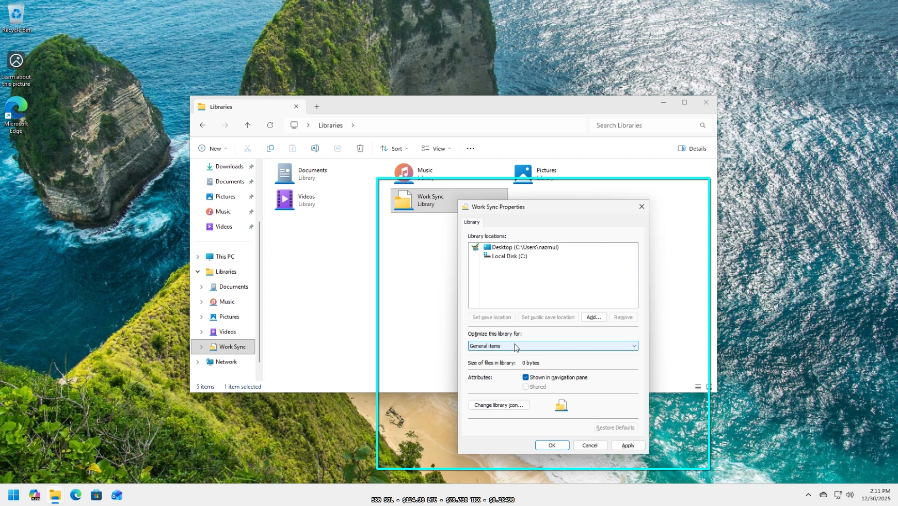
   *Figure 6: Aggregating folders from multiple sources.*

---

## Lab 9.3: Relocating Files and Folders
Moving files seems basic, but doing it wrong creates duplicate copies or "ghost" shortcuts. Use these methods to be precise.

### Procedure
1. **Using Cut and Paste (The Ribbon Method)**:
   - Select your files.
   - Click the **Scissors (Cut)** icon in the top command bar (or press **Ctrl + X**).
   - Navigate to the new folder and click the **Paste** icon.
   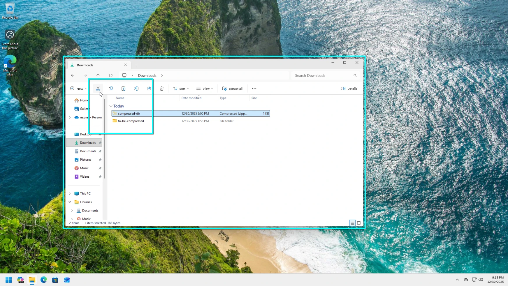
   *Figure 7: Modern cut/paste icons in the command bar.*

2. **The Right-Click Drag trick**:
   - **Right-click and drag** a file to a new location.
   - When you drop it, a menu pops up asking: **Move here** vs **Copy here**.
   - This is the only way to be 100% sure of what will happen.
   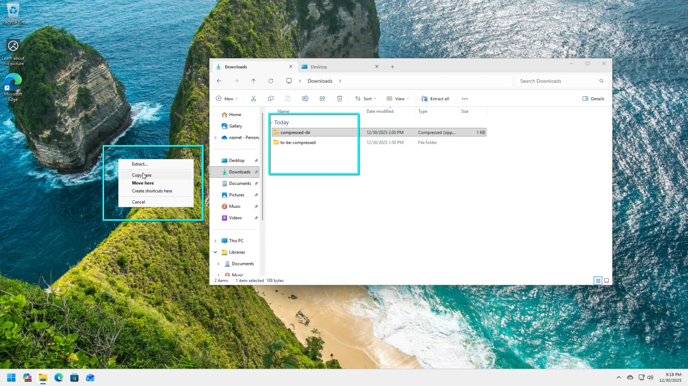
   *Figure 8: The infallible "Move vs Copy" menu.*

3. **Dragging between Tabs**:
   - Open a second tab by clicking the **+** in the title bar.
   - Drag a file from your active tab and hover it over the **title** of the destination tab.
   - Wait for the tab to switch, then drop the file.
   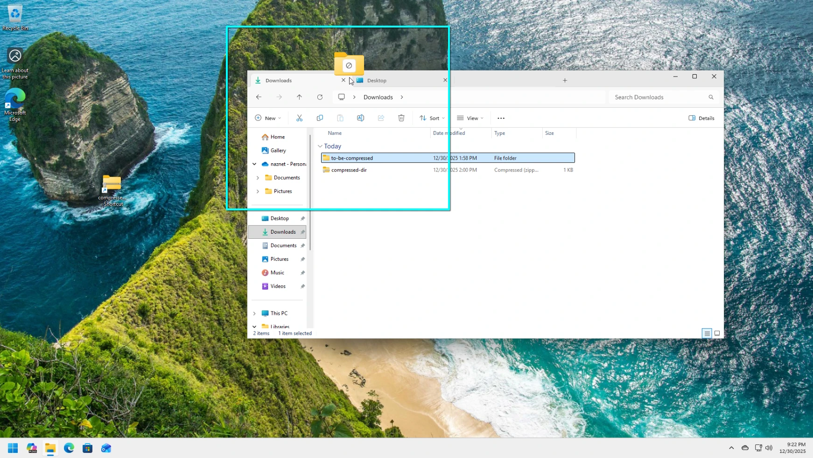
   *Figure 9: Moving files across tabs.*

---

## Lab 9.4: Integrating OneDrive with File Explorer
OneDrive isn't just a background app; it's built into the explorer window. You can manage sharing and versions without opening a web browser.

### Procedure
1. **Generating Share Links**:
   - Right-click a synced file > **Share** (look for the OneDrive icon next to Share).
   - Set permissions (e.g., "Anyone with the link") and click **Copy link**.
   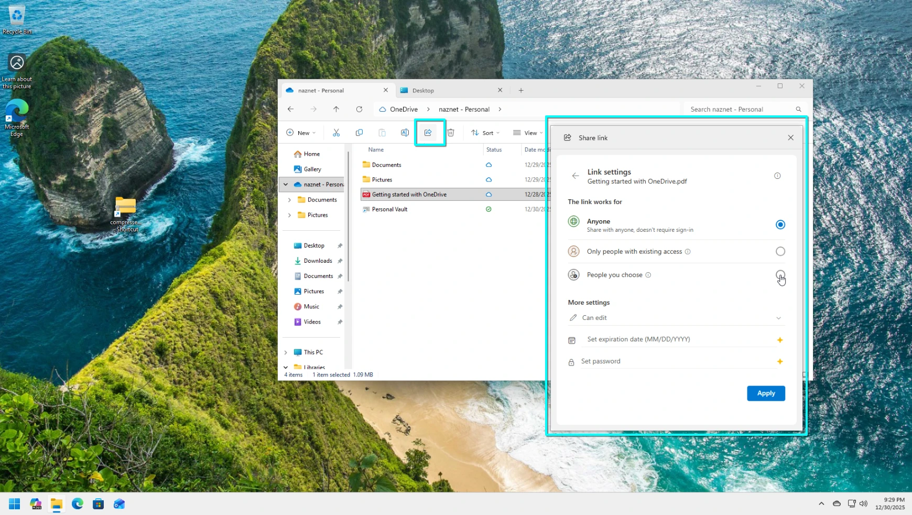
   *Figure 10: Creating a cloud share link directly from Explorer.*

2. **Restoring Previous Versions**:
   - Right-click a document > **Version History**.
   - You'll see a list of timestamps. Click the **three dots** on an older version to **Restore** or **Download** it.
   - Keep this in mind before you panic about overwriting a file.
   
   *Figure 11: Accessing cloud backups of specific files.*

3. **Pinning Folders**:
   - Right-click a frequently used Cloud folder > **Pin to Quick access**.
   - It now lives at the top left of every window for instant access.
   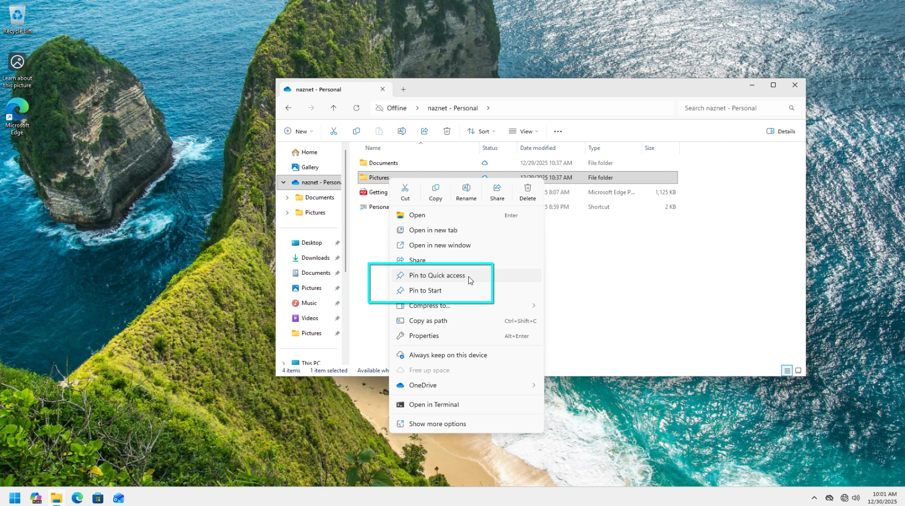
   *Figure 12: Shortcut to cloud storage.*

---

## Lab 9.5: Recovering Deleted Files
The Recycle Bin is your safety net. Unless you force-deleted (Shift+Del), your files are safe here.

### Procedure
1. **Restoring files**:
   - Open the **Recycle Bin** from the Desktop.
   - Select your file > Right-click > **Restore**.
   - It returns to its original folder immediately.
   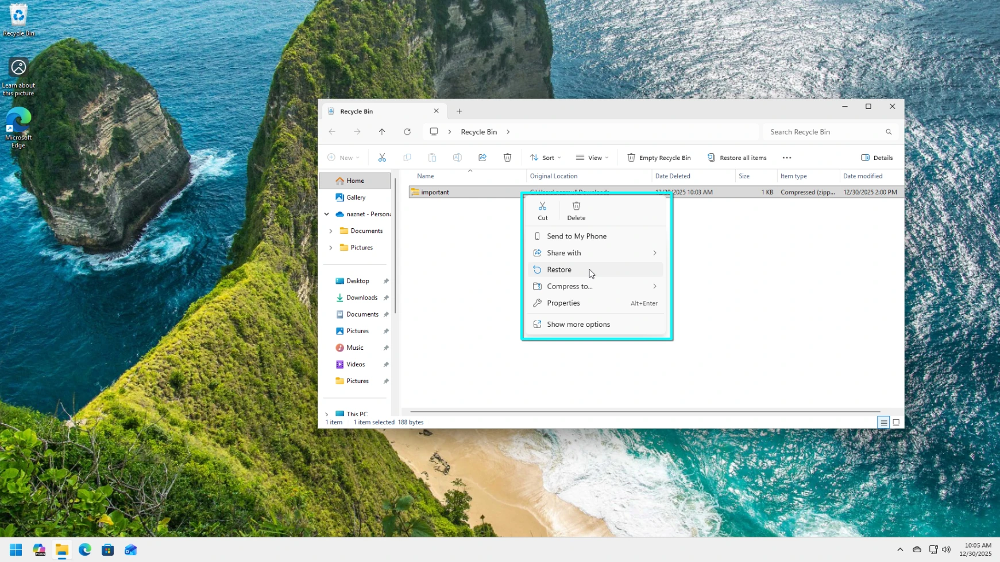
   *Figure 13: Recovering accidental deletions.*

2. **Managing Bin Size**:
   - Right-click Recycle Bin > **Properties**.
   - Limit the "Maximum size" if you're low on disk space.
   - Ensure "Display delete confirmation" is **ON** if you want a warning before deletion.
   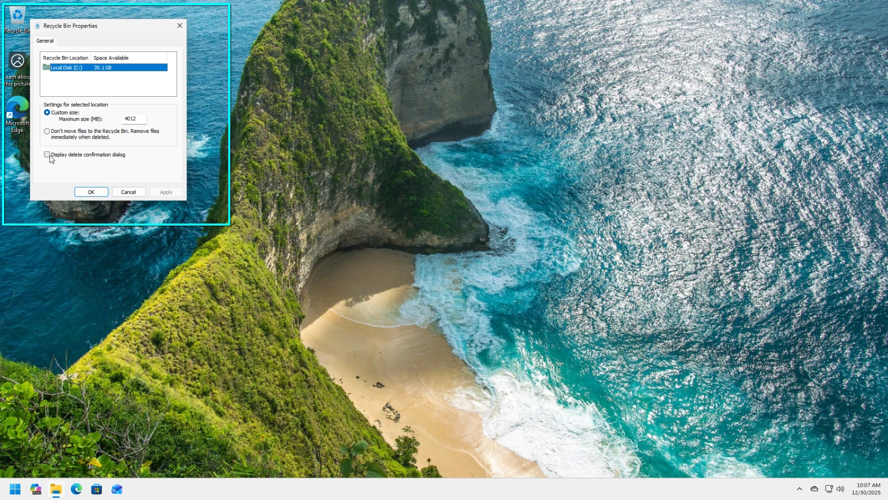
   *Figure 14: Setting storage limits.*

---

## Lab 9.6: Restoring Files (Legacy File History)
While OneDrive handles cloud versions, **File History** is the legacy tool for **local, offline backups** to external drives. It's hidden in the Control Panel but still vital for full system safety.

### Procedure
1. **Enabling File History**:
   - Connect an external USB drive.
   - Search specifically for "**File History**" in the Start Menu (it's a Control Panel applet).
   - Click **Turn on**.
   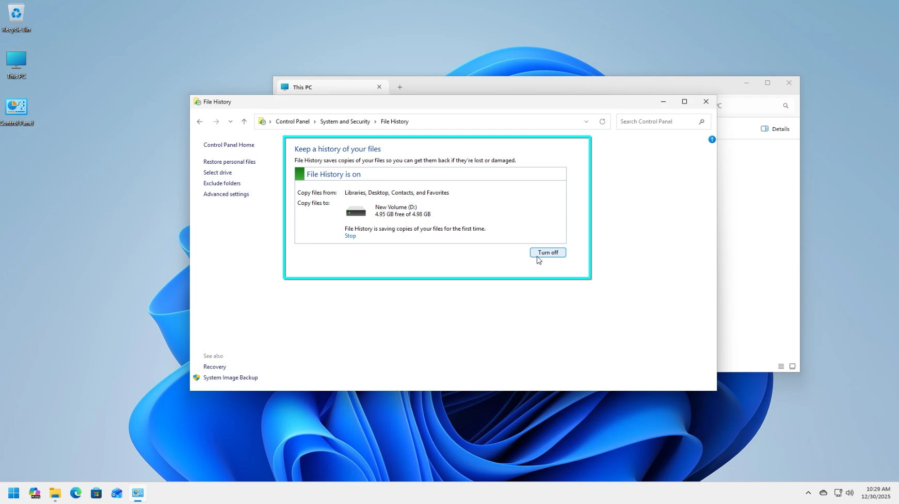
   *Figure 15: The legacy Control Panel interface for backups.*

2. **Accessing Local Versions**:
   - Right-click a file > **Properties** > **Previous Versions** tab.
   - If File History is running, you'll see local snapshots here.
   - Select a date and click **Restore**.
   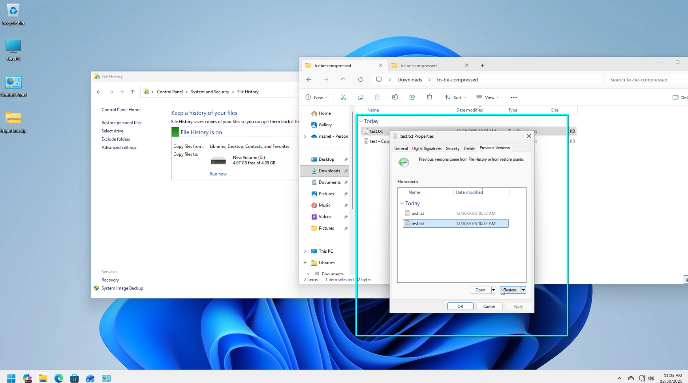
   *Figure 16: Restoring from a local shadow copy.*

3. **Restoring a lost folder**:
   - If you deleted an entire folder, right-click the **Parent folder** > **Properties** > **Previous Versions**.
   - You can roll back the parent container to a time when the subfolder existed.
   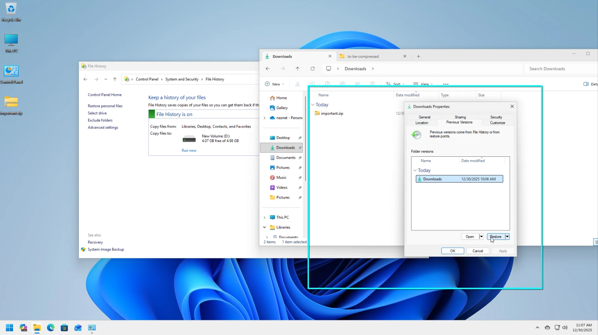
   *Figure 17: Recovering an entire directory structure.*

---

## Lab 9.7: Sorting, Filtering, and Grouping
Default lists are fine for ten files. For ten thousand, you need these organization tools.

### Procedure
1. **Grouping content**:
   - In the command bar, click **Sort** > **Group by** > **Type**.
   - This creates visual headers (Folders, Images, PDFs). You can collapse sections you don't need.
   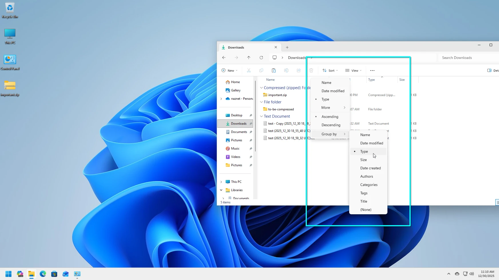
   *Figure 18: Segmenting a messy folder.*

2. **Filtering columns**:
   - Switch to **Details View** (View > Details).
   - Hover over the **Type** or **Date** column header. Click the small **arrow**.
   - Check the boxes to show only specific files (e.g., "Last Week").
   
   *Figure 19: Filtering a list without searching.*

3. **Sorting**:
   - Sorting arranges the list; Grouping breaks it into chunks.
   - Use **Sort** > **Size** > **Descending** to find space-hogging files.
   
   *Figure 20: Simple ordering options.*

---

## Lab 9.8: Configuring Windows Search Index
If you can't find a file you *know* is there, it's likely not indexed. Windows only indexes "standard" locations by default.

### Procedure
1. **Opening Indexing Options**:
   - Press Start, type **Indexing Options**, and hit Enter.
   - This shows you exactly what Windows is "watching."
   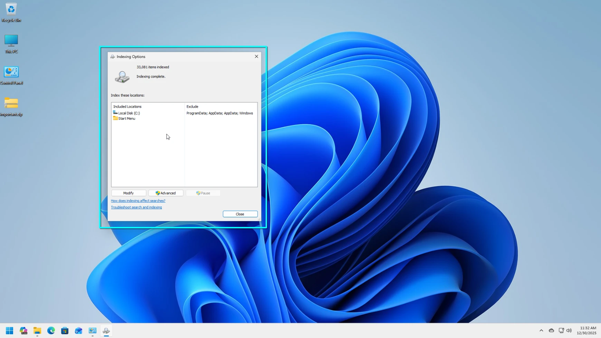
   *Figure 21: The search indexer control panel.*

2. **Adding locations**:
   - Click **Modify**.
   - Expand your drives and check any folder you want searchable (like `D:\Projects`).
   - Don't index the whole C: drive; it will slow down your PC.
   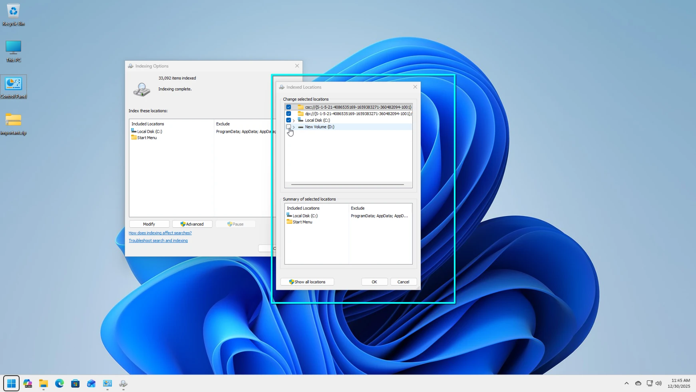
   *Figure 22: Adding custom folders to the index.*

3. **Indexing File Contents**:
   - Go to **Advanced** > **File Types**.
   - Select "Index Properties and File Contents" for text-heavy formats like `.pdf` or `.docx`.
   - This lets you search for words *inside* the file, not just the filename.
   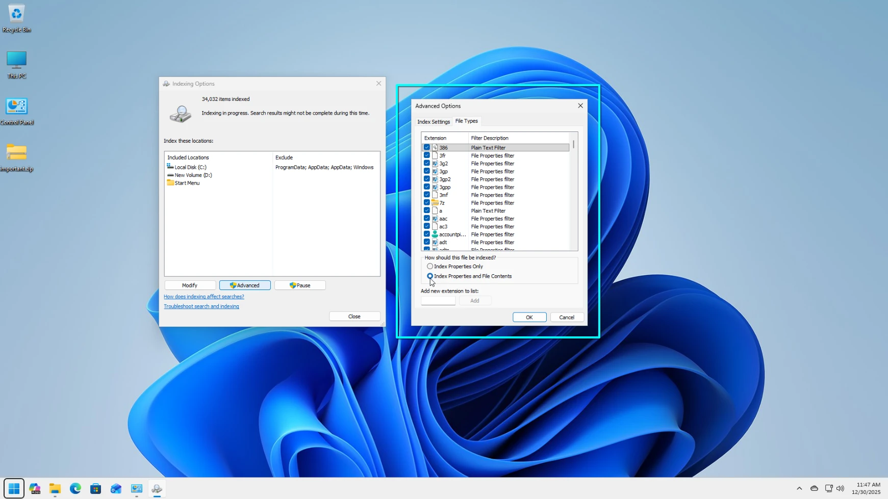
   *Figure 23: Enabling deep content search.*

---

## Lab 9.9: Mastering Search Syntax
**Critical Note**: Modern Windows 11 removed the "Search Tools" ribbon tab. To search effectively, you must type commands directly into the search box.

### Procedure
1. **Searching by Kind**:
   - Click the search box.
   - Type `kind:image` or `kind:document`.
   - Windows filters the view instantly.
   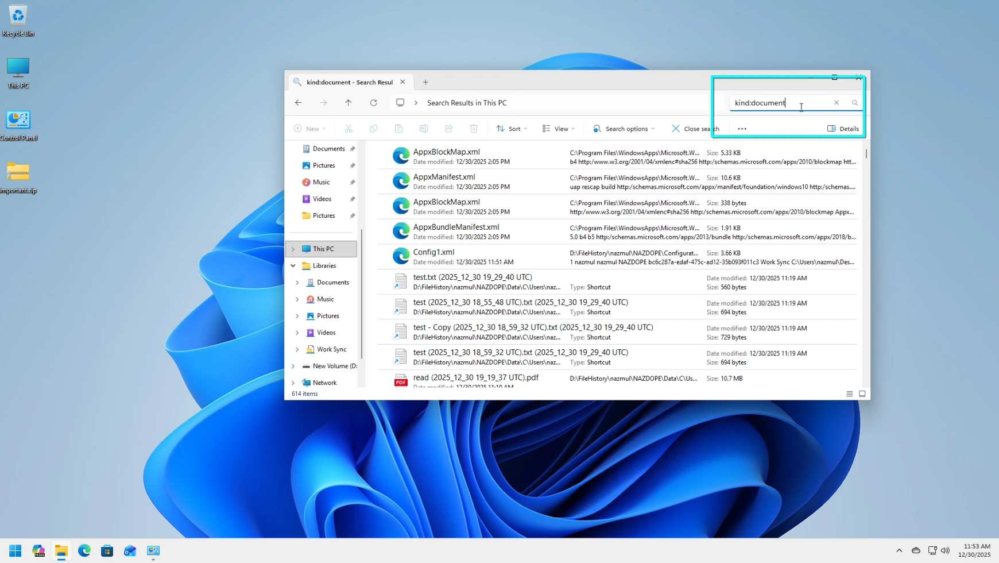
   *Figure 24: Using the kind: operator.*

2. **Searching by Date**:
   - Type `date:today` or `date:thisweek`.
   - You can also specify years: `date:2024`.
   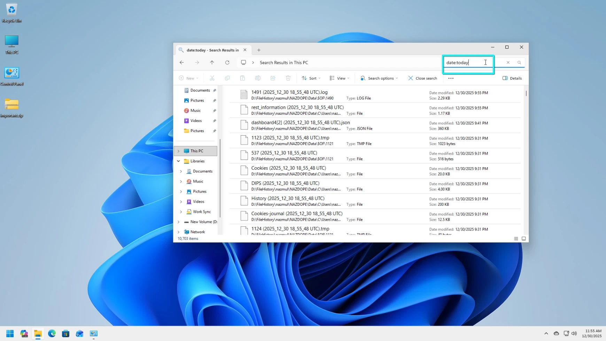
   *Figure 25: Filtering by time.*

3. **Advanced Boolean Queries**:
   - Combine terms to narrow results: `report AND budget`.
   - Exclude terms: `budget NOT draft` (finds "budget" but hides "budget draft").
   - Find large files: `size:>100mb`.
   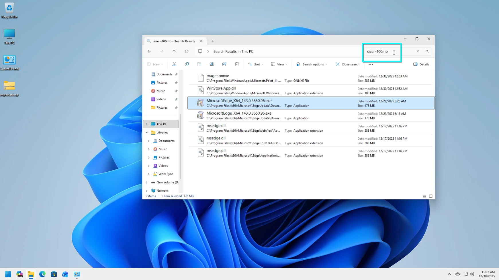
   *Figure 26: Building a complex query string.*
