# Chapter MISC-1: Configuring MikroTik RADIUS Authentication

This chapter covers configuring Windows Server 2019 and MikroTik RouterOS to enable centralized user authentication using Active Directory credentials.

### Topology Overview

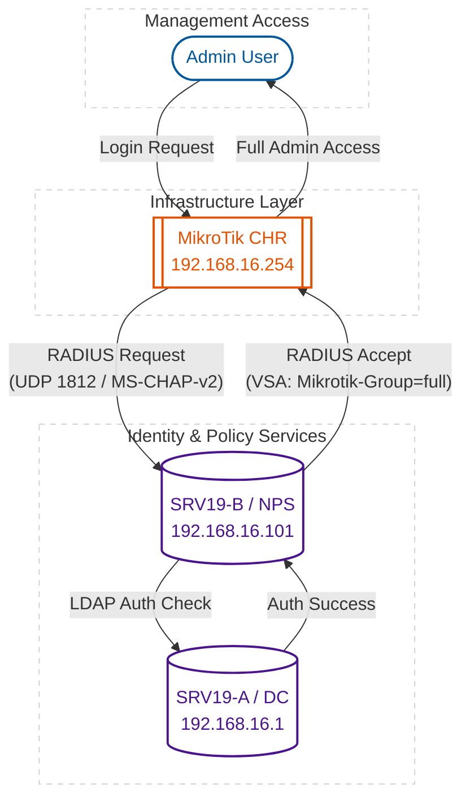

---

## Lab MISC-1.1: Preparing Active Directory & Installing NPS

Centralizing router management login improves security and simplifies user administration.

### Procedure

1.  **Creating the Security Group**:
    - Log in to your Domain Controller (`srv19-a`)
    - Open **Active Directory Users and Computers**
    - Create a new **Security Group** named `Mikrotik-Admins`
    - Add your admin user accounts to this group
    <figure>
     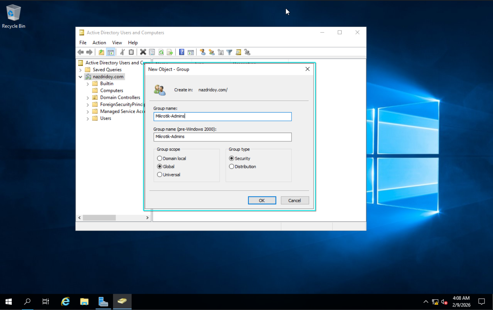
     <figcaption align="left"><i>Figure 1: Creating the Mikrotik-Admins security group.</i></figcaption>
    </figure>

2.  **Installing the NPS Role**:
    - Log in to the member server (`srv19-b`)
    - Open **Server Manager** > **Manage** > **Add Roles and Features**
    - Proceed to **Server Roles**
    - Select **Network Policy and Access Services**
    - Click **Add Features**, then **Next**
    - Click **Install** to finish
    <figure>
     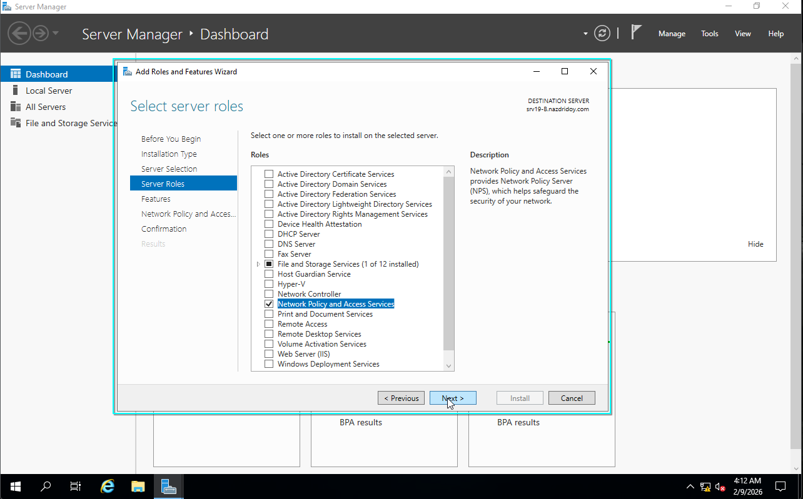
     <figcaption align="left"><i>Figure 2: Selecting the Network Policy and Access Services role.</i></figcaption>
    </figure>

---

## Lab MISC-1.2: Configuring Network Policy Server

You must configure the NPS server to process RADIUS requests from the router and validate them against Active Directory.

### Procedure

1.  **Registering the Server**:
    - Open **Network Policy Server**
    - Right-click **NPS (Local)** > **Register server in Active Directory**
    - Click **OK** to confirm
    <figure>
     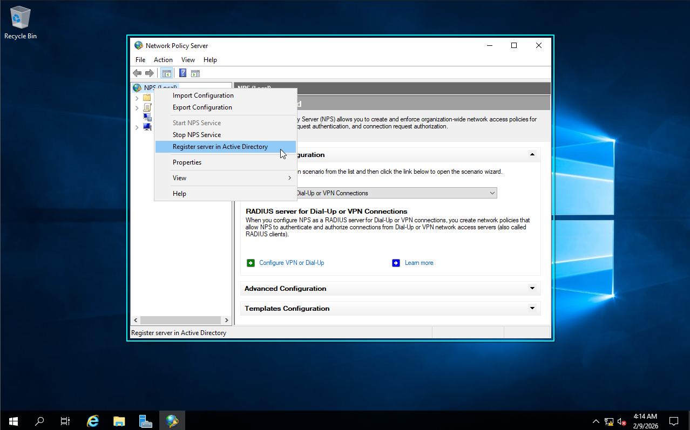
     <figcaption align="left"><i>Figure 1: Registering the NPS server in AD.</i></figcaption>
    </figure>

2.  **Configuring Windows Firewall**:
    - Open **Windows Defender Firewall with Advanced Security**
    - Create a **New Inbound Rule** > **Port** > **UDP**
    - Specific local ports: `1812, 1813, 1645, 1646`
    - **Allow the connection** for Domain/Private profiles
    - Name it `RADIUS Traffic`
    <figure>
     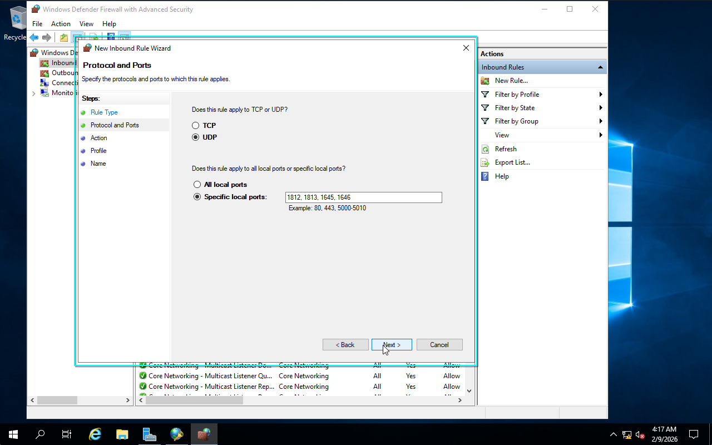
     <figcaption align="left"><i>Figure 2: Allowing RADIUS UDP ports.</i></figcaption>
    </figure>

3.  **Adding the RADIUS Client**:
    - In NPS, right-click **RADIUS Clients** > **New**
    - **Friendly name**: `MikroTik-CHR`
    - **Address**: Enter the router's IP (e.g., `192.168.16.254`)
    - **Shared Secret**: Enter a strong password (e.g., `DTCM$1234`)
    <figure>
     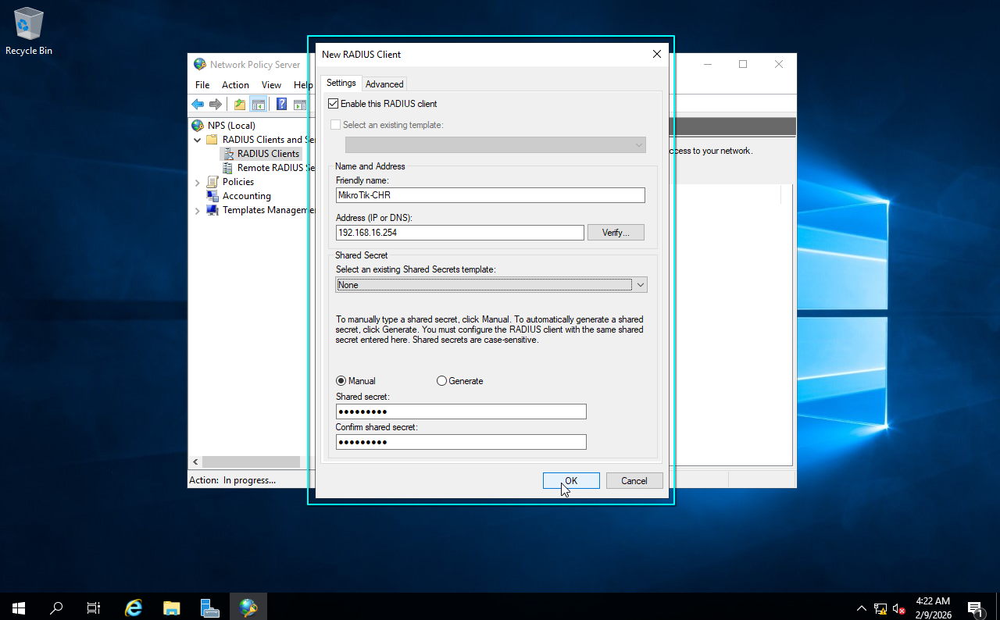
     <figcaption align="left"><i>Figure 3: Configuring the MikroTik client and shared secret.</i></figcaption>
    </figure>

4.  **Creating the Network Policy**:
    - Right-click **Network Policies** > **New**
    - Name: `MikroTik Admin Access`
    - **Conditions**: Add **Windows Groups** > Select `Mikrotik-Admins`
    - **Permission**: Access granted
    - **Authentication**: Check **MS-CHAP-v2** (matches MikroTik default)
    <figure>
     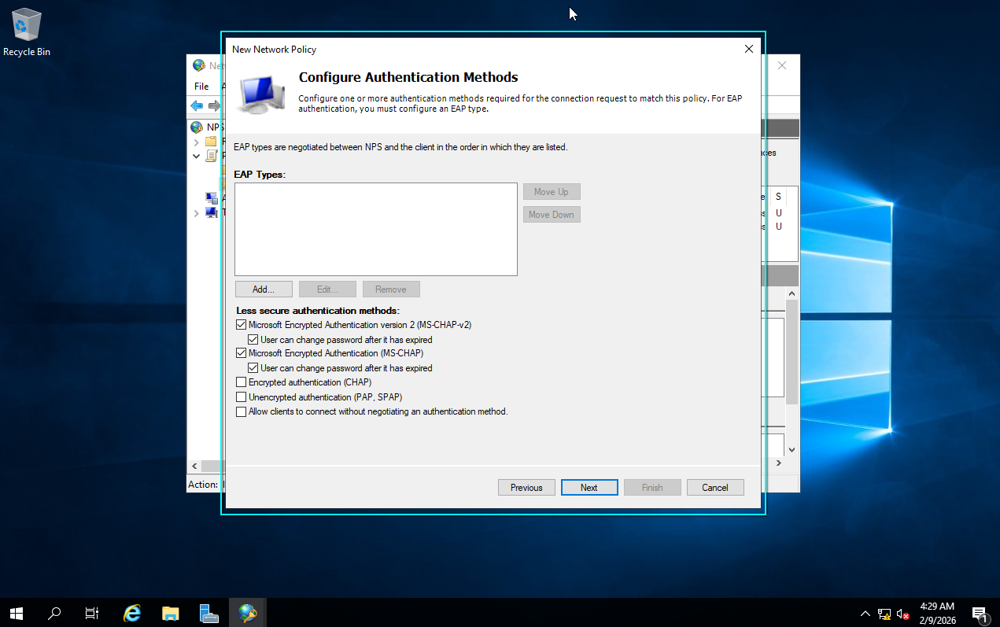
     <figcaption align="left"><i>Figure 4: Enabling MS-CHAP-v2.</i></figcaption>
    </figure>

5.  **Configuring Standard Attributes**:
    - Click **Next** past the **Constraints** page
    - On the **Settings** page, select **Standard Attributes**
    - Remove `Framed-Protocol` if present
    - Click **Add** > Select **Service-Type** > **Add**
    - Select **Others** > **Login** (or **Administrative**)
    - Click **OK**
    <figure>
     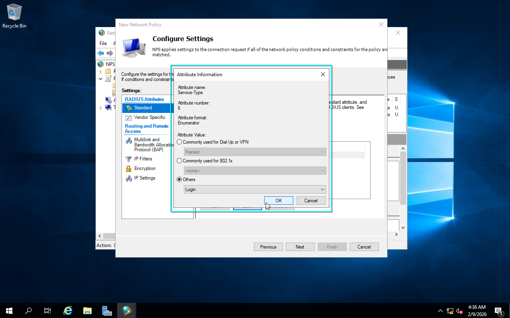
     <figcaption align="left"><i>Figure 5: Setting the Service-Type to Login.</i></figcaption>
    </figure>

6.  **Configuring Vendor Specific Attributes (VSA)**:
    - Still in **Settings**, select **Vendor Specific** > **Add**
    - Choose **Custom** > **Vendor-Specific**
    - **Vendor Code**: `14988` (MikroTik)
    - **Attribute Number**: `3` (Mikrotik-Group)
    - **Format**: `String`
    - **Value**: `full`
    <figure>
     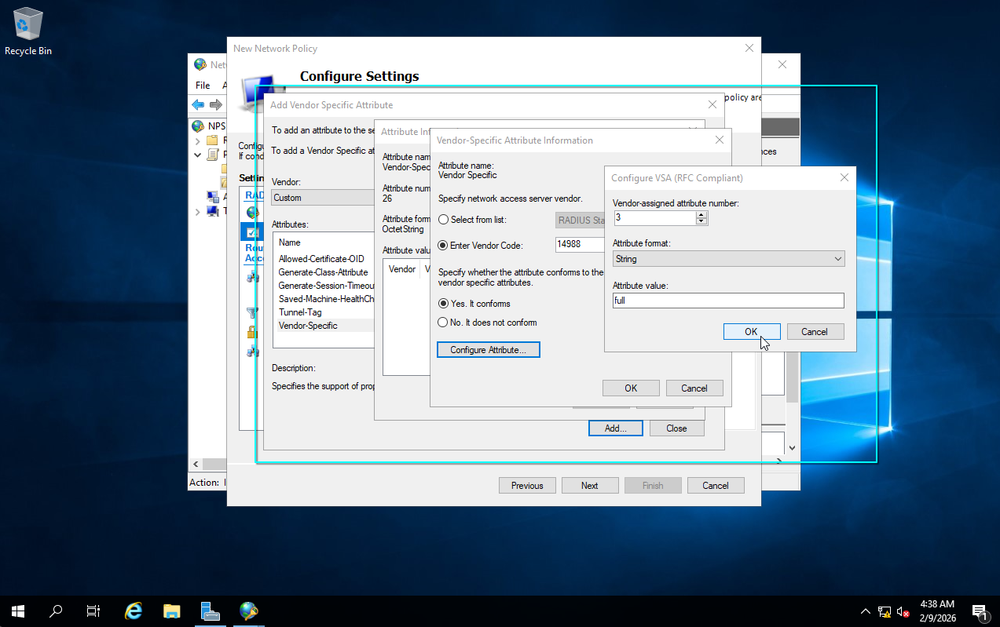
     <figcaption align="left"><i>Figure 6: Setting the MikroTik Group attribute to 'full'.</i></figcaption>
    </figure>

---

## Lab MISC-1.3: Configuring MikroTik Router

Configure the router to talk to the NPS server for user authentication.

### Procedure

1.  **Adding the RADIUS Server**:
    - Connect via WinBox or SSH
    - Run the command to add the server (escape the `$` with `\`):
      ```bash
      /radius add address=192.168.16.101 secret="DTCM\$1234" service=login timeout=10s require-message-auth=no
      ```
    <figure>
     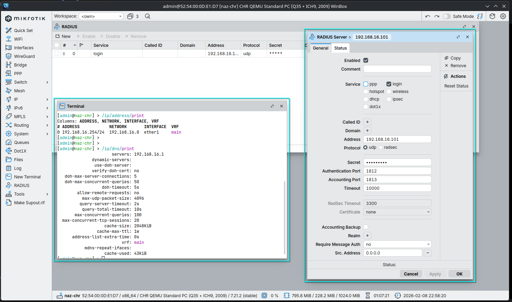
     <figcaption align="left"><i>Figure 1: RADIUS server configuration in WinBox.</i></figcaption>
    </figure>

2.  **Enabling AAA**:
    - Set the router to use RADIUS for logins:
      ```bash
      /user aaa set use-radius=yes default-group=read
      ```
    - `default-group=read` ensures users get read-only access if the VSA fails
    <figure>
     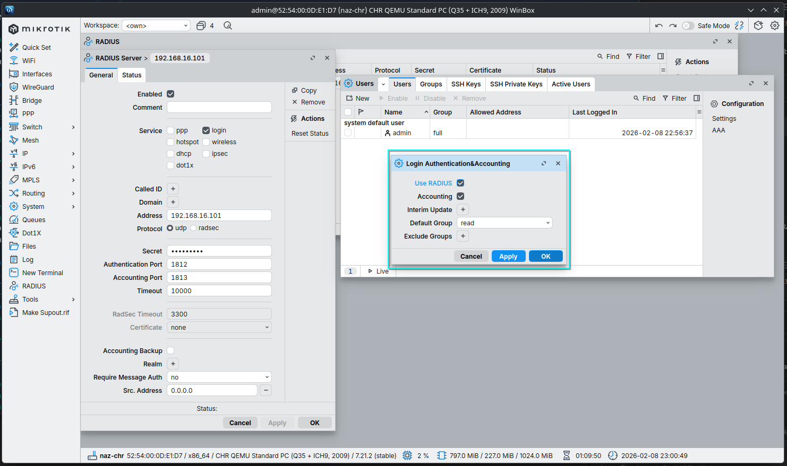
     <figcaption align="left"><i>Figure 2: Enabling RADIUS usage in User settings.</i></figcaption>
    </figure>
---

## Lab MISC-1.4: Verifying Access

Test the configuration by logging into the router with a domain user account.

### Procedure

1.  **Logging in with Domain Credentials**:
    - Open WinBox or your preferred SSH client
    - Connect to the MikroTik router IP
    - Login: `nazmul` (Ensure this user is in the `Mikrotik-Admins` group)
    - Password: Your domain password
    - **Result**: You should log in successfully with full admin rights
    <figure>
     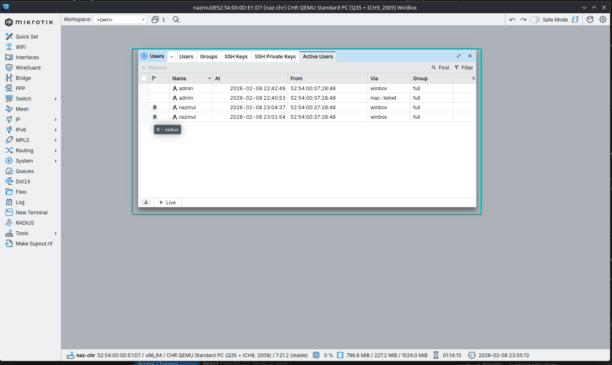
     <figcaption align="left"><i>Figure 1: Successful login using the 'nazmul' domain account.</i></figcaption>
    </figure>

---

## Troubleshooting Tips

> [!IMPORTANT]
> **Policy Order Matters**: Ensure your **MikroTik Admin Access** network policy is at the **top of the list** (Order 1) in NPS. If it is below a "Deny Access" policy, authentication will fail.

- **Event ID 18**: Indicates a shared secret mismatch. Retype the secret on both the NPS client and MikroTik settings.
- **Stuck Authenticating**:
    - Ensure **MS-CHAP-v2** is enabled in NPS Network Policy.
    - Increase RADIUS timeout on MikroTik if connecting over a slow link.
- **No Response / Timeout**:
    - Verify the Firewall Rule on the NPS server allows **UDP 1812**.
    - Check if the MikroTik **Source IP** matches the RADIUS Client IP in NPS.
    - Enable **File and Printer Sharing (Echo Request - ICMPv4-In)** on the server to allow ping tests.
